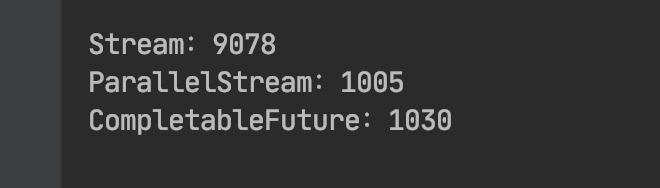

# CompletableFuture

## Future接口

引入Future接口，设计初衷是对将来某个时刻会发生的结果进行建模。

## CompletableFuture

实现Future接口，提供了更为强大的异步操作。

### 浅尝

编写一个aplle手机的价格查询器。创建apple类的价格查询方法。

~~~java
public Double findPrice(String name){
      try {
          TimeUnit.SECONDS.sleep(1);
      } catch (InterruptedException e) {
          e.printStackTrace();
      }
      Random random = new Random();
      return random.nextDouble()+name.charAt(0)+name.charAt(name.length()-1);
  }
~~~

1. Funture接口方式

   ~~~java
   ExecutorService executorService = Executors.newFixedThreadPool(10);
   Apple apple = new Apple();
   Future<Double> iphone7 = executorService.submit(() -> apple.findPrice("iphone7"));
   ~~~

   

2. CompletableFuture接口方式

   ~~~java
   ExecutorService executorService = Executors.newFixedThreadPool(10);
   Apple apple = new Apple();
   CompletableFuture<Double> completableFuture = new CompletableFuture<>();
   executorService.submit(()->{
       Double ipone7_pro = apple.findPrice("ipone7 pro");
       completableFuture.complete(ipone7_pro);
   });
   ~~~

### 异常处理

当价格计算过程中产生了错误会怎样呢？结果是：用于提示错误的异常会被限制在试图计算商品价格的当前线程的范围内，最终会杀死该线程，而这会导致等待get方法返回结果的客户端永久地被阻塞。

面对这个问题解决方案：

1. 使用get的重载版本，添加超时时间

2. 将异常抛出。

   ~~~java
   ExecutorService executorService = Executors.newFixedThreadPool(10);
   Apple apple = new Apple();
   CompletableFuture<Double> completableFuture = new CompletableFuture<>();
   executorService.submit(()->{
       Double ipone7_pro = apple.findPrice("ipone7 pro");
       try {
           completableFuture.complete(ipone7_pro);
       }catch (Exception ex){
           completableFuture.completeExceptionally(ex);
       }
   });
   ~~~

> 推荐的做法：使用第二种方式，可以得知是什么原因导致。

### supplyAsync

CompletableFuture类自身提供了大量精巧的工厂方法，使用这些方法能更容易地完成整个流程，还不用担心实现的细节。比如常用的supplyAsync方法。

~~~java 
Apple apple = new Apple();
CompletableFuture<Double> completableFuture = CompletableFuture.supplyAsync(() -> apple.findPrice("iphone8"));
~~~

supplyAsync方法接受一个生产者（Supplier）作为参数，返回一个CompletableFuture对象，该对象完成异步执行后会读取调用生产者方法的返回值。生产者方法会交由ForkJoinPool池中的某个执行线程（Executor）运行，但是也可以使用supplyAsync方法的重载版本，传递第二个参数指定不同的执行线程执行生产者方法。

~~~java 
Apple apple = new Apple();
CompletableFuture<Double> completableFuture = CompletableFuture.supplyAsync(() -> apple.findPrice("iphone8"),Executors.newFixedThreadPool(10));
~~~

### 集合操作

出现多个手机名称需要查询价格时：

~~~java
 List<String> list = Arrays.asList("ipone4", "ipone5", "ipone5s", "ipone6", "ipone6s", "ipone7", "ipone7s", "ipone8", "iponex");
~~~

1. Stream

   ~~~java 
   List<Double> collect = list.stream().map(string -> apple.findPrice(string)).collect(Collectors.toList());
   ~~~

2. parallelStream

   ~~~java 
    List<Double> collect1 = list.parallelStream().map(string -> apple.findPrice(string)).collect(Collectors.toList());
   ~~~

3. CompletableFuture

   这里使用了两个不同的Stream流水线:如果在单一流水线中处理流，那么发向不同商家的请求只能以同步、顺序执行的方式才会成功。

   ~~~java 
   List<CompletableFuture<Double>> collect2 = list.stream().map(str -> CompletableFuture.supplyAsync(() -> apple.findPrice(str))).collect(Collectors.toList());
   List<Double> collect3 = collect2.stream().map(CompletableFuture::join).collect(Collectors.toList());
   ~~~

> 性能比较：
>
> 
>
> 看到parallelStream和CompletableFuture不相伯仲，原因是：它们内部采用的是同样的通用线程池，默认都使用固定数目的线程，具体线程数取决于Runtime.getRuntime(). availableProcessors()的返回值。然而，CompletableFuture具有一定的优势，因为它允许你对执行器（Executor）进行配置，尤其是线程池的大小，让它以更适合应用需求的方式进行配置，满足程序的要求，而这是并行流API无法提供的。

### 定制执行器

当集合数量增到20时；

~~~java
// parallelStream
long l2 = System.currentTimeMillis();
List<Double> collect1 = list.parallelStream().map(string -> apple.findPrice(string)).collect(Collectors.toList());
System.out.println("ParallelStream："+(System.currentTimeMillis() - l2));

//CompletableFuture
long l3 = System.currentTimeMillis();
List<CompletableFuture<Double>> collect2 = list.stream().map(str -> CompletableFuture.supplyAsync(() -> apple.findPrice(str),Executors.newFixedThreadPool(20))).collect(Collectors.toList());
List<Double> collect3 = collect2.stream().map(CompletableFuture::join).collect(Collectors.toList());
System.out.println("CompletableFuture："+(System.currentTimeMillis() - l3));
~~~

执行结果：

### 并行选择

可以遵循以下建议：

1. 如果你进行的是计算密集型的操作，并且没有I/O，那么推荐使用Stream接口，因为实现简单，同时效率也可能是最高的（如果所有的线程都是计算密集型的，那就没有必要创建比处理器核数更多的线程）。
2. 如果你并行的工作单元还涉及等待I/O的操作（包括网络连接等待），那么使用CompletableFuture灵活性更好，你可以像前文讨论的那样，依据等待/计算，或者W/C的比率设定需要使用的线程数。这种情况不使用并行流的另一个原因是，处理流的流水线中如果发生I/O等待，流的延迟特性会让我们很难判断到底什么时候触发了等待。

## 常用方法

[查看]: https://www.cnblogs.com/GGuoLiang/p/13633900.html

 ### runAsync 、supplyAsync

~~~java
public static CompletableFuture<Void> runAsync(Runnable runnable)
public static CompletableFuture<Void> runAsync(Runnable runnable, Executor executor)
public static <U> CompletableFuture<U> supplyAsync(Supplier<U> supplier)
public static <U> CompletableFuture<U> supplyAsync(Supplier<U> supplier, Executor executor)
~~~

runAsync无返回值，supplyAsync有返回值。

### thenApply

结果转化；当一个线程依赖另一个线程时，可以使用 thenApply 方法来把这两个线程串行化。

~~~java
//Function<? super T,? extends U> T：上一个任务返回结果的类型 U：当前任务的返回值类型
public <U> CompletableFuture<U> thenApply(Function<? super T,? extends U> fn)
public <U> CompletableFuture<U> thenApplyAsync(Function<? super T,? extends U> fn)
public <U> CompletableFuture<U> thenApplyAsync(Function<? super T,? extends U> fn, Executor executor)
~~~

执行：

~~~java 
 CompletableFuture<String> stringCompletableFuture
   = CompletableFuture.supplyAsync(() -> "GGuo").thenApply(string -> string + " Liang");
 System.out.println(stringCompletableFuture.join());

//结果
//GGuo Liang
~~~

### thenAccept

消耗结果

~~~java
public CompletionStage<Void> thenAccept(Consumer<? super T> action);
public CompletionStage<Void> thenAcceptAsync(Consumer<? super T> action);
public CompletionStage<Void> thenAcceptAsync(Consumer<? super T> action,Executor executor);
~~~

执行：

~~~java
CompletableFuture.supplyAsync(()->"GGuoLiang").thenAccept(System.out::println);

// 结果
//GGuoLiang
~~~

### thenRun

~~~java
public CompletionStage<Void> thenRun(Runnable action);
public CompletionStage<Void> thenRunAsync(Runnable action);
public CompletionStage<Void> thenRunAsync(Runnable action,Executor executor);
~~~

执行：

~~~java
CompletableFuture.supplyAsync(()->{
    System.out.println("当前线程："+Thread.currentThread().getName());
    return "GGuo";
}).thenRun(()-> {
    System.out.println("当前线程："+Thread.currentThread().getName());
    System.out.println("Liang");
});

// 结果
当前线程：ForkJoinPool.commonPool-worker-9
当前线程：main
Liang
~~~

### thenCompose 

thenCompose 方法允许你对两个 CompletionStage 进行流水线操作，第一个操作完成时，将其结果作为参数传递给第二个操作。

~~~java
public <U> CompletableFuture<U> thenCompose(Function<? super T, ? extends CompletionStage<U>> fn);
public <U> CompletableFuture<U> thenComposeAsync(Function<? super T, ? extends CompletionStage<U>> fn) ;
public <U> CompletableFuture<U> thenComposeAsync(Function<? super T, ? extends CompletionStage<U>> fn, Executor executor) ;
~~~

执行：

~~~java
  String join = CompletableFuture.supplyAsync(() -> {
      System.out.println("当前线程："+Thread.currentThread().getName()+" 执行时间 "+System.currentTimeMillis());
      try {
          TimeUnit.SECONDS.sleep(1);
      } catch (InterruptedException e) {
          e.printStackTrace();
      }
      return "GGuo";
  }).thenCompose(string -> CompletableFuture.supplyAsync(() -> {
      try {
          TimeUnit.SECONDS.sleep(1);
      } catch (InterruptedException e) {
          e.printStackTrace();
      }
      System.out.println("当前线程："+Thread.currentThread().getName()+" 执行时间 "+System.currentTimeMillis());
      return string + "Liang";
  })).join();
  System.out.println(join);

// 结果
当前线程：ForkJoinPool.commonPool-worker-9 执行时间 1599552921454
当前线程：ForkJoinPool.commonPool-worker-9 执行时间 1599552923457
GGuoLiang
~~~

### thenCombine 

合并俩个CompletableFuture操作

~~~java
public <U,V> CompletionStage<V> thenCombine(CompletionStage<? extends U> other,BiFunction<? super T,? super U,? extends V> fn);
public <U,V> CompletionStage<V> thenCombineAsync(CompletionStage<? extends U> other,BiFunction<? super T,? super U,? extends V> fn);
public <U,V> CompletionStage<V> thenCombineAsync(CompletionStage<? extends U> other,BiFunction<? super T,? super U,? extends V> fn,Executor executor);
~~~

执行：

~~~java 
String join = CompletableFuture.supplyAsync(() -> "GGuoLiang")
        .thenCombine(CompletableFuture.supplyAsync(() -> "Liang"),
                (a, b) -> a + b).join();
System.out.println(join);

//结果
GGuoliangLiang
~~~

### thenAcceptBoth

thenAccept升级版，消耗俩个CompletableFuture操作。

~~~java
public <U> CompletionStage<Void> thenAcceptBoth(CompletionStage<? extends U> other,BiConsumer<? super T, ? super U> action);
public <U> CompletionStage<Void> thenAcceptBothAsync(CompletionStage<? extends U> other,BiConsumer<? super T, ? super U> action);
public <U> CompletionStage<Void> thenAcceptBothAsync(CompletionStage<? extends U> other,BiConsumer<? super T, ? super U> action,     Executor executor);
~~~

执行:

~~~java
CompletableFuture.supplyAsync(()->"GGuoLiang")
        .thenAcceptBoth(CompletableFuture.supplyAsync(()->"thenAcceptBoth"),
                (a,b)-> System.out.println(a+" 测试 "+b));
~~~

### runAfterBoth

thenRun升级版，俩个CompletableFuture操作执行完毕。

~~~java
public CompletionStage<Void> runAfterBoth(CompletionStage<?> other,Runnable action);
public CompletionStage<Void> runAfterBothAsync(CompletionStage<?> other,Runnable action);
public CompletionStage<Void> runAfterBothAsync(CompletionStage<?> other,Runnable action,Executor executor);
~~~

执行:

~~~java 
CompletableFuture.supplyAsync(()->"GGuoLiang")
        .runAfterBoth(CompletableFuture.supplyAsync(()->"runAfterBoth"),
                ()-> System.out.println("执行完毕"));

// 结果
执行完毕
~~~

### runAfterEither

只要执行完毕一个操作，就往下执行。

~~~java
public CompletionStage<Void> runAfterEither(CompletionStage<?> other,Runnable action);
public CompletionStage<Void> runAfterEitherAsync(CompletionStage<?> other,Runnable action);
public CompletionStage<Void> runAfterEitherAsync(CompletionStage<?> other,Runnable action,Executor executor);
~~~

执行：

~~~java
CompletableFuture.supplyAsync(() -> {
    try {
        TimeUnit.SECONDS.sleep(1);
    } catch (InterruptedException e) {
        e.printStackTrace();
    }
    return "GGuoLiang";
}).runAfterEither(CompletableFuture.supplyAsync(() -> "runAfterBoth"), 
        ()-> System.out.println("执行完毕"));

//结果
执行完毕
~~~

### applyToEither

获取快的结果。

~~~java
public <U> CompletionStage<U> applyToEither(CompletionStage<? extends T> other,Function<? super T, U> fn);
public <U> CompletionStage<U> applyToEitherAsync(CompletionStage<? extends T> other,Function<? super T, U> fn);
public <U> CompletionStage<U> applyToEitherAsync(CompletionStage<? extends T> other,Function<? super T, U> fn,Executor executor);
~~~

执行：

~~~java 
String join = CompletableFuture.supplyAsync(() -> {
    try {
        TimeUnit.SECONDS.sleep(1);
    } catch (InterruptedException e) {
        e.printStackTrace();
    }
    return "GGuoLiang";
}).applyToEither(CompletableFuture.supplyAsync(() -> "runAfterBoth"), a -> a).join();
System.out.println(join);

//结果
runAfterBoth
~~~

### acceptEither

消耗快的结果。

~~~java
public CompletionStage<Void> acceptEither(CompletionStage<? extends T> other,Consumer<? super T> action);
public CompletionStage<Void> acceptEitherAsync(CompletionStage<? extends T> other,Consumer<? super T> action);
public CompletionStage<Void> acceptEitherAsync(CompletionStage<? extends T> other,Consumer<? super T> action,Executor executor);
~~~

执行：

~~~java
CompletableFuture.supplyAsync(() -> {
    try {
        TimeUnit.SECONDS.sleep(1);
    } catch (InterruptedException e) {
        e.printStackTrace();
    }
    return "GGuoLiang";
}).acceptEither(CompletableFuture.supplyAsync(() -> "runAfterBoth"), System.out::println);
}

//结果
runAfterBoth
~~~

###  exceptionally

异常处理。

~~~java
public CompletionStage<T> exceptionally(Function<Throwable, ? extends T> fn);
~~~

执行：

~~~java
Object str = CompletableFuture.supplyAsync(() -> {
    try {
        TimeUnit.SECONDS.sleep(1);
    } catch (InterruptedException e) {
        e.printStackTrace();
    }
    throw new RuntimeException("exceptionally 异常测试");
}).exceptionally(Throwable::getMessage).join();
System.out.println(str.toString());

// 结果
java.lang.RuntimeException: exceptionally 异常测试
~~~

### whenComplete

消费执行的正常的结果或异常的结果。

~~~java
public CompletionStage<T> whenComplete(BiConsumer<? super T, ? super Throwable> action);
public CompletionStage<T> whenCompleteAsync(BiConsumer<? super T, ? super Throwable> action);
public CompletionStage<T> whenCompleteAsync(BiConsumer<? super T, ? super Throwable> action,Executor executor);
~~~

执行：

~~~java
String  whenComplete = CompletableFuture.supplyAsync(() -> {
    try {
        TimeUnit.SECONDS.sleep(1);
    } catch (InterruptedException e) {
        e.printStackTrace();
    }
    if (true) {
        throw new RuntimeException("whenComplete 异常测试");
    }
    return "GGuoLiang";
}).whenComplete((s, t) -> {
   if(s == null){
       System.out.println(t.getMessage());
   }else{
       System.out.println(s);
   }
}).join();
System.out.println(whenComplete);

//执行结果
java.lang.RuntimeException: whenComplete 异常测试
~~~

### handle

返回执行的正常的结果或异常的结果。

~~~java
public <U> CompletionStage<U> handle(BiFunction<? super T, Throwable, ? extends U> fn);
public <U> CompletionStage<U> handleAsync(BiFunction<? super T, Throwable, ? extends U> fn);
public <U> CompletionStage<U> handleAsync(BiFunction<? super T, Throwable, ? extends U> fn,Executor executor);
~~~

执行：

~~~java
String  handle = CompletableFuture.supplyAsync(() -> {
    try {
        TimeUnit.SECONDS.sleep(1);
    } catch (InterruptedException e) {
        e.printStackTrace();
    }
    if (true) {
        throw new RuntimeException("whenComplete 异常测试");
    }
    return "GGuoLiang";
}).handle((s, t) -> {
    if(s == null){
       return t.getMessage();
    }else{
       return s;
    }
}).join();
System.out.println(handle);

//结果
java.lang.RuntimeException: whenComplete 异常测试
~~~

