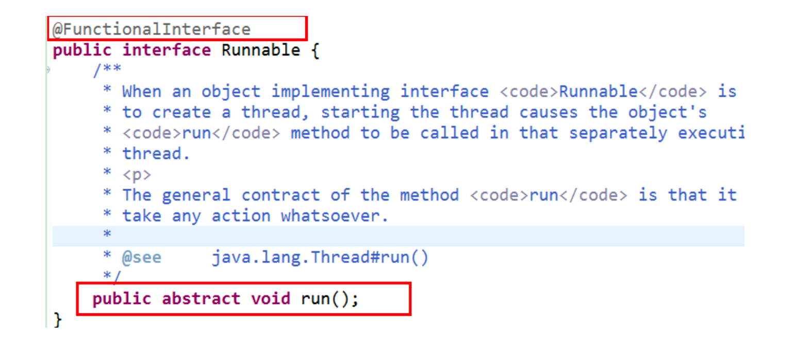

# Functional

## **函数式(Functional)接口**

1. 只包含一个抽象方法的接口，称为**函数式接口**。
2. 你可以通过 Lambda 表达式来创建该接口的对象。（若 Lambda 表达式抛出一个受检异常(即：非运行时异常)，那么该异常需要在目标接口的抽象方法上进行声明）。
3. 我们可以在一个接口上使用 **@FunctionalInterface** 注解，这样做可以检查它是否是一个函数式接口。同时 javadoc 也会包含一条声明，说明这个接口是一个函数式接口。
4. 在java.util.function包下定义了Java 8 的丰富的函数式接口

## 如何理解函数式编程

- Java从诞生日起就是一直倡导“一切皆对象”，在Java里面面向对象(OOP)编程是一切。但是随着python、scala等语言的兴起和新技术的挑战，Java不得不做出调整以便支持更加广泛的技术要求，**也即java不但可以支持OOP还可以支持OOF（面向函数编程）** 
- 在函数式编程语言当中，函数被当做一等公民对待。在将函数作为一等公民的编程语言中，Lambda表达式的类型是函数。但是在Java8中，有所不同。在Java8中，Lambda表达式是对象，而不是函数，它们必须依附于一类特别的对象类型——函数式接口。
- 简单的说，在Java8中，Lambda表达式就是一个函数式接口的实例。这就是Lambda表达式和函数式接口的关系。也就是说，只要一个对象是函数式接口的实例，那么该对象就可以用Lambda表达式来表示。 
- **所以以前用匿名实现类表示的现在都可以用Lambda表达式来写。**

## 四大核心函数接口

### Comsumer 

Consumer<T> 消费型接口；void accept(T t)

### Supplier

Supplier<T> 供给型接口； T get()

### Function

Function<T> 函数型接口；R apply(T t)

### Predicate

Predicate<T> 断言型接口；boolean test(T t)

## 其他接口

### BiConsumer

 BiConsumer<T, U>；void accept(T t, U u);

### BiPredicate

 BiPredicate<T, U>；boolean test(T t, U u);

### BiFunction

 BiFunction<T, U, R>；R apply(T t, U u)

### BinaryOperator

 BinaryOperator<T> extends BiFunction<T,T,T>；

### UnaryOperator

 UnaryOperator<T> extends Function<T, T> ；

