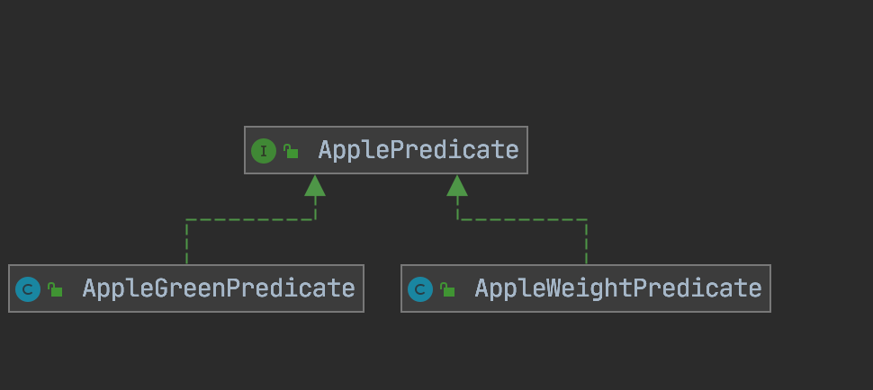
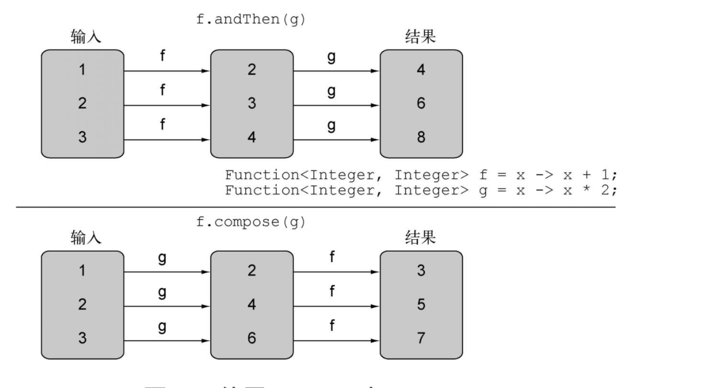

# Lambda

## 行为参数化

**软件工程中一个众所周知的问题就是，不管你做什么，用户的需求肯定会变。**例如：有个应用程序是帮助农民了解自己的库存。这位农民可能想要一个查找库存中所有绿色苹果的功能。但到了第二天，他可能会告诉你：“其实我还想找出所有重量超过150克的苹果。”过了两天，农民又跑回来补充道：“要是我可以找出所有既是绿色，重量也超过150克的苹果，那就太棒了。”你要如何应对这样不断变化的需求？理想的状态下，应该把你的工作量降到最少。此外，类似的新功能实现起来还应该很简单，而且易于长期维护。

**行为参数化就是可以帮助你处理频繁变更的需求的一种软件开发模式。一言以蔽之，它意味着拿出一个代码块，把它准备好却不去执行它。这个代码块以后可以被你程序的其他部分调用，这意味着你可以推迟这块代码的执行。例如，你可以将代码块作为参数传递给另一个方法，稍后再去执行它。这样，这个方法的行为就基于那块代码被参数化了**

### 应对变化需求

初级需求：筛选出绿色的苹果

~~~java
 public List<Apple> filterGreenApples(List<Apple> apples){
        List<Apple>  appleList = new ArrayList<>();
        for (Apple apple : apples) {
            if("green".equals(apple.getColor())){
                appleList.add(apple);
            }
        }
        return appleList;
    }
~~~

中级需求：筛选出别的颜色的苹果

把颜色作为参数

~~~Java 
 public List<Apple> filterColorApples(List<Apple> apples,String color){
        List<Apple>  appleList = new ArrayList<>();
        for (Apple apple : apples) {
            if(color.equals(apple.getColor())){
                appleList.add(apple);
            }
        }
        return appleList;
    }
~~~

高级需求：筛选各个颜色重的苹果

~~~java 
public List<Apple> filterApples(List<Apple> apples,String color,double weight){
        List<Apple>  appleList = new ArrayList<>();
        for (Apple apple : apples) {
            if(color.equals(apple.getColor())){
                if(weight > 150){
                    appleList.add(apple);
                }
            }
        }
        return appleList;
    }
~~~

过几天终极需求：既可以筛选各个颜色重的苹果也可以筛选各个颜色轻的苹果

~~~java
 public List<Apple> filterApples(List<Apple> apples,String color,double weight,boolean flag){
        List<Apple>  appleList = new ArrayList<>();
        for (Apple apple : apples) {
            if(color.equals(apple.getColor())){
                if(flag){
                    if(weight > 150){
                        appleList.add(apple);
                    }
                }else {
                    if(weight <= 150){
                        appleList.add(apple);
                    } 
                }
            }
        }
        return appleList;
    }
~~~

代码开始臃肿了。。。。

### 行为函数化

定义一个接口来对选择标准建模：

~~~java
public interface ApplePredicate {
    Boolean test(Apple apple);
}
~~~

筛选重的苹果AppleWeightPredicate

```java 
public class AppleWeightPredicate implements ApplePredicate {
    @Override
    public Boolean test(Apple apple) {
        return apple.getWeight() > 150;
    }
}
```

筛选绿色的苹果AppleGreenPredicate

```java 
public class AppleGreenPredicate implements ApplePredicate {
    @Override
    public Boolean test(Apple apple) {
        return "green".equals(apple.getColor());
    }
}
```



**可以把这些标准看作filter方法的不同行为。你刚做的这些和“策略设计模式”相关，它让你定义一族算法，把它们封装起来（称为“策略”），然后在运行时选择一个算法。在这里，算法族就是ApplePredicate，不同的策略就是AppleWeightPredicate和AppleGreenPredicate**。

筛选方法修改为

~~~java
public List<Apple> filterApples(List<Apple> apples, ApplePredicate applePredicate){
        List<Apple>  appleList = new ArrayList<>();
        for (Apple apple : apples) {
            if(applePredicate.test(apple)){
                appleList.add(apple);
            }
        }
        return appleList;
    }
~~~

现在：**filterApples方法的行为取决于你通过ApplePredicate对象传递的代码。换句话说，你把filterApples方法的行为参数化了**

### 匿名类

通过上面的行为参数化，为我们必须去通过创建一个类去实现AppleWeightPredicate接口的test方法。当不断去创建实例类不够简洁时，就可以使用匿名类。

~~~java 
List<Apple> redApples = filterApples(apples, new ApplePredicate() {
            @Override
            public Boolean test(Apple apple) {
                return "red".equals(apple.color);
            }
        });
~~~

但是匿名类不够简洁：1.有点笨重 2.有时觉得会觉得它用起来很让人费解。

> 猜测匿名类输出情况
>
> ~~~java
> public class MeaningOfThis {
> 
>     private static final int value = 5;
> 
>     public void doIt(){
>         int value = 6;
>         new Thread(new Runnable() {
>             public final int value= 7;
>             @Override
>             public void run() {
>                 System.out.println(this.value);
>             }
>         }).start();
> 
>     }
> 
>     public static void main(String[] args) {
>         MeaningOfThis meaningOfThis = new MeaningOfThis();
>         meaningOfThis.doIt();
>     }
> }
> ~~~
>
> 结果是7；里面的this指的当前Runnable。

### Lambda表达式

~~~java
 List<Apple> redApples = filterApples(apples, apple -> "red".equals(apple.color));
~~~

## Lambda表达式

**帮助你很简洁地表示一个行为或者传递代码**

### 语法

参数列表 -> lambda主体

1. 表达式-风格

   ~~~java
   （parameters）-> expression
   ~~~

2. 块-风格

   ~~~java
   （parameters）-> {expression;}
   ~~~

### 函数式接口

**可以在函数式接口上使用Lambda表达式。而函数式接口就是只定义一个抽象方法的接口**

1. Predicate

   java.util.function.Predicate<T>接口定义了一个名叫test的抽象方法，它接受泛型T对象，并返回一个boolean。在你需要表示一个涉及类型T的布尔表达式时，就可以使用这个接口。

2. Consumer

   java.util.function.Consumer<T>接口定义了一个名叫accept的抽象方法，它接受泛型T的对象，没有返回（void）。你如果需要访问类型T的对象，并对其执行某些操作，就可以使用这个接口。

3. Function

   java.util.function.Function<T, R>接口定义了一个叫作apply的抽象方法，它接受泛型T的对象，并返回一个泛型R的对象。

4. 基本类型特化：避免装箱和拆箱操作，针对专门的输入参数类型的函数式接口的名称都要加上对应的基本类型前缀：比如DoublePredicate、IntConsumer、LongBinaryOperator、IntFunction等。Function接口还有针对输出参数类型的变种：ToIntFunction<T>、IntToDoubleFunction等。

5. 自定义函数式接口

### 分格

1. 无参，无返回值

   ~~~Java
    Runnable r1 = new Runnable() {
               @Override
               public void run() {
                   System.out.println("我爱北京天安门");
               }
           }; 
   
   Runnable r2 = () -> {
               System.out.println("我爱北京故宫");
           };
   ~~~

2. 需要一个参数，但是没有返回值

   ~~~Java
   Consumer<String> con = new Consumer<String>() {
               @Override
               public void accept(String s) {
                   System.out.println(s);
               }
           };
    con.accept("谎言和誓言的区别是什么？");
   
    Consumer<String> con1 = (String s) -> {
               System.out.println(s);
           };
    con1.accept("一个是听得人当真了，一个是说的人当真了");
   
   ~~~

3. 数据类型可以省略，因为可由编译器推断得出，称为“类型推断

   ~~~Java
    Consumer<String> con1 = (String s) -> {
               System.out.println(s);
           };
   con1.accept("一个是听得人当真了，一个是说的人当真了");
   
   
   Consumer<String> con2 = (s) -> {
               System.out.println(s);
           };
   con2.accept("一个是听得人当真了，一个是说的人当真了");
   ~~~

4. 若只需要一个参数时，参数的小括号可以省略

   ~~~java
    Consumer<String> con1 = (s) -> {
               System.out.println(s);
           };
    con1.accept("一个是听得人当真了，一个是说的人当真了");
   
    Consumer<String> con2 = s -> {
               System.out.println(s);
           };
   con2.accept("一个是听得人当真了，一个是说的人当真了");
   ~~~

5.  需要两个或以上的参数，多条执行语句，并且可以有返回值

   ~~~java
     Comparator<Integer> com1 = new Comparator<Integer>() {
               @Override
               public int compare(Integer o1, Integer o2) {
                   System.out.println(o1);
                   System.out.println(o2);
                   return o1.compareTo(o2);
               }
           };
   
   System.out.println(com1.compare(12,21));
   
   Comparator<Integer> com2 = (o1,o2) -> {
               System.out.println(o1);
               System.out.println(o2);
               return o1.compareTo(o2);
           };
   
   System.out.println(com2.compare(12,6));
   ~~~

6.  当 Lambda 体只有一条语句时，return 与大括号若有，都可以省略

   ~~~java
   Comparator<Integer> com1 = (o1,o2) -> {
               return o1.compareTo(o2);
           };
   System.out.println(com1.compare(12,6));
        
   Comparator<Integer> com2 = (o1,o2) -> o1.compareTo(o2);
   System.out.println(com2.compare(12,21));
   ~~~


### 局部变量

Lambda表达式也允许使用自由变量（不是参数，而是在外层作用域中定义的变量），就像匿名类一样。它们被称作捕获Lambda。

L**ambda可以没有限制地捕获（也就是在其主体中引用）实例变量和静态变量。但局部变量必须显式声明为final，或事实上是final。换句话说，Lambda表达式只能捕获指派给它们的局部变量一次。**

## 复合使用

### 比较器复合

 Comparator接口存在 逆序方法reversed() 和 比较器链thenComparing()

~~~java 
List<Employee> employees = EmployeeData.getEmployees();
// 以员工的工资排序
Comparator<Employee> comparator = Comparator.comparing(Employee::getSalary);
employees.sort(comparator);
employees.stream().forEach(System.out::println);
// 逆序排序
employees.sort(comparator.reversed());
employees.stream().forEach(System.out::println);
// 出现工资一样的以名称排序
employees.sort(comparator.reversed().thenComparing(Employee::getName));
employees.stream().forEach(System.out::println);
~~~

### 谓词复合

Predicate接口and、or和negate

and和or方法是按照在表达式链中的位置，从左向右确定优先级的。因此，a.or(b).and(c)可以看作(a || b) && c。同样，a.and(b).or(c) 可以看作(a && b) || c。

~~~Java
Predicate<Employee> predicate = employee -> employee.getSalary() > 30000;

// &&
Predicate<Employee> and = predicate.and(employee -> employee.getId() == 2222);

// ||
Predicate<Employee> or = predicate.or(employee -> employee.getSalary() < 100);

// 非
Predicate<Employee> negate = predicate.negate();
~~~

### 函数复合

 Function接口andThen和compose方法



~~~java
public class Letter {

    public static String addHeader(String text){
        System.out.println("addHeader:" +System.nanoTime());
        return "header"+text;
    }

    public static String addFooter(String text){
        System.out.println("addFooter:"+System.nanoTime());
        return "Footer"+text;
    }

    public static String check(String text){
        System.out.println("check:"+System.nanoTime());
        return text.replace("aaa","ccc");
    }


    public static void main(String[] args) {
        Function<String,String> function = Letter::addHeader;
        Function<String, String> function1 = function.andThen(Letter::addFooter).andThen(Letter::check);
        System.out.println(function1.apply("aaaabbbbaaa"));

        Function<String, String> function2 = function.compose(Letter::addFooter).compose(Letter::check);
        System.out.println(function2.apply("aaaabbbbaaa"));

    }
}
~~~

