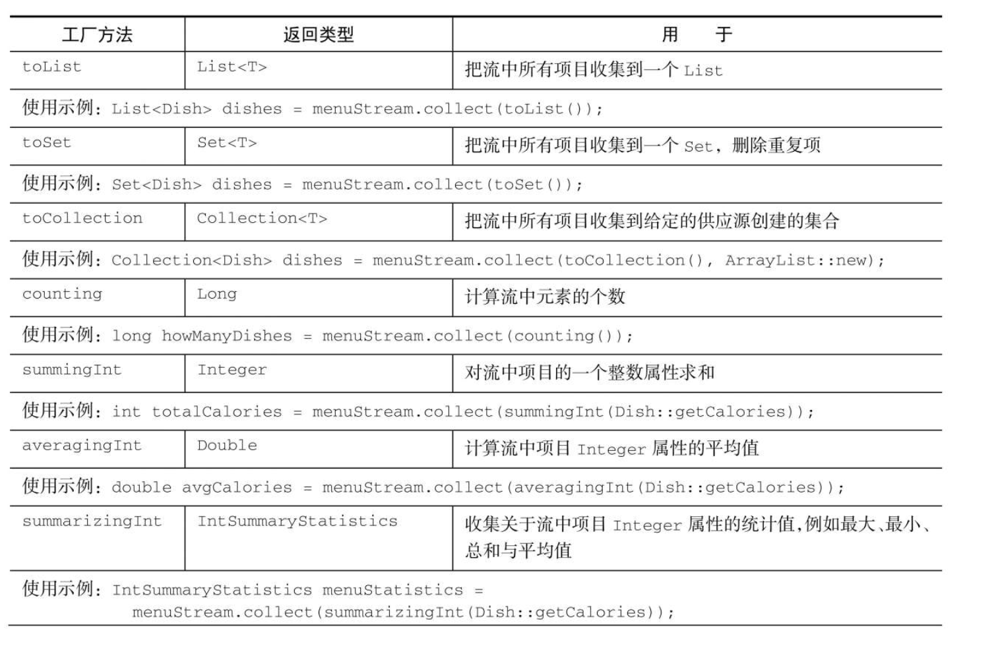
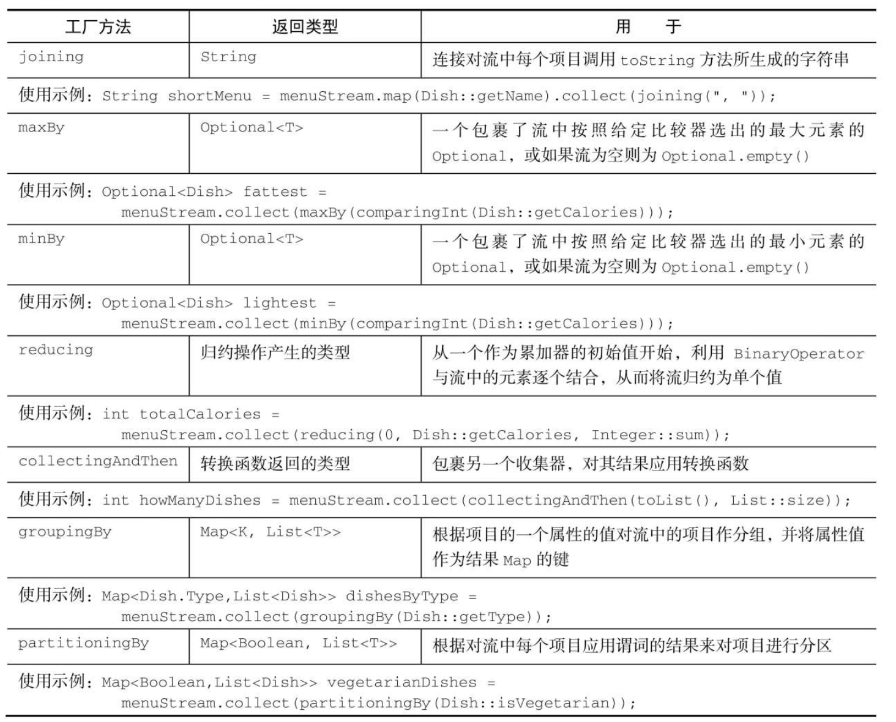

# Stream

**遍历数据集的高级迭代器**。使用StreamApi让代码：

1. 声明式：更简洁，更易读；
2. 可复合：更灵活；
3. 可并行：性能更好；

## 使用流

流的使用一般包括三件事：

1. 一个数据源（如集合）来执行一个查询；
2. 一个中间操作链，形成一条流的流水线；
3. 一个终端操作，执行流水线，并能生成结果；

## 流操作

### 创建操作

#### 创建流

- 集合

  ~~~java
  List<Employee> employees = EmployeeData.getEmployees();
  //        default Stream<E> stream() : 返回一个顺序流
  Stream<Employee> stream = employees.stream();
  //        default Stream<E> parallelStream() : 返回一个并行流
  Stream<Employee> parallelStream = employees.parallelStream();
  ~~~

- 数组

  ~~~java
   int[] arr = new int[]{1,2,3,4,5,6}; 
  //调用Arrays类的static <T> Stream<T> stream(T[] array): 返回一个流
   IntStream stream = Arrays.stream(arr);
  ~~~

- stream的of()

  ~~~java
  Stream<Integer> stream = Stream.of(1, 2, 3, 4, 5, 6);
  ~~~

- 文件流

  Java中用于处理文件等I/O操作的NIO API（非阻塞I/O）已更新，以便利用StreamAPI。java.nio.file.Files中的很多静态方法都会返回一个流。例如，一个很有用的方法是Files.lines，它会返回一个由指定文件中的各行构成的字符串流。

  Files.lines得到一个流，其中的每个元素都是给定文件中的一行

  ~~~Java
  Stream<String> lines = Files.lines(Paths.get("/comprehensive-code/aaaa.txt")
  ~~~

- 无限流

  - 迭代 Stream.iterate

    ~~~java
     Stream.iterate(0,n -> n+2).limit(5).forEach(System.out::println);
    ~~~

  - 生成 Stream.generate

    ~~~java
     Stream.generate(Math::random).limit(10).forEach(System.out::println);
    ~~~

  - 由iterate和generate产生的流会用给定的函数按需创建值，因此可以无穷无尽地计算下去！一般来说，应该使用limit(n)来对这种流加以限制，以避免打印无穷多个值。

### 中间操作

**可以连接起来的流操作**。

#### 筛选

- filter过滤操作

- distinct去重操作

  ~~~java
  List<Employee> list = EmployeeData.getEmployees();
  //        filter(Predicate p)——接收 Lambda ， 从流中排除某些元素。
  Stream<Employee> stream = list.stream();
  //练习：查询员工表中薪资大于7000的员工信息
  stream.filter(e -> e.getSalary() > 7000).forEach(System.out::println);
  ~~~

#### 切片

- limit

  ~~~java
  //        limit(n)——截断流，使其元素不超过给定数量。
  list.stream().limit(3).forEach(System.out::println);
  ~~~

- skip

  ~~~java
  //        skip(n) —— 跳过元素，返回一个扔掉了前 n 个元素的流。若流中元素不足 n 个，则返回一个空流。与 limit(n) 互补
  list.stream().skip(3).forEach(System.out::println);
  ~~~

- takeWhile（Java 9方法）遭遇第一个不符合要求的元素时停止处理

- dropWhile（Java 9方法）遭遇第一个符合要求的元素时停止处理

#### 映射

- map

  ~~~java
  //        map(Function f)——接收一个函数作为参数，将元素转换成其他形式或提取信息，该函数会被应用到每个元素上，并将其映射成一个新的元素。
  List<String> list = Arrays.asList("aa", "bb", "cc", "dd");
  list.stream().map(str -> str.toUpperCase()).forEach(System.out::println);
  ~~~

- flatmap

  ~~~java
  //        flatMap(Function f)——接收一个函数作为参数，将流中的每个值都换成另一个流，然后把所有流连接成一个流。
  Stream<String> stringStream = Stream.of("aaaaa", "vvvvv", "dddddd", "avd");
  List<String> collect = stringStream
          .map(string -> string.split(""))
          .flatMap(Arrays::stream).collect(Collectors.toList());
  System.out.println(collect);
  ~~~

#### 排序

- sorted

  ~~~java
  //        sorted()——自然排序
  List<Integer> list = Arrays.asList(12, 43, 65, 34, 87, 0, -98, 7);
  list.stream().sorted().forEach(System.out::println);
  //        sorted(Comparator com)——定制排序
  
  List<Employee> employees = EmployeeData.getEmployees();
  employees.stream().sorted( (e1,e2) -> {
  
   int ageValue = Integer.compare(e1.getAge(),e2.getAge());
   if(ageValue != 0){
       return ageValue;
   }else{
       return -Double.compare(e1.getSalary(),e2.getSalary());
   }
  
  }).forEach(System.out::println);
  ~~~

  

### 终止操作

**关闭流的操作**。

#### 查找

- findAny

  ~~~java
  //        findFirst——返回第一个元素
  Optional<Employee> employee = employees.stream().findFirst();
  ~~~

- findFirst

  ~~~java
  //        findAny——返回当前流中的任意元素
  Optional<Employee> employee1 = employees.parallelStream().findAny();
  ~~~

#### 匹配

- anyMatch

  ~~~java
  //         anyMatch(Predicate p)——检查是否至少匹配一个元素。
  //         练习：是否存在员工的工资大于 10000
  boolean anyMatch = employees.stream().anyMatch(e -> e.getSalary() > 10000);
  ~~~

- allMatch

  ~~~java
  //        allMatch(Predicate p)——检查是否匹配所有元素。
  //          练习：是否所有的员工的年龄都大于18
  boolean allMatch = employees.stream().allMatch(e -> e.getAge() > 18);
  ~~~

- noneMatch

  ~~~java
  //          noneMatch(Predicate p)——检查是否没有匹配的元素。
  //          练习：是否存在员工姓“雷”
  boolean noneMatch = employees.stream().noneMatch(e -> e.getName().startsWith("雷"));
  ~~~

#### 求和 最大和最小值

-  count

  ~~~java
  // count——返回流中元素的总个数
  long count = employees.stream().filter(e -> e.getSalary() > 5000).count();
  ~~~

-  max min

  ~~~java
  //        max(Comparator c)——返回流中最大值
  //        练习：返回最高的工资：
  Stream<Double> salaryStream = employees.stream().map(e -> e.getSalary());
  Optional<Double> maxSalary = salaryStream.max(Double::compare);
  System.out.println(maxSalary);
  //        min(Comparator c)——返回流中最小值
  //        练习：返回最低工资的员工
  Optional<Employee> employee = employees.stream().min((e1, e2) -> Double.compare(e1.getSalary(), e2.getSalary()));
  System.out.println(employee);
  ~~~

#### 归约

- redue

  ~~~java
  //        reduce(T identity, BinaryOperator)——可以将流中元素反复结合起来，得到一个值。返回 T
  //        练习1：计算1-10的自然数的和
  List<Integer> list = Arrays.asList(1,2,3,4,5,6,7,8,9,10);
  Integer sum = list.stream().reduce(0, Integer::sum);
  System.out.println(sum);
  
  
  //        reduce(BinaryOperator) ——可以将流中元素反复结合起来，得到一个值。返回 Optional<T>
  //        练习2：计算公司所有员工工资的总和
  List<Employee> employees = EmployeeData.getEmployees();
  Stream<Double> salaryStream = employees.stream().map(Employee::getSalary);
  Optional<Double> sumMoney = salaryStream.reduce(Double::sum);
  // Optional<Double> sumMoney = salaryStream.reduce((d1,d2) -> d1 + d2);
  System.out.println(sumMoney.get());
  ~~~

#### 收集

collect方法，主要使用收集器[Collector](https://juejin.im/post/6868792036221419534)

### 数值流

减少装箱拆箱操作，Stream API还提供了原始类型流特化，专门支持处理数值流的方法。IntStream、DoubleStream和LongStream

- 映射到数值流

  - mapToInt
  - mapToDouble
  - mapToLong

- 转换回对象流

  - boxed

- 默认值OptionalInt

  ~~~java
  Stream<Integer> integerStream = Stream.of(1, 2, 3, 4, 5, 6);
  OptionalInt max = integerStream.mapToInt(Integer::intValue).max();
  System.out.println(max.orElse(1));
  ~~~

### Collectors

**Collector接口中方法的实现决定了如何对流执行归约操作。但Collectors实用类提供了很多静态工厂方法，可以方便地创建常见收集器的实例，只要拿来用就可以了。**

#### 归约操作

- Collectors.counting

  ~~~java
  // 集合个数
  Long collect = employees.stream().collect(Collectors.counting());
  System.out.println(collect);
  System.out.println(employees.stream().count());
  ~~~

- Collectors.maxBy 和 Collectors.minBy

  ~~~java
  //最大最小值
  Optional<Employee> collect1 = employees.stream()
    .collect(Collectors.maxBy(Comparator.comparingDouble(Employee::getSalary)));
  System.out.println(collect1.get());
  Optional<Employee> collect2 = employees.stream()
    .collect(Collectors.minBy(Comparator.comparingDouble(Employee::getSalary)));
  System.out.println(collect2.get());
  ~~~

- Collectors.summingInt

  ~~~java
  // 汇总
    Integer collect3 = employees.stream().collect(Collectors.summingInt(Employee::getId));
    System.out.println(collect3);
  ~~~

  Collectors.summingLong和Collectors.summingDouble方法的作用完全一样，可以用于求和字段为long或double的情况。

  > Collectors.averagingInt，连同对应的averagingLong和averagingDouble可以计算数值的平均数；
  >
  > summarizingInt，summarizingLong和summarizingDouble可以计算总和、平均值、最大值和最小值；得到IntSummaryStatistics，LongSummaryStatistics和DoubleSummaryStatistics

- Collectors.joining

  joining工厂方法返回的收集器会把对流中每一个对象应用toString方法得到的所有字符串连接成一个字符串。

  ~~~java
  // 2个重载版本
  List<Employee> employees = EmployeeData.getEmployees();
  String collect = employees.stream().map(Employee::getName)
    .collect(Collectors.joining());
  System.out.println(collect);
  // 添加分隔符
  String collect1 = employees.stream().map(Employee::getName).collect(Collectors.joining("，"));
  System.out.println(collect1);
  // 添加分隔符，开头 结尾 
  String collect2 = employees.stream().map(Employee::getName)
    .collect(Collectors.joining(",", "开头", "结尾"));
  System.out.println(collect2);
  ~~~

- Collectors.reducing

  需要三个参数：

  1.第一个参数是归约操作的起始值，也是流中没有元素时的返回值，所以很显然对于数值和而言0是一个合适的值。

  2.转换函数

  3.是一个BinaryOperator，将两个项目累积成一个同类型的值

  ~~~java
  List<Employee> employees = EmployeeData.getEmployees();
    Integer collect = employees.stream().collect(Collectors.reducing(0, Employee::getId, (a, b) -> a + b));
    System.out.println(collect);
  Optional<Employee> collect3 = employees.stream()
    .collect(Collectors.reducing((a, b) -> a.getSalary() > b.getSalary() ? a : b));
  System.out.println(collect3);
  
  Optional<Integer> collect1 = Stream.of(1, 2, 3, 4, 5).collect(Collectors.reducing((a, b) -> a + b));
  System.out.println(collect1.get());
  Integer collect2 = Stream.of(1, 2, 3, 4, 5).collect(Collectors.reducing(10, (a, b) -> a + b));
  System.out.println(collect2);
  ~~~

#### 分组

Collectors.groupingBy。

~~~java
List<Employee> employees = EmployeeData.getEmployees();
// 按工资分组
Map<Double, List<Employee>> collect = employees.stream()
  .collect(Collectors.groupingBy(Employee::getSalary));
System.out.println(collect);
~~~

~~~Java
Map<String, List<Employee>> collect1 = employees.stream().collect(Collectors.groupingBy(employee -> {
            if (employee.getSalary() > 9000) {
                return "gao";
            } else if (employee.getSalary() > 500) {
                return "zhong";
            } else {
                return "di";
            }
        }));
System.out.println(collect1);
~~~

##### 操作分组的元素

Collectors类重载了工厂方法groupingBy，除了常见的分类函数，它的第二变量也接受一个Collector类型的参数。

~~~java
Map<Double, List<String>> collect2 = employees.stream()
.collect(Collectors.groupingBy(Employee::getSalary, Collectors.mapping(Employee::getName, Collectors.toList())));
System.out.println(collect2);
~~~

Collectors类通过mapping方法提供了另一个Collector函数，它接受一个映射函数和另一个Collector函数作为参数。作为参数的Collector会收集对每个元素执行该映射函数的运行结果。

有三个参数重载版本，多增加一个map生成工厂

~~~java
 HashMap<Double, List<Integer>> collect3 = employees.stream()
   .collect(Collectors.groupingBy(Employee::getSalary, HashMap::new, Collectors
                                  .mapping(Employee::getAge, Collectors.toList())));
~~~

##### 多级分组

要实现多级分组，可以使用一个由双参数版本的Collectors.groupingBy工厂方法创建的收集器，它除了普通的分类函数之外，还可以接受collector类型的第二个参数。那么要进行二级分组的话，可以把一个内层groupingBy传递给外层groupingBy，并定义一个为流中项目分类的二级标准。

~~~java
 // 多级分组
Map<Double, Map<Integer, List<Employee>>> collect4 = employees.stream().collect
(Collectors.groupingBy(Employee::getSalary,Collectors.groupingBy(Employee::getAge)));
~~~

##### 按子组收集数据

- 把收集器的结果转换为另一种类型

  ~~~java
  Map<Double, Optional<Employee>> collect5 = employees.stream().
     collect(Collectors.groupingBy(Employee::getSalary, Collectors.maxBy(Comparator.comparing(Employee::getName))));
  
  // 把收集器的结果转换为另一种类型
  Map<Double, Employee> collect6 = employees.stream().
    collect(Collectors.groupingBy(Employee::getSalary, Collectors.collectingAndThen(Collectors.maxBy(Comparator.comparingInt(Employee::getId)), Optional::get)));   
  ~~~

- 与groupingBy联合使用的其他收集器

  ~~~java
   Map<Double, Set<String>> collect7 = employees.stream().collect(
     Collectors.groupingBy(Employee::getSalary, Collectors.mapping(Employee::getName, Collectors.toSet()))); 
  ~~~

  > 联合使用其他的收集器，可以产生各种类型数据。继续摸索使用中

#### 分区

分区函数返回一个布尔值，这意味着得到的分组Map的键类型是Boolean，于是它最多可以分为两组——true是一组，false是一组。

~~~java
 List<Employee> employees = EmployeeData.getEmployees();
 Map<Boolean, List<Employee>> collect = employees.stream()
    .collect(Collectors.partitioningBy(employee -> employee.getSalary() > 1000));
~~~

#### 总结

