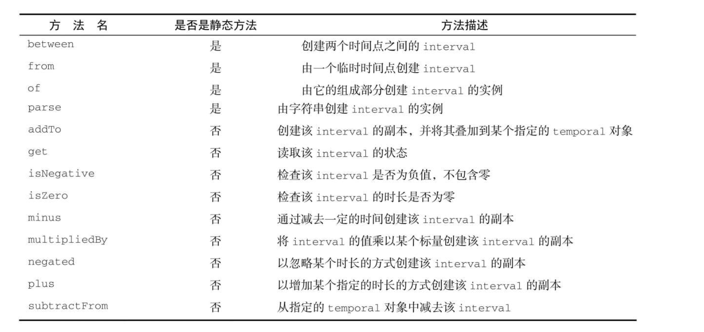
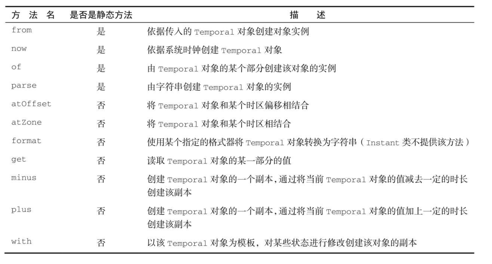
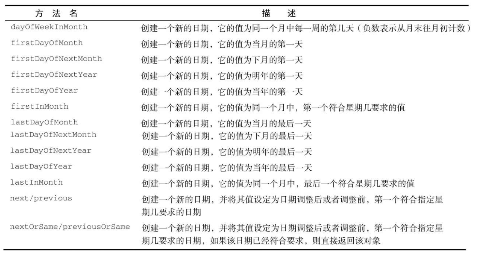

# 新的日期和时间API

新的日期和时间类解决了Date和Calendar类出现的问题

## 浅尝

### LocalDate

日期类

~~~java 
LocalDate of = LocalDate.of(2018, 7, 13);
LocalDate now = LocalDate.now();
int year = now.getYear();
Month month = now.getMonth();
int dayOfMonth = now.getDayOfMonth();
~~~

### LocalTime

时间类

~~~java 
LocalTime of = LocalTime.of(12, 30, 50);
LocalTime now = LocalTime.now();
int hour = now.getHour();
int minute = now.getMinute();
int second = now.getSecond();
~~~

### LocalDateTime

日期时间类

~~~java 
LocalDateTime now = LocalDateTime.now();
LocalDateTime of = LocalDateTime.of(2012, 7, 23, 12, 50, 23);
~~~

### Instant

适用于机器的日期时间类

~~~java
Instant now = Instant.now();
// 3秒之后再加上10亿纳秒 -> 4秒
Instant instant = Instant.ofEpochSecond(3, 1_000_000_000);
Instant instant1 = Instant.ofEpochSecond(4);
System.out.println(instant.getEpochSecond());
System.out.println(instant1.getEpochSecond());
~~~

### Duration和Period

Duration：主要用于以秒和纳秒衡量时间的长短

Period：主要支持年、月或者日的方式对多个时间单位

## 深入

### 修改

1. 直接修改

~~~java 
LocalDate now = LocalDate.now();
LocalDate localDate = now.withYear(2012);
LocalDate localDate1 = now.withMonth(12);
LocalDate localDate2 = now.withDayOfMonth(23);
LocalDate with = now.with(ChronoField.DAY_OF_MONTH, 23);
~~~

2. 间接修改

~~~java
// 加
LocalDate localDate3 = now.plusYears(2);
// 减
LocalDate localDate4 = now.minusYears(2);
now.plus(10, ChronoUnit.YEARS);
now.minus(10,ChronoUnit.YEARS);
~~~

### TemporalAdjuster

将日期调整到下个周日、下个工作日，或者是本月的最后一天。这时，你可以使用重载版本的with方法，向其传递一个提供了更多定制化选择的TemporalAdjuster对象，更加灵活地处理日期。

~~~java
LocalDate now = LocalDate.now();
LocalDate with = now.with(TemporalAdjusters.nextOrSame(DayOfWeek.FRIDAY));
LocalDate with1 = now.with(TemporalAdjusters.lastDayOfMonth());
~~~

### DateTimeFormatter

DateTimeFormatter实例都是线程安全的

~~~java
LocalDate now = LocalDate.now();
String format = now.format(DateTimeFormatter.BASIC_ISO_DATE);
LocalDate parse = LocalDate.parse("20201025", DateTimeFormatter.BASIC_ISO_DATE);
~~~

DateTimeFormatter类支持一个静态工厂方法，它可以按照某个特定的模式创建格式器。

~~~java 
DateTimeFormatter dateTimeFormatter = DateTimeFormatter.ofPattern("dd/MM/YYYY");
// 地区
DateTimeFormatter dateTimeFormatter1 = DateTimeFormatter.ofPattern("dd/MM/YYYY", Locale.CHINESE);
~~~

DateTimeFormatterBuilder类还提供了更复杂的格式器，你可以选择恰当的方法，一步一步地构造自己的格式器

~~~java 
 DateTimeFormatterBuilder dateTimeFormatterBuilder = new DateTimeFormatterBuilder()
                .appendLiteral("该月")
                .appendText(ChronoField.MONTH_OF_YEAR)
                .appendLiteral("的")
                .appendText(ChronoField.DAY_OF_MONTH)
                .appendLiteral("号");
 DateTimeFormatter dateTimeFormatter2 = dateTimeFormatterBuilder.toFormatter();
~~~

### 时区

时区是按照一定的规则将区域划分成的标准时间相同的区间。

~~~java 
//创建一个时区
ZoneId of = ZoneId.of("Asia/Shanghai");
//将一个老的时区对象转换为ZoneId
ZoneId zoneId = TimeZone.getDefault().toZoneId();
~~~

~~~java
//localDateTime 和 instant像话转换
LocalDateTime localDateTime = LocalDateTime.of(2012,1,1,1,1,10);
ZoneOffset zoneOffset = ZoneOffset.of("Asia/Shanghai");
Instant instant = localDateTime.toInstant(zoneOffset);
LocalDateTime localDateTime1 = LocalDateTime.ofInstant(instant, of);
~~~

