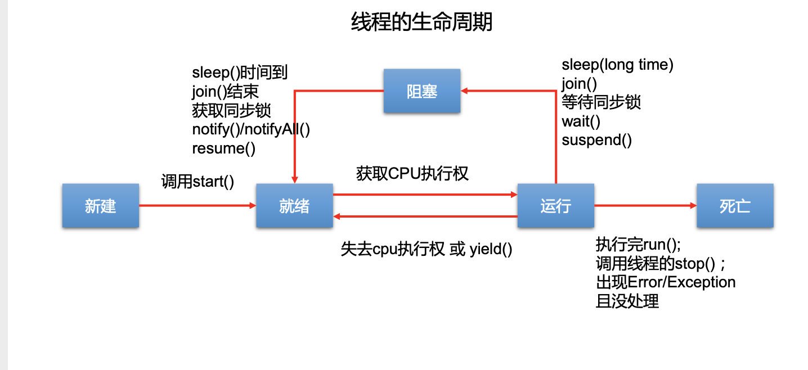
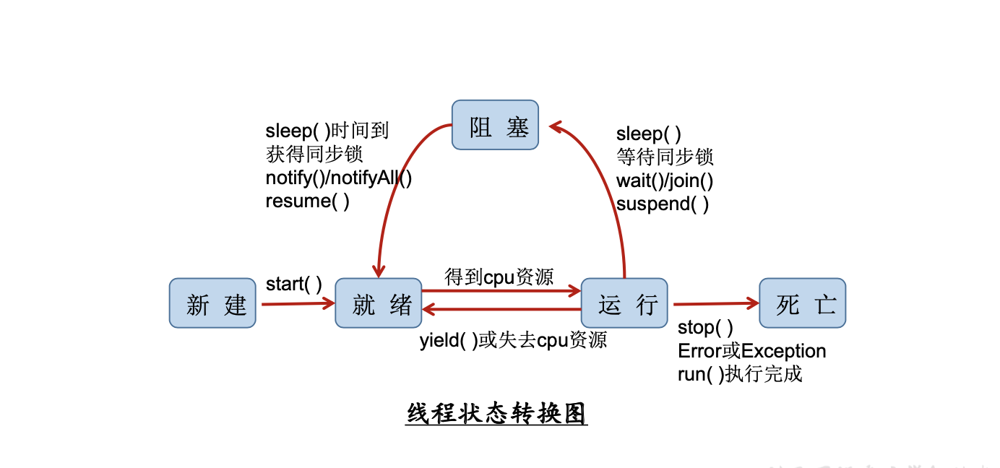

# 多线程

## 基本概念

**程序（program）**：是为完成特定任务、用某种语言编写的一组指令的集合。即指一段静态的代码，静态对象。

**进程（process）**：是程序的一次执行过程，或者是**正在运行的一个程序**；是一个动态的过程:有它自身的产生、存在和消亡的过程。——生命周期

> 程序是静态的，进程是动态的
>
> **进程作为资源分配的单位**，系统在运行时会为每个进程分配不同的内存区域

**线程（thread）**：进程可进一步细化为线程，是一个程序内部的一条执行路径。

- 若一个进程同一时间并行执行多个线程，就是支持多线程的
- 线程作为调度和执行的单位，每个线程拥有独立的运行栈和程序计数器(pc)，线程切换的开销小
- 一个进程中的多个线程共享相同的内存单元/内存地址空间它们从同一堆中分配对象，可以访问相同的变量和对象。这就使得线程间通信更简便、高效。但多个线程操作共享的系统资 源可能就会带来安全的隐患。

**单核CPU和多核CPU的理解**

- 单核CPU，其实是一种假的多线程，因为在一个时间单元内，也只能执行一个线程 的任务。例如:虽然有多车道，但是收费站只有一个工作人员在收费，只有收了费 才能通过，那么CPU就好比收费人员。如果有某个人不想交钱，那么收费人员可以 把他“挂起”(晾着他，等他想通了，准备好了钱，再去收费)。但是因为CPU时 间单元特别短，因此感觉不出来。
- 如果是多核的话，才能更好的发挥多线程的效率。(现在的服务器都是多核的)
- 一个Java应用程序java.exe，其实至少有三个线程:main()主线程，gc()垃圾回收线程，异常处理线程。当然如果发生异常，会影响主线程。

**并行与并发**

1. 并行:多个CPU同时执行多个任务。比如:多个人同时做不同的事。
2. 并发:一个CPU(采用时间片)同时执行多个任务。比如:秒杀、多个人做同一件事。

## 线程

以单核CPU为例，只使用单个线程先后完成多个任务(调用多个方 法)，肯定比用多个线程来完成用的时间更短，为何仍需多线程呢?

### 多线程程序的优点

1. 提高应用程序的响应。对图形化界面更有意义，可增强用户的体验
2. 提高计算机系统cpu的利用率
3. 改善程序结构。将既长又复杂的进程分为多个线程，独立运行，利于理解和修改。

### 线程的创建

Java语言的JVM允许程序运行多个线程，它通过java.lang.Thread 类来体现。

#### Thread类的特性：

​		每个线程都是通过某个特定thrad对象的run()方法来完成操作的，经常把run方法的主体成为线程体。

​	 	通过Thread对象的start方法来启动这个线程，而非直接调用run()。

#### 构造器

1. Thread():创建新的Thread对象
2. Thread(String threadname):创建线程并指定线程实例名
3. Thread(Runnable target):指定创建线程的目标对象，它实现了Runnable接 口中的run方法
4. Thread(Runnable target, String name):创建新的Thread对象

#### 创建线程的方法

##### 继承Thread类的方式

1. 定义子类继承Thread类。
2. 子类中重写Thread类中的run方法。
3. 创建Thread子类对象，即创建了线程对象。
4. 调用线程对象start方法:启动线程，调用run方法。

~~~java
/**
 *  JDK1.5之前创建新执行线程有两种方法:
 *   继承Thread类的方式
 *   实现Runnable接口的方式
 */
public class ThreadTest1 {

    public static void main(String[] args) {
        MyThread myThread = new MyThread();
        myThread.start();
        System.out.println(" main ............");
    }

}

/**
 *
 * 继承Thread类创建创建线程
 *
 * 1.定义子类继承Thread类。
 * 2.子类中重写Thread类中的run方法。
 * 3.创建Thread子类对象，即创建了线程对象。
 * 4.调用线程对象start方法:启动线程，调用run方法。
 */
class MyThread extends Thread{
    @Override
    public void run(){
        System.out.println(" mythread .........");
    }
}
~~~

> 1. 如果自己手动调用run()方法，那么就只是普通方法，没有启动多线程模式。
> 2. run()方法由JVM调用，什么时候调用，执行的过程控制都有操作系统的CPU调度决定。
> 3. 想要启动多线程，必须调用start方法。
> 4. 一个线程对象只能调用一次start()方法启动，如果重复调用了，则将抛出以上 的异常“IllegalThreadStateException”。

##### 实现Runnable接口

1. 定义子类，实现Runnable接口。
2. 子类中重写Runnable接口中的run方法。
3. 通过Thread类含参构造器创建线程对象。
4. 将Runnable接口的子类对象作为实际参数传递给Thread类的构造器中。
5. 调用Thread类的start方法:开启线程，调用Runnable子类接口的run方法。

~~~java 
/**
 *实现Runnable接口
 *
 */
public class ThreadTest2 {

    public static void main(String[] args) {
        Thread thread = new Thread(new MyThread());
        thread.start();
        System.out.println(" main ............");
    }

}

/**
 * 1. 定义子类，实现Runnable接口。
 * 2. 子类中重写Runnable接口中的run方法。
 * 3. 通过Thread类含参构造器创建线程对象。
 * 4. 将Runnable接口的子类对象作为实际参数传递给Thread类的构造器中。
 * 5. 调用Thread类的start方法:开启线程，调用Runnable子类接口的run方法。
 */
 class MyThread2 implements Runnable{

    @Override
    public void run() {
        System.out.println("MyThread2 ............... ");
    }
}
~~~

##### 实现Callable接口

与使用Runnable相比， Callable功能更强大些

- 相比run()方法，可以有返回值
-  方法可以抛出异常
- 支持泛型的返回值
- 需要借助FutureTask类，比如获取返回结果

~~~java 
/**
 * 创建线程的1.5 新增的方法
 * 1.创建一个实现Callable的实现类
 * 2.实现call方法，将此线程需要执行的操作声明在call()中
 * 3.创建Callable接口实现类的对象
 * 4.将此Callable接口实现类的对象作为传递到FutureTask构造器中，创建FutureTask的对象
 * 5.将FutureTask的对象作为参数传递到Thread类的构造器中，创建Thread对象，并调用start()
 * 6.获取Callable中call方法的返回值
 * 
 */
public class CallThreadTest {

    public static void main(String[] args) {
        MyCallThread myCallThread = new MyCallThread();
        FutureTask futureTask = new FutureTask(myCallThread);
        new Thread(futureTask).start();
        try {
            //get()返回值即为FutureTask构造器参数Callable实现类重写的call()的返回值。
            Object sum = futureTask.get();
            System.out.println("总和为：" + sum);
        } catch (InterruptedException e) {
            e.printStackTrace();
        } catch (ExecutionException e) {
            e.printStackTrace();
        }
    }

}

class MyCallThread implements Callable{

    @Override
    public Object call() throws Exception {
        int sum = 0;
        for (int i = 1; i <= 100; i++) {
            if(i % 2 == 0){
                System.out.println(i);
                sum += i;
            }
        }
        return sum;
    }
}
~~~

###### Future接口

- 可以对具体Runnable、Callable任务的执行结果进行取消、查询是 否完成、获取结果等
- FutrueTask是Futrue接口的唯一的实现类
- utureTask 同时实现了Runnable, Future接口。它既可以作为Runnable被线程执行，又可以作为Future得到Callable的返回值

#### 使用线程池

- 背景:经常创建和销毁、使用量特别大的资源，比如并发情况下的线程， 对性能影响很大。
-  思路:提前创建好多个线程，放入线程池中，使用时直接获取，使用完 放回池中。可以避免频繁创建销毁、实现重复利用。类似生活中的公共交通工具。
- 好处:
  - 提高响应速度(减少了创建新线程的时间)
  - 降低资源消耗(重复利用线程池中线程，不需要每次都创建)
  - 便于线程管理（ corePoolSize:核心池的大小、maximumPoolSize:最大线程数、keepAliveTime:线程没有任务时最多保持多长时间后会终止...）
- JDK 5.0起提供了线程池相关API:ExecutorService 和 Executors
- ExecutorService:真正的线程池接口。常见子类ThreadPoolExecutor
  - void execute(Runnable command) :执行任务/命令，没有返回值，一般用来执行 Runnable
  - <T> Future<T> submit(Callable<T> task):执行任务，有返回值，一般又来执行 Callable
  - void shutdown() :关闭连接池
- Executors:工具类、线程池的工厂类，用于创建并返回不同类型的线程池
  - Executors.newCachedThreadPool():创建一个可根据需要创建新线程的线程池
  - Executors.newFixedThreadPool(n); 创建一个可重用固定线程数的线程池
  - Executors.newSingleThreadExecutor() :创建一个只有一个线程的线程池
  - Executors.newScheduledThreadPool(n):创建一个线程池，它可安排在给定延迟后运 行命令或者定期地执行。

~~~java 
/**
 创建线程的方式四：使用线程池
 *
 * 好处：
 * 1.提高响应速度（减少了创建新线程的时间）
 * 2.降低资源消耗（重复利用线程池中线程，不需要每次都创建）
 * 3.便于线程管理
 *      corePoolSize：核心池的大小
 *      maximumPoolSize：最大线程数
 *      keepAliveTime：线程没有任务时最多保持多长时间后会终止
 *
 *
 * 面试题：创建多线程有几种方式？四种！
 */
public class ThreadPool {
    public static void main(String[] args) {
        //1. 提供指定线程数量的线程池
        ExecutorService service = Executors.newFixedThreadPool(10);
        ThreadPoolExecutor service1 = (ThreadPoolExecutor) service;
        //设置线程池的属性
//        System.out.println(service.getClass());
//        service1.setCorePoolSize(15);
//        service1.setKeepAliveTime();

        //2.执行指定的线程的操作。需要提供实现Runnable接口或Callable接口实现类的对象
        service.execute(new NumberThread());//适合适用于Runnable
        service.execute(new NumberThread1());//适合适用于Runnable

//        service.submit(Callable callable);//适合使用于Callable
        //3.关闭连接池
        service.shutdown();
    }

}

class NumberThread implements Runnable{

    @Override
    public void run() {
        for(int i = 0;i <= 100;i++){
            if(i % 2 == 0){
                System.out.println(Thread.currentThread().getName() + ": " + i);
            }
        }
    }
}

class NumberThread1 implements Runnable{

    @Override
    public void run() {
        for(int i = 0;i <= 100;i++){
            if(i % 2 != 0){
                System.out.println(Thread.currentThread().getName() + ": " + i);
            }
        }
    }
}
~~~

#### 创建线程的区别

1. 继承Thread:线程代码存放Thread子类run方法中。

2. 实现Runnable:线程代码存在接口的子类的run方法。

3. 避免了单继承的局限性

4. 多个线程可以共享同一个接口实现类的对象，非常适合多个相同线

   程来处理同一份资源。

> 开发中：优先选择：实现Runnable接口的方式
> 原因：
>
> 1. 实现的方式没有类的单继承性的局限性
>
> 2. 实现的方式更适合来处理多个线程有共享数据的情况。

### Thread类的有关方法

- void start(): 启动线程，并执行对象的run()方法
- run(): 线程在被调度时执行的操作
- String getName(): 返回线程的名称
- void setName(String name):设置该线程名称
- static Thread currentThread(): 返回当前线程。在Thread子类中就 是this，通常用于主线程和Runnable实现类
- static void yield():线程让步 ：暂停当前正在执行的线程，把执行机会让给优先级相同或更高的线程 ；若队列中没有同优先级的线程，忽略此方法
- join() :当某个程序执行流中调用其他线程的 join() 方法时，调用线程将 被阻塞，直到 join() 方法加入的 join 线程执行完为止；低优先级的线程也可以获得执行
- static void sleep(long millis):(指定时间:毫秒):令当前活动线程在指定时间段内放弃对CPU控制,使其他线程有机会被执行,时间到后 重排队。抛出InterruptedException异常
- stop(): 强制线程生命期结束，不推荐使用
- boolean isAlive():返回boolean，判断线程是否还活着

### 线程的调度

#### 调度策略

1. 时间片
2. 抢占式:高优先级的线程抢占CPU

#### Java的调度方法

1. 同优先级线程组成先进先出队列(先到先服务)，使用时间片策略
2. 对高优先级，使用优先调度的抢占式策略

#### 线程的优先级

1. MAX_PRIORITY:10
2. MIN _PRIORITY:1
3. NORM_PRIORITY:5

涉及的方法

1. getPriority() :返回线程优先值
2. setPriority(int newPriority) :改变线程的优先级

#### 说明

- 线程创建时继承父线程的优先级
- 低优先级只是获得调度的概率低，并非一定是在高优先级线程之后才被调用

> Java中的线程分为两类:一种是守护线程，一种是用户线程。
>
> - 它们在几乎每个方面都是相同的，唯一的区别是判断JVM何时离开。
> - 守护线程是用来服务用户线程的，通过在start()方法前调用 thread.setDaemon(true)可以把一个用户线程变成一个守护线程。
> - Java垃圾回收就是一个典型的守护线程。
> - 若JVM中都是守护线程，当前JVM将退出。

### 线程的生命周期

要想实现多线程，必须在主线程中创建新的线程对象。Java语言使用Thread类 及其子类的对象来表示线程，在它的一个完整的生命周期中通常要经历如下的五 种状态:

- 新建： 当一个Thread类或其子类的对象被声明并创建时，新生的线程对象处于新建 状态
- 就绪：处于新建状态的线程被start()后，将进入线程队列等待CPU时间片，此时它已 具备了运行的条件，只是没分配到CPU资源
- 运行：当就绪的线程被调度并获得CPU资源时,便进入运行状态， run()方法定义了线 程的操作和功能
- 阻塞：在某种特殊情况下，被人为挂起或执行输入输出操作时，让出 CPU 并临时中 止自己的执行，进入阻塞状态
- 死亡：线程完成了它的全部工作或线程被提前强制性地中止或出现异常导致结束

线程的转换

### 线程的同步（线程的安全问题）

- 多个线程执行的不确定性引起执行结果的不稳定
- 多个线程对账本的共享，会造成操作的不完整性，会破坏数据。

买票的例子

~~~java
/**
 *
 * 例子：创建三个窗口卖票，总票数为100张.使用继承Thread类的方式
 *
 * 存在线程的安全问题，待解决。
 *
 */
class Window extends Thread{

    private static int ticket = 100;
    @Override
    public void run() {

        while(true){

            if(ticket > 0){
                System.out.println(getName() + "：卖票，票号为：" + ticket);
                ticket--;
            }else{
                break;
            }

        }

    }
}

public class WindowTest {
    public static void main(String[] args) {
        Window t1 = new Window();
        Window t2 = new Window();
        Window t3 = new Window();

        t1.setName("窗口1");
        t2.setName("窗口2");
        t3.setName("窗口3");

        t1.start();
        t2.start();
        t3.start();

    }
}

~~~

#### Synchronized的使用方法

Java对于多线程的安全问题提供了专业的解决方式:同步机制

1. 同步代码块:synchronized (对象){// 需要被同步的代码; }
2. synchronized还可以放在方法声明中，表示整个方法为同步方法。

~~~java
public synchronized void show (String name){ 
  ....
}
~~~

~~~java 
public class SynchronizedTest {
    public static void main(String[] args) {
        //Window2 w = new Window2();
        Window3 w = new Window3();

        Thread t1 = new Thread(w);
        Thread t2 = new Thread(w);
        Thread t3 = new Thread(w);

        t1.setName("窗口1");
        t2.setName("窗口2");
        t3.setName("窗口3");

        t1.start();
        t2.start();
        t3.start();
    }

}

class Window2 extends Thread {

    private int ticket = 100;

    @Override
    public void run() {

        synchronized (this) {
            while (true) {

                if (ticket > 0) {
                    System.out.println(getName() + "：卖票，票号为：" + ticket);
                    ticket--;
                } else {
                    break;
                }

            }
        }

    }
}

class Window3 extends Thread {
    private int ticket = 100;

    @Override
    public synchronized void run() {

        while (true) {

            if (ticket > 0) {
                System.out.println(getName() + "：卖票，票号为：" + ticket);
                ticket--;
            } else {
                break;
            }

        }
    }
}

~~~

##### 同步机制

对于并发工作，你需要某种方式来防 止两个任务访问相同的资源(其实就是共享资源竞争)。 防止这种冲突的方法 就是当资源被一个任务使用时，在其上加锁。第一个访问某项资源的任务必须 锁定这项资源，使其他任务在其被解锁之前，就无法访问它了，而在其被解锁 之时，另一个任务就可以锁定并使用它了。

##### synchronized的锁

- 任意对象都可以作为同步锁。所有对象都自动含有单一的锁(监视器)。

- 同步方法的锁:静态方法(类名.class)、非静态方法(this)

- 同步代码块:自己指定，很多时候也是指定为this或类名.class

  > 注意
  >
  > 1. 必须确保使用同一个资源的多个线程共用一把锁，这个非常重要，否则就无法保证共享资源的安全
  > 2. 一个线程类中的所有静态方法共用同一把锁(类名.class)，所有非静态方法共用同一把锁(this)，同步代码块(指定需谨慎)

##### 同步的范围

- 如何找问题，即代码是否存在线程安全?(非常重要)

  - 明确哪些代码是多线程运行的代码
  - 明确多个线程是否有共享数据
  - 明确多线程运行代码中是否有多条语句操作共享数据

- 如何解决呢?(非常重要)

  对多条操作共享数据的语句，只能让一个线程都执行完，在执行过程中，其 他线程不可以参与执行。 即所有操作共享数据的这些语句都要放在同步范围中

- 切记:

  - 范围太小:没锁住所有有安全问题的代码
  - 范围太大:没发挥多线程的功能。

##### 释放锁的操作

- 当前线程的同步方法、同步代码块执行结束。
- 当前线程在同步代码块、同步方法中遇到break、return终止了该代码块、 该方法的继续执行。
- 当前线程在同步代码块、同步方法中出现了未处理的Error或Exception，导 致异常结束。
- 当前线程在同步代码块、同步方法中执行了线程对象的wait()方法，当前线 程暂停，并释放锁。

##### 不释放锁的操作

- 线程执行同步代码块或同步方法时，程序调用Thread.sleep()、Thread.yield()方法暂停当前线程的执行
- 线程执行同步代码块时，其他线程调用了该线程的suspend()方法将该线程 挂起，该线程不会释放锁(同步监视器)。

##### 线程的死锁问题

###### 死锁

- 不同的线程分别占用对方需要的同步资源不放弃，都在等待对方放弃 自己需要的同步资源，就形成了线程的死锁
- 出现死锁后，不会出现异常，不会出现提示，只是所有的线程都处于 阻塞状态，无法继续

~~~java 
package com.guoliang.thread;

/**
 * 死锁的演示
 */
public class DeadLock implements Runnable {
    A a = new A();
    B b = new B();

    public void init() {
        Thread.currentThread().setName("主线程");
        // 调用a对象的foo方法
        a.foo(b);
        System.out.println("进入了主线程之后");
    }

    public void run() {
        Thread.currentThread().setName("副线程");
        // 调用b对象的bar方法
        b.bar(a);
        System.out.println("进入了副线程之后");
    }

    public static void main(String[] args) {
        DeadLock dl = new DeadLock();
        new Thread(dl).start();

        dl.init();
    }
}

class A {
    public synchronized void foo(B b) { //同步监视器：A类的对象：a
        System.out.println("当前线程名: " + Thread.currentThread().getName()
                + " 进入了A实例的foo方法"); // ①
//		try {
//			Thread.sleep(200);
//		} catch (InterruptedException ex) {
//			ex.printStackTrace();
//		}
        System.out.println("当前线程名: " + Thread.currentThread().getName()
                + " 企图调用B实例的last方法"); // ③
        b.last();
    }

    public synchronized void last() {//同步监视器：A类的对象：a
        System.out.println("进入了A类的last方法内部");
    }
}

class B {
    public synchronized void bar(A a) {//同步监视器：b
        System.out.println("当前线程名: " + Thread.currentThread().getName()
                + " 进入了B实例的bar方法"); // ②
//		try {
//			Thread.sleep(200);
//		} catch (InterruptedException ex) {
//			ex.printStackTrace();
//		}
        System.out.println("当前线程名: " + Thread.currentThread().getName()
                + " 企图调用A实例的last方法"); // ④
        a.last();
    }

    public synchronized void last() {//同步监视器：b
        System.out.println("进入了B类的last方法内部");
    }
}

~~~

###### 解决办法

- 专门的算法、原则
- 尽量减少同步资源的定义
- 尽量避免嵌套同步

##### 单例设计模式之懒汉氏

~~~java
/**
 * 线程安全的单例设计模式 -懒汉式
 *
 */
public class SingletonTest {
    public static void main(String[] args) {
        Singleton s1=Singleton.getInstance();
        Singleton s2=Singleton.getInstance();
        System.out.println(s1==s2);
    }
}

class Singleton{

    private static Singleton singleton = null;

    private Singleton(){

    }

    public static Singleton getInstance(){
        synchronized (Singleton.class){
            if(singleton == null){
                singleton = new Singleton();
            }
        }
        return singleton;
    }

}
~~~

#### Lock锁

- 从JDK 5.0开始，Java提供了更强大的线程同步机制——通过显式定义同 步锁对象来实现同步。同步锁使用Lock对象充当。
- java.util.concurrent.locks.Lock接口是控制多个线程对共享资源进行访问的 工具。锁提供了对共享资源的独占访问，每次只能有一个线程对Lock对象 加锁，线程开始访问共享资源之前应先获得Lock对象。
- ReentrantLock 类实现了 Lock ，它拥有与 synchronized 相同的并发性和 内存语义，在实现线程安全的控制中，比较常用的是ReentrantLock，可以 显式加锁、释放锁。

~~~java
class A{
private final ReentrantLock lock = new ReenTrantLock(); public 		void m(){
	lock.lock();
try{
	//保证线程安全的代码;
} finally{
		lock.unlock();
			} 
	}
}

注意:如果同步代码有异常，要将unlock()写入finally语句块
~~~

~~~java
/**
 * 解决线程安全问题的方式三：Lock锁  --- JDK5.0新增
 *
 * 1. 面试题：synchronized 与 Lock的异同？
 *   相同：二者都可以解决线程安全问题
 *   不同：synchronized机制在执行完相应的同步代码以后，自动的释放同步监视器
 *        Lock需要手动的启动同步（lock()），同时结束同步也需要手动的实现（unlock()）
 *
 * 2.优先使用顺序：
 * Lock  同步代码块（已经进入了方法体，分配了相应资源）  同步方法（在方法体之外）
 *
 *
 *  面试题：如何解决线程安全问题？有几种方式
 * @author guoliang
 */
public class LockTest {
    public static void main(String[] args) {
        Window4 w = new Window4();

        Thread t1 = new Thread(w);
        Thread t2 = new Thread(w);
        Thread t3 = new Thread(w);

        t1.setName("窗口1");
        t2.setName("窗口2");
        t3.setName("窗口3");

        t1.start();
        t2.start();
        t3.start();
    }
}
class Window4 implements Runnable{

    private int ticket = 100;
    //1.实例化ReentrantLock
    private ReentrantLock lock = new ReentrantLock();

    @Override
    public void run() {
        while(true){
            try{

                //2.调用锁定方法lock()
                lock.lock();

                if(ticket > 0){

                    try {
                        Thread.sleep(100);
                    } catch (InterruptedException e) {
                        e.printStackTrace();
                    }

                    System.out.println(Thread.currentThread().getName() + "：售票，票号为：" + ticket);
                    ticket--;
                }else{
                    break;
                }
            }finally {
                //3.调用解锁方法：unlock()
                lock.unlock();
            }

        }
    }
}

~~~

#### synchronized 与 Lock 的对比

1. Lock是显式锁(手动开启和关闭锁，别忘记关闭锁)，synchronized是 隐式锁，出了作用域自动释放
2. Lock只有代码块锁，synchronized有代码块锁和方法锁
3. 使用Lock锁，JVM将花费较少的时间来调度线程，性能更好。并且具有更好的扩展性(提供更多的子类)

> 优先使用顺序:
>
> Lock →同步代码块(已经进入了方法体，分配了相应资源) → 同步方法 (在方法体之外)

### 线程的通信

> 使用两个线程打印 1-100。线程1, 线程2 交替打印

~~~java 
/**
 * 使用两个线程打印 1-100。线程1, 线程2 交替打印
 */
class CommunicationTest{
    public static void main(String[] args) {
        Communication communication = new Communication();
        new Thread(communication).start();
        new Thread(communication).start();
    }
}

public class Communication implements Runnable {

    int i = 1;

    @Override
    public void run() {
        while (true) {
            synchronized (this) {
                this.notify();
                if (i <= 100) {
                    System.out.println(Thread.currentThread().getName() + ":" + i++);
                } else {
                    break;
                }
                try {
                   this.wait();
                } catch (InterruptedException e) {
                    e.printStackTrace();
                }
            }
        }
    }
}

~~~

- wait() 与 notify() 和 notifyAll()

  - wait():令当前线程挂起并放弃CPU、同步资源并等待，使别的线程可访问并修改共享资源，而当 前线程排队等候其他线程调用notify()或notifyAll()方法唤醒，唤醒后等待重新获得对监视器的所有 权后才能继续执行
  - notify():唤醒正在排队等待同步资源的线程中优先级最高者结束等待
  - notifyAll ():唤醒正在排队等待资源的所有线程结束等待.

- 这三个方法只有在synchronized方法或synchronized代码块中才能使用，否则会报 java.lang.IllegalMonitorStateException异常

- 因为这三个方法必须有锁对象调用，而任意对象都可以作为synchronized的同步锁， 因此这三个方法只能在Object类中声明。

#### wait() 方法

1. 在当前线程中调用方法: 对象名.wait()

2. 使当前线程进入等待(某对象)状态 ，直到另一线程对该对象发出 notify(或notifyAll) 为止。

3. 调用方法的必要条件:当前线程必须具有对该对象的监控权(加锁)

4. 调用此方法后，当前线程将释放对象监控权 ，然后进入等待

5. 在当前线程被notify后，要重新获得监控权，然后从断点处继续代码的执行。

#### notify()或notifyAll()

1. 在当前线程中调用方法: 对象名.notify()
2. 功能:唤醒等待该对象监控权的一个/所有线程。
3. 调用方法的必要条件:当前线程必须具有对该对象的监控权(加锁)

#### 经典例题 生产者和消费者

- 生产者(Productor)将产品交给店员(Clerk)，而消费者(Customer)从店员处 取走产品，店员一次只能持有固定数量的产品(比如:20)，如果生产者试图 生产更多的产品，店员会叫生产者停一下，如果店中有空位放产品了再通 知生产者继续生产;如果店中没有产品了，店员会告诉消费者等一下，如 果店中有产品了再通知消费者来取走产品。
- 这里可能出现两个问题:
  - 生产者比消费者快时，消费者会漏掉一些数据没有取到。
  - 消费者比生产者快时，消费者会取相同的数据。

~~~java 
public class ProductTest {

    public static void main(String[] args) {
        Clerk clerk = new Clerk();

        Productor productor = new Productor(clerk);
        Consumer consumer = new Consumer(clerk);

        new Thread(productor).start();
        new Thread(productor).start();
        new Thread(consumer).start();
    }

}

class Clerk{
    private int productCount = 0;

    public synchronized void addProduct(){
        if(productCount < 20){
            productCount++;
            System.out.println(Thread.currentThread().getName() + ":开始生产第" + productCount + "个产品");

            notify();

        }else{
            //等待
            try {
                wait();
            } catch (InterruptedException e) {
                e.printStackTrace();
            }
        }

    }

    //消费产品
    public synchronized void consumeProduct() {
        if(productCount > 0){
            System.out.println(Thread.currentThread().getName() + ":开始消费第" + productCount + "个产品");
            productCount--;

            notify();
        }else{
            //等待
            try {
                wait();
            } catch (InterruptedException e) {
                e.printStackTrace();
            }
        }

    }

}

class Productor implements Runnable{
    private Clerk clerk;

    public Productor(Clerk clerk) {
        this.clerk = clerk;
    }

    @Override
    public void run() {
        System.out.println(Thread.currentThread().getName() + ":开始生产产品.....");

        while(true){

            try {
                Thread.sleep(10);
            } catch (InterruptedException e) {
                e.printStackTrace();
            }

            clerk.addProduct();
        }

    }
}

class Consumer implements Runnable{
    private Clerk clerk;

    public Consumer(Clerk clerk) {
        this.clerk = clerk;
    }

    @Override
    public void run() {
        System.out.println(Thread.currentThread().getName() + ":开始消费产品.....");

        while(true){

            try {
                Thread.sleep(20);
            } catch (InterruptedException e) {
                e.printStackTrace();
            }

            clerk.consumeProduct();
        }
    }
}
~~~

