# Maven笔记:

## 1.目前掌握的技术:

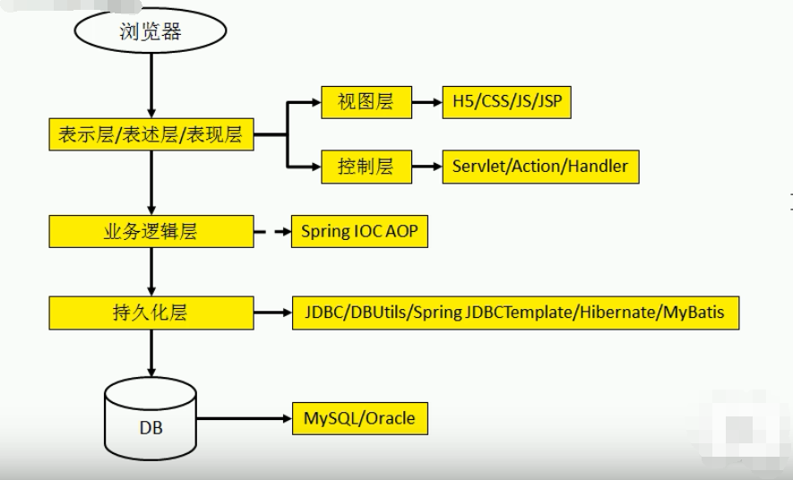

## 2.目前的技术在开发中存在的问题(why)

1. 一个项目就是一个工程

   如果一个项目非常庞大,不适合用packge来划分模块, 最好是每一个模块对应一个工程 **分工合作**.

   借助于**Maven**就可以将一个项目拆分成多个工程.

2. 项目中需要的jar包必须手动"复制","粘贴"到WEB-INF/lib目录下

   带来的**问题**是:同样的jar包文件重复出现在不同的项目工程中, 一方面**浪费存储空间**比较臃肿

   借助**Maven**, 可以将jar包仅仅保存在"**仓库**"中, 有需要使用的工程"引用"这个文件接口, 并不需要真的把jar包复制过来.

3. jar包需要别人替我们准备好,或者官网下载

   不同技术的官网提供jar包**下载的形式**是五花八门的.

   有些技术的官网就是通过Maven或AVN等专门的工具来提供下载的.

   如果是以非正规的方式下载的jar包, 那么其中的内容很可能也是不规范的.

   **借助于Maven**可以以一种规范的方式下载jar包, 因为所有的知名框架或者第三方工具的jar包都以统**一的规范**存放在Maven的中央仓库中.

   以规范的方式下载的jar包, 内容也是可靠的.

   **Tips**: "**统一的规范**", 不仅仅是对IT开发领域非常重要, 对于整个人类社会都是非常重要.

4. 一个jar包依赖的其他jar包需要自己手动加入到项目中

   如果所有的jar包之间的依赖关系都需要程序员自己非常清楚的了解, 那么就会极大的增加学习成本

   Maven会自动将依赖的jar包导入进来.

## 3.Maven是什么(What)

1. Maven是一款**服务于Java服务平台**的自动化**构建**工具

   Make ==> Ant ==> Maven ==> Gradle(最新)

2. 构建

   [1]概念: 以 "Java源文件", "框架配置文件", "JSP" , "HTML" ,"图片"等资源为"原材料", 去"生产"一个可以运行的项目的过程.

   - 编译
   - 部署
   - 搭建

   [2]编译: Java源文件[User.java] ==> Class字节码文件[User.class] ==> 交给JVM去执行

   [3]部署: 一个BS项目最终运行的并不是动态Web工程本身, 而是这个动态Web工程"编译的结果"

      生的鸡 ==> 处理 ==> 熟的鸡

      动态Web工程 ==> 编译 ==> 编译结果

   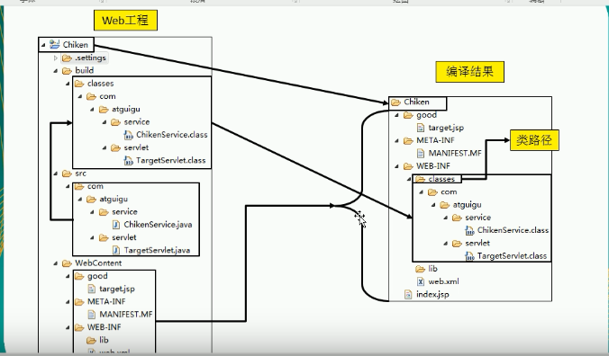

      开发过程中, 所有路径或配置文件中配置的类路径都是以编译结果的目录为标准的.

   Tips: 运行时环境.

   

      其实是一组jar包的应用, 并没有把jar包本身复制到工程中, 所以并不是目录

   Tips: tc_servlet

   ​    整个目录复制到eclipse解压目录下的dropins目录下即可

   ​	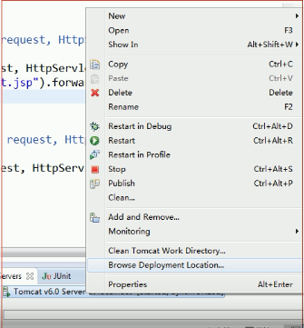

3. 构建过程中的各个环节

   [1]清理: 将以前编译得到的旧的class字节码文件删除 , 为下一次编译做准备

   [2]编译: 将Java源程序编译成class字节码文件

   [3]测试: 自动测试, 自动调用junit程序

   [4]报告: 测试程序执行的结果

   [5]打包: 动态Web工程打war包, Java工程打jar包

   [6]安装: maven特定的概念 ---将打包得到的文件复制到"仓库"中的指定位置

   [7]部署: 将动态Web工程生成war包复制到Servlet容器的指定目录下, 使其可以运行.	

4. 自动糊构建

## 4.安装Maven核心程序:

1. 检测JAVA_HOME环境变量

   

2. 解压maven核心程序的压缩包, 放在一个非中文无空格路径下

   D:\maven\apache-maven-3.5.4-bin

3. 配置Maven相关的环境变量

   [1]MAVEN_HOME或M2_HOME

   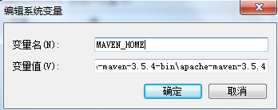

   [2]Path

   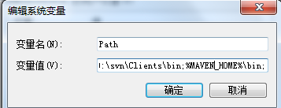

4. 验证: 运行mav -v 命令查看Maven版本

   

## 5.Maven的核心概念

1. **约定的目录结构**
2. **POM**
3. **坐标**
4. **依赖**
5. 仓库
6. 声明周期/插件/目标
7. 继承
8. 聚合
9. 999

## 6.第一个Maven工程:

1. 创建目录结构

   [1]根目录: 工程名

   [2]src目录: 源码

   [3]pom.xml文件 : Maven工程的核心配置文件

   [4]main目录: 存放主程序

   [5]test目录: 存放测试程序

   [6]java目录: 存放Java源文件

   [7]resources目录: 存放框架或其他工具的配置文件

   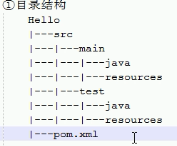

2. 问什么要遵守约定的目录结构呢?

   - Maven要赋值我们这个项目的自动化构建, 以编译为例, Maven要想自动进行编译, 那么它必须知道Java源文件保存在哪里.

   - 如果我们自己自定义的东西想要让框架或工具知道

     - 以配置的方式明确告诉框架

       ```xml
       <param-value>classpath:spring-context.xml</param-value>
       ```

     - 遵守框架内部已经存在的约定

       ```
       log4j.properties
       log4j.xml
       ```

   - **约定 > 配置 > 编码**

   ## 7.常用Maven命令

   1. 注意: 执行与构造相关的Maven命令, 必须进入pom.xml所在的目录

      与构建过程相关: 编译, 测试, 打包...

   2. 常用的命令

      [1]mvn clean: 清理

      [2]mvn compile: 编译主程序

      [3]mvn test-compile: 编译测试程序

      [4]mvn test: 执行测试

      [5]mvn package: 打包

      [6]mvn install : 安装

      [7]mvn site : 生成站点

   ## 8.关于互联网的我问题:

   1. Maven的核心程序中仅仅定义了抽象的声明周期, 但是具体的工作必须由特定的插件来完成, 而插件本身并不包含在Maven的核心程序中

   2. 当我们执行的Maven命令需要用到某个插件时, Maven核心城西会首先到本地仓库中查找

   3. 本地仓库的默认位置: [系统中当前用户的家目录\..m2\repositoy)

      C:\Users\Administrator\.m2\repository

   4. Maven核心程序如果在本地仓库中找不到, 那么它会自动连接外网, 到中央仓库下载

   5. 如果此时无法连接外网,则构建失败

   6. 修改默认的本地仓库的位置可以让Maven核心程序到我们事先准备好的目录下查找插件

      [1]找到Maven解压目录\conf\settings.xml

      [2]在settings.xml文件中找到 localRepository标签

      [3]将< localRepository  >/path/to/local/repo< /localRepository  > 从注释中取出

      [4]将标签体内容修改为准备好的Maven仓库目录

      ​	<localRepository>D:\repository2</localRepository>

## 9.POM

1. 含义: Project Object Model 项目对象模型

   DOM Document Object Model 文档对象模型

2. pom.xml对于Maven工程是核心配置文件, 与构建过程相关的一切设置都在这个文件中进行配置

   重要程序相当于web.xml对于动态web工程

## 10.坐标

1. 数学中的坐标:

   [1].在平面上. 使用X,Y两个向量可以唯一的定位平面上的任意一个点

   [2]在空间中, 使用X,Y,Z三个向量可以唯一的定位空间中的任何一个点

2. Maven的坐标

   使用下面三个向量在查看中唯一定位一个Maven工程

      [1]**g**roupid  :   公司或组织域名倒序 + 项目名

   ```xml
   <groupid>com.yao.maven</groupid>
   ```

      [2]**a**rtfactid  :  模块

   ```xml
   <artifactid>Hello</artifactid>
   ```

      [3]**v**ersion :　版本

   ```xml
   <version>1.0.0</version>
   ```

3. Maven工程的坐标与仓库中路径的对应关系

   ```xml
   <groupid>org.springframework</groupid>
   <artifactid>spring-core</artifactid>
   <version>4.0.0.RELEASE</version>
   ```

   ```
   org/springframework/spring-core/4.0.0.RELEASE/spring-core-4.0.0.RELEASE.jar
   ```

## 11.仓库

1. 仓库的分类

   [1]本地仓库: 当前电脑上部署的查看目录, 为当前电脑上所有Maven工程服务

   [2]远程仓库:

   ​	(1).私服: 架设在当前局域网环境下, 为当前局域网范围内所有Maven工程服务

   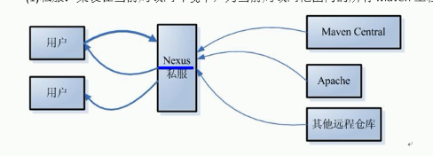

   ​	(2)中央仓库: 架设在Internet上, 为全世界所有Maven工程服务

   ​	(3)中央仓库镜像:架设在各大洲, 为中央仓库分担流量, 减轻中央仓库的压力, 同时更快的响应用户请求

2. 仓库中保存的内容: Maven工程

   [1]Maven自身所需要的插件

   [2]第三方框架或工具的jar包

   [3]我们自己开发的Maven工程

## 12.依赖

1. Maven解析依赖信息时会到本地的仓库中查找被依赖的jar包

   对于我们自己开发的maven工程, 使用mvn instail命令安装后就可以进入仓库

2. 依赖的范围（<scope>标签）

   

   [1]compile范围依赖

   - 对主程序是否有效:有效
   
   - 对测试程序是否有效: 有效
   
   - 是否参与打包: 参与

   - 是否参与部署: 参与

   - 典型例子: spring-core
   
     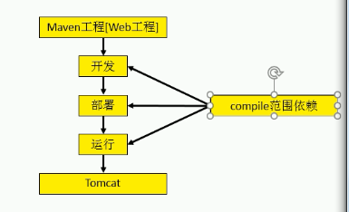
   
   [2]test范围依赖

   - 对主程序是否有效: 无效
- 对测试程序是否有效: 有效
   
   - 是否参与打包: 不参与
- 是否参与部署: 不参与
   - 典型例子: junit

   [3]provided范围依赖

   - 对主程序是否有效: 有效

   - 对测试程序是否有效: 有效

   - 是否参与打包: 不参与

   - 是否参与部署: 不参与

   - 典型的例子: servlet-api.jar
   
     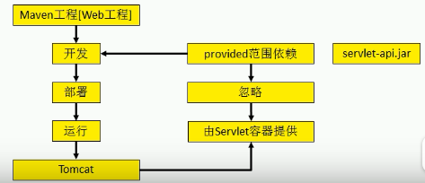

## 13.生命周期

1. 各个构建环节执行的顺序: 不能打乱顺序, 必须按照既定的正确顺序来执行

2. Maven的核心程序中定义了抽象的生命周期, 生命周期中各个阶段的具体任务是由插件来完成的

3. Maven有三套相互独立的生命周期, 分别是:

   [1]Clean Lifecycle 在进行真正的构建之前进行一些清理工作

   [2]Default Lifecycle 构建的核心部分, 编译, 测试, 打包 ,安装, 部署等等

   [3].Site Lifecycle 生成项目报告, 站点, 发布站点

   它们是相互独立的, 你可以仅仅调用clean来清理工作目录, 仅仅调用site来生成站点, 当然也可以直接运行mvn clean install site 运行所有的这三套生命周期

   ```txt
   clean：清理项目  
   pre-clean（执行一些清理前需要完成的工作） 
   		clean （清理上一次构建生成的文件，最常用） 
   		post-clean（执行一些清理后需要完成的工作）
   default：构建项目  
   process-sources（处理项目主资源文件，将src/main/resources目录的内容经过处理后，复制到项目输出的主	classpath目录中） 
   	compile（编译项目主源码，编译src/main/java目录下的java文件至项目输出的主classpath目录中） 
   	process-test-source（处理项目测试资源文件。对src/test/resources目录） 
   	test-compile（编译项目的测试代码） 
   	test （使用单元测试框架运行测试，测试代码不会被打包或部署） 
   	package （接受编译好的代码，打包成可发布格式） 
   	install （发布到本地仓库）  Install是给自己工程依赖 
   	deploy （发布到远程仓库）  deploy是给项目组其他成员依赖
   site：建立和发布项目站点                                   
        	    site （生成项目站点文档） 
        	    site-deploy（将生成的项目站点发布到服务器上） 
   ```

4. Maven核心程序为了更好的实现自动化构建, 按照这一特点执行生命周期中的各个阶段: 不论现在要执行生命周期中的哪一个阶段, 都是从这个生命周期最初的位置开始执行

   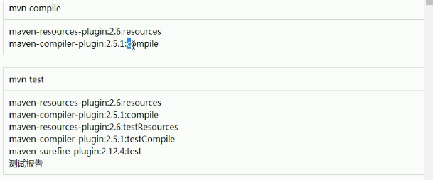

   

5. 插件和目标

   [1]声明周期的各个阶段仅仅定义了要执行的任务是什么

   [2]各个阶段和插件的目标是对应的

   [3]形式的目标由特定的插件来完成

   

   [4]可以将目标看作"调用插件功能的命令"

## 14.在eclipse 中使用Maven

1. Maven插件: eclipse内置

2. Maven插件的设置:

   [1].insetalations: 指定Maven核心程序的位置, 不建议使用插件自带的Maven程序, 而建议使用自己的Maven程序

   [2]user settings: 指定本地仓库的位置

3. 基本操作:

   [1].创建Maven版的Java工程

   [2]创建Maven版的Web工程

   [3]执行Maven版命令

## 15.依赖(高级)

1. 依赖的传递性

   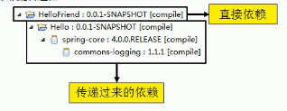

   [1]好处: 可以传递的依赖不必再每个模块工程中重复声明, 在"最下面"的工程中一次即可.

   [2]注意: 非compile范围的依赖不能传递, 所以在各个工程模块中, 如果有需要就得重复声明依赖

2. 依赖的排除

   [1]需要设置依赖排除的场合

   

   [2]依赖排除的设置

   

3. 依赖的原则

   [1]作用: 解决模版工程之间的jar包冲突问题

   [2]情景设定1: 验证路径最短者优先原则

   

   [3]情景设定2:

   

   ​		先声明指的是dependency标签的声明顺序

4. 统一管理依赖的版本

   [1]情景举例:

   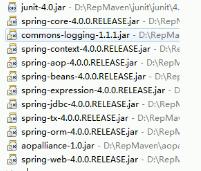

   这里对Spring各jar包的依赖版本都是4.0.0

   如果需要统一升级为4.1.1, 怎么办?手动逐一修改不可靠

   [2]建议配置方式

   ​	i : 使用properties标签内使用自定义标签统一的标签声明版本号

   

   ​	ii: 在需要统一版本的位置, 使用${自定义标签名}引用声明的版本号

   ​	

   ```jsp
   <version>${atguigu.spring.version}</version>
   ```

   [3]其实properties标签配合自定义标签声明数据的配置并不是只能用于声明依赖版本号. 凡是需要统一声明在引用的场合都可以使用.

   

## 16.继承

1. 现状

   Hello依赖的junit:4.0

   HelloFriend依赖的junit: 4.0

   mavenFriends依赖的junit: 4.9

   由于test依赖范围不能传递, 所以必然会分散在各个模块中, 很容易照成版本不一致

2. 需求: 统一管理各个模块工程中对junit依赖的版本

3. 解决思路: 将junit依赖版本统一提取到"父"工程中, 在子工程中声明junit依赖时不指定版本, 以父工程中统一设定的为准. 同时也便于修改

4. 操作步骤

   [1].创建一个Maven工程作为父工程, 注意: 打包方式pom

   

   [2]在子工程中声明对父工程的引用

   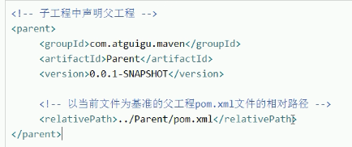

   [3]将子工程的坐标中与父工程坐标中重复的内容删除

   

   [4]在父工程中**统一管理**junit的依赖

   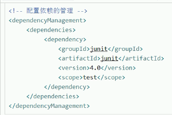

   [5]在子工程中删除junit依赖的版本号部分

   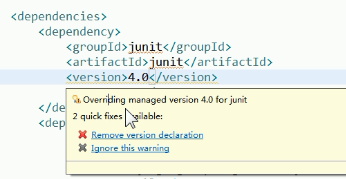

5. 注意: 配置继承后, 执行安装命令时要先安装父工程

## 17.聚合

1. 作业: 一键安装各个模块工程

2. 配置方式: 在一个"总的聚合工程"中配置各个参与聚合的板块

   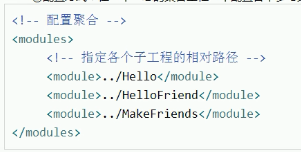

3. 使用方式: 在聚合工程上的pom.xml 点右键 ==> run as ==> maven install

## 18.查找依赖网站:

http://mvnrepository.com/ 搜索需要的jar包的依赖信息