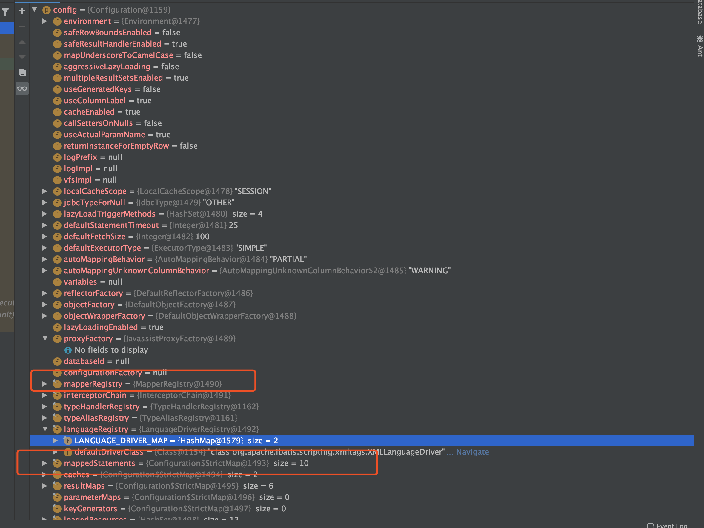
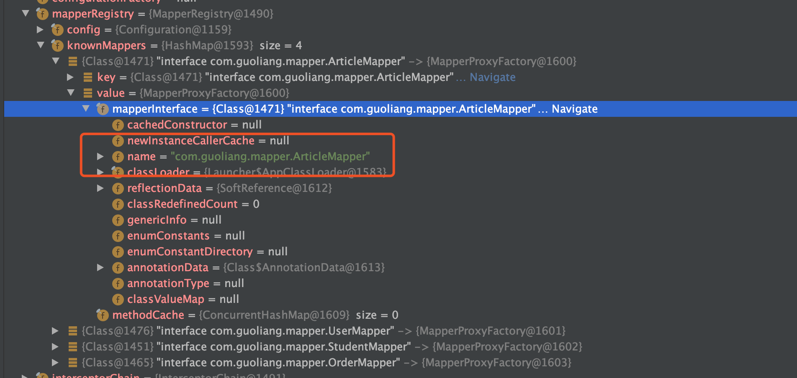
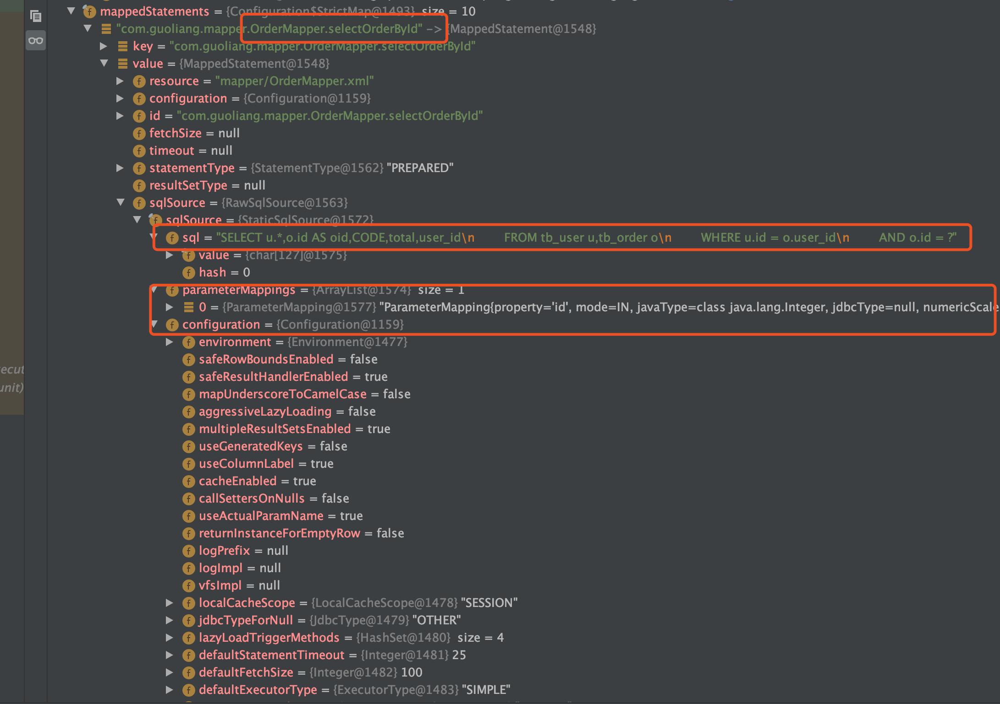
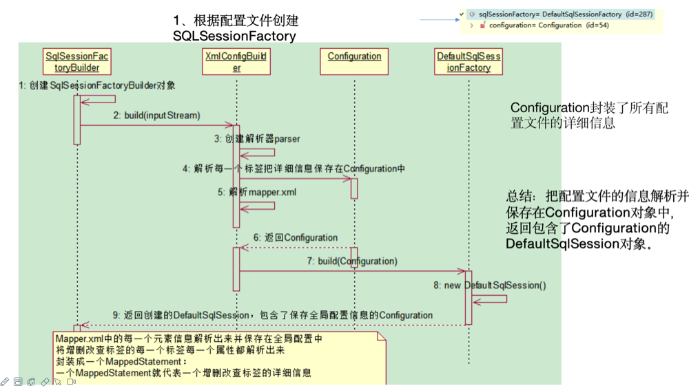

## mybties —原理

### sqlSessionFactory

#### 源码流程

```java
String resource = "mybaties-config.xml";
InputStream inputStream = Resources.getResourceAsStream(resource);
SqlSessionFactory sqlSessionFactory = new SqlSessionFactoryBuilder().build(inputStream);
```

进入到SqlSessionFactoryBuilder().build(inputStream)方法：根据inputStream创建XMLConfigBuilder（xml配置文件文件解析器）

~~~java
public SqlSessionFactory build(InputStream inputStream, String environment, 
                               Properties properties) {
        SqlSessionFactory var5;
        try {
          // 根据io流创建XMLConfigBuilder
            XMLConfigBuilder parser = new XMLConfigBuilder(inputStream, environment, properties);
            var5 = this.build(parser.parse());
        } catch (Exception var14) {
            throw ExceptionFactory.wrapException("Error building SqlSession.", var14);
        } finally {
            ErrorContext.instance().reset();

            try {
                inputStream.close();
            } catch (IOException var13) {
            }

        }

        return var5;
    }
~~~

进入到parser.parse()方法

~~~Java
  public Configuration parse() {
        if (this.parsed) {
            throw new BuilderException("Each XMLConfigBuilder can only be used once.");
        } else {
            this.parsed = true;
          //读取配置文件(mybaties-config.xml)的父节点
            this.parseConfiguration(this.parser.evalNode("/configuration"));
            return this.configuration;
        }
    }
~~~

其中调用的parseConfiguration方法，开始拿到全局配置文件的各个下层节点信息

~~~java
 private void parseConfiguration(XNode root) {
        try {
            this.propertiesElement(root.evalNode("properties"));
            Properties settings = this.settingsAsProperties(root.evalNode("settings"));
            this.loadCustomVfs(settings);
            this.typeAliasesElement(root.evalNode("typeAliases"));
            this.pluginElement(root.evalNode("plugins"));
            this.objectFactoryElement(root.evalNode("objectFactory"));
            this.objectWrapperFactoryElement(root.evalNode("objectWrapperFactory"));
            this.reflectorFactoryElement(root.evalNode("reflectorFactory"));
            this.settingsElement(settings);
            this.environmentsElement(root.evalNode("environments"));
            this.databaseIdProviderElement(root.evalNode("databaseIdProvider"));
            this.typeHandlerElement(root.evalNode("typeHandlers"));
            this.mapperElement(root.evalNode("mappers"));
        } catch (Exception var3) {
            throw new BuilderException("Error parsing SQL Mapper Configuration. Cause: " + var3, var3);
        }
    }
~~~

查看其中的一个方法 this.settingsElement(settings)，在该方法中可以看到全局配置文件对该属性的默认配置和自己在全局配置文件中的显式配置。并把详细的解析信息放到Configuration中

~~~java
private void settingsElement(Properties props) throws Exception {
        this.configuration.setAutoMappingBehavior(AutoMappingBehavior.valueOf(props.getProperty("autoMappingBehavior", "PARTIAL")));
        this.configuration.setAutoMappingUnknownColumnBehavior(AutoMappingUnknownColumnBehavior.valueOf(props.getProperty("autoMappingUnknownColumnBehavior", "NONE")));
  .......
~~~

主要查看this.mapperElement(root.evalNode("mappers"))方法生成XMLMapperBuilder

~~~java
 if (resource != null && url == null && mapperClass == null) {
     ErrorContext.instance().resource(resource);
     inputStream = Resources.getResourceAsStream(resource);
     mapperParser = new XMLMapperBuilder(inputStream, this.configuration, resource, this.configuration.getSqlFragments());
     mapperParser.parse();
~~~

最终将保存了详细配置文件的信息configuration返回并创建DefaultSqlSessionFactory

~~~Java
public SqlSessionFactory build(Configuration config) {
        return new DefaultSqlSessionFactory(config);
    }
~~~

返回的Configuration结构重要的信息



mapperRegistry（mapper接口信息）




mappedStatements (一个mappedStatement代表一个增删改查的标签详细信息（sql）)



#### 时序图



