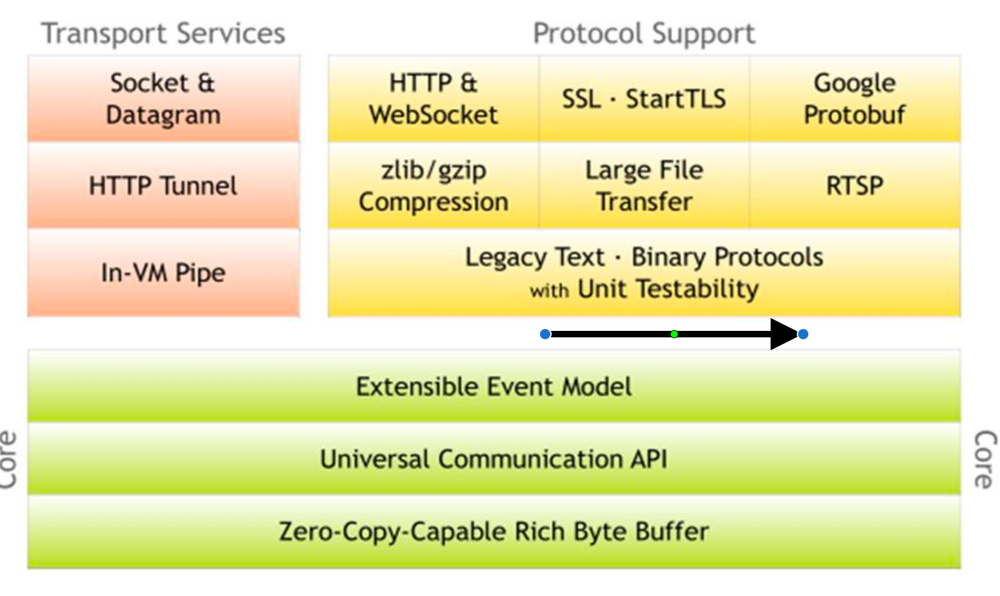

# Netty

## 概述

###  原生NIO存在的问题

1. NIO 的类库和 API 繁杂，使用麻烦:需要熟练掌握 Selector、ServerSocketChannel、SocketChannel、ByteBuffer 等。
2. 需要具备其他的额外技能:要熟悉 Java 多线程编程，因为 NIO 编程涉及到 Reactor 模式，你必须对多线程 和网络编程非常熟悉，才能编写出高质量的 NIO 程序。
3. 开发工作量和难度都非常大:例如客户端面临断连重连、网络闪断、半包读写、失败缓存、网络拥塞和异常流 的处理等等。
4. DK NIO 的 Bug:例如臭名昭著的 Epoll Bug，它会导致 Selector 空轮询，最终导致 CPU 100%。直到 JDK 1.7 版本该问题仍旧存在，没有被根本解决。

###  官网

https://netty.io/

###  优点

Netty 对 JDK 自带的 NIO 的 API 进行了封装，解决了上述问题。

1. 设计优雅:适用于各种传输类型的统一 API 阻塞和非阻塞 Socket;基于灵活且可扩展的事件模型，可以清晰地分离关注点;高度可定制的线程模型 - 单线程，一个或多个线程池.
2. 使用方便:详细记录的 Javadoc，用户指南和示例;没有其他依赖项，JDK 5(Netty 3.x)或 6(Netty 4.x)就 足够了。
3. 高性能、吞吐量更高:延迟更低;减少资源消耗;最小化不必要的内存复制。
4. 安全:完整的 SSL/TLS 和 StartTLS 支持。
5. 社区活跃、不断更新:社区活跃，版本迭代周期短，发现的 Bug 可以被及时修复，同时，更多的新功能会被加入。

###  版本

1. netty 版本分为 netty3.x 和 netty4.x、netty5.x
2. 因为Netty5出现重大bug，已经被官网废弃了，目前推荐使用的是Netty4.x的稳定版本

## 高性能架构设计

###  线程模型 

1. 传统阻塞 I/O 服务模型
2. Reactor 模式：
   1. 单 Reactor 单线程;
   2. 单 Reactor 多线程;
   3. 主从 Reactor 多线程

Netty 线程模式(Netty 主要基于主从 Reactor 多线程模型做了一定的改进，其中主从 Reactor 多线程模型有多个 Reactor)

###  传统阻塞I/O服务模型

###  单Reactor单线程

###  单Reactor 多线程;

### 主从 Reactor 多线程

