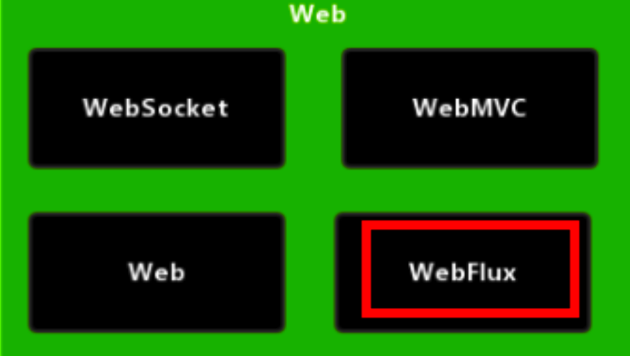
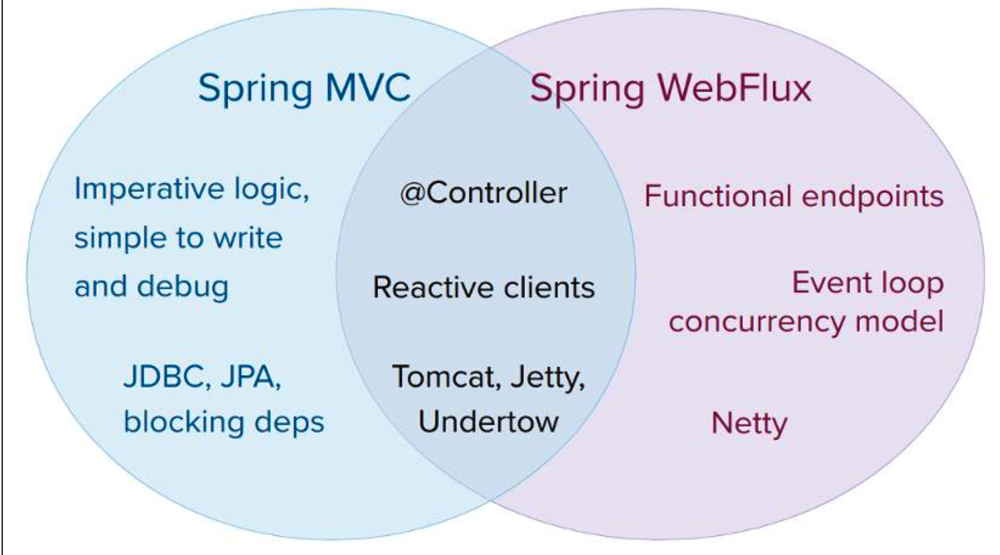

#  Webflux简单介绍

1. 是 Spring5 添加新的模块，用于 web 开发的，功能和 SpringMVC 类似的，Webflux 使用 当前一种比较流程响应式编程出现的框架。

2. 使用传统 web 框架，比如 SpringMVC，这些基于 Servlet 容器，Webflux 是一种异步非阻 塞的框架，异步非阻塞的框架在 Servlet3.1 以后才支持，核心是基于 Reactor 的相关 API 实现 的。
3. 异步非阻塞
   1. 异步和同步：异步和同步针对调用者，调用者发送请求，如果等着对方回应之后才去做其他事情就是同 步，如果发送请求之后不等着对方回应就去做其他事情就是异步
   2. 非阻塞和阻塞：阻塞和非阻塞针对被调用者，被调用者受到请求之后，做完请求任务之后才给出反馈就是阻 塞，受到请求之后马上给出反馈然后再去做事情就是非阻塞
4. Webflux 特点
   1. 非阻塞式：在有限资源下，提高系统吞吐量和伸缩性，以 Reactor 为基础实现响应式编程
   2. 函数式编程:Spring5 框架基于 java8，Webflux 使用 Java8 函数式编程方式实现路由请求
5. 比较 SpringMVC
   1. 两个框架都可以使用注解方式，都运行在 Tomet 等容器中
   2. SpringMVC 采用命令式编程，Webflux 采用异步响应式编程

#  响应式编程（Java实现）

## 响应式编程

响应式编程是一种面向数据流和变化传播的编程范式。这意味着可以在编程语言中很方便地表达静态或动态的数据流，而相关的计算模型会自动将变化的值通过数据流进行传播。电子表格程序就是响应式编程的一个例子。单元格可以包含字面值或类似"=B1+C1"的公式，而包含公式的单元格的值会依据其他单元格的值的变化而变化。

## 基于代码实现

提供的观察者模式两个类 Observer 和 Observable

~~~java
public class ObserverDemo extends Observable {

    public static void main(String[] args) {
        ObserverDemo observerDemo = new ObserverDemo();

        observerDemo.addObserver(((o, arg) -> System.out.println("发生了变化")));

        observerDemo.addObserver(((o, arg) -> System.out.println("手动被观察者通知发生了变化")));

        observerDemo.addObserver(((o, arg) -> System.out.println("手动被观察者通知发生了变化2222")));

        observerDemo.addObserver(((o, arg) -> System.out.println("手动被观察者通知发生了变化333333")));

        observerDemo.setChanged(); //数据发生了变化

        observerDemo.notifyObservers();
    }
}
~~~

