#  Webflux简单介绍

1. 是 Spring5 添加新的模块，用于 web 开发的，功能和 SpringMVC 类似的，Webflux 使用 当前一种比较流程响应式编程出现的框架。


2. 使用传统 web 框架，比如 SpringMVC，这些基于 Servlet 容器，Webflux 是一种异步非阻 塞的框架，异步非阻塞的框架在 Servlet3.1 以后才支持，核心是基于 Reactor 的相关 API 实现 的。
3. 异步非阻塞
   1. 异步和同步：异步和同步针对调用者，调用者发送请求，如果等着对方回应之后才去做其他事情就是同 步，如果发送请求之后不等着对方回应就去做其他事情就是异步
   2. 非阻塞和阻塞：阻塞和非阻塞针对被调用者，被调用者受到请求之后，做完请求任务之后才给出反馈就是阻 塞，受到请求之后马上给出反馈然后再去做事情就是非阻塞
4. Webflux 特点
   1. 非阻塞式：在有限资源下，提高系统吞吐量和伸缩性，以 Reactor 为基础实现响应式编程
   2. 函数式编程:Spring5 框架基于 java8，Webflux 使用 Java8 函数式编程方式实现路由请求
5. 比较 SpringMVC
   1. 两个框架都可以使用注解方式，都运行在 Tomet 等容器中
   2. SpringMVC 采用命令式编程，Webflux 采用异步响应式编程


# 反应式编程

## 反应式编程概述

反应式编程要求我们采取和命令式编程不一样的思维方式。此时我们不会再描述每一步要进行的步骤，反应式编程意味着要构建数据将要流经的管道。当数据流经管道时，可以对它们进行某种形式的修改或者使用。

> Java的流和反应式流：
>
> 1. Java的流和反应式流之间有很多相似之处。首先，它们的名字中都有流（Stream）这个词。它们还提供了用于处理数据的函数式API。事实上，正如你稍后将会在我们介绍Reactor时看到的那样，它们甚至可以共享许多相同的操作。
> 2. Java的流通常都是同步的，并且只能处理有限的数据集。从本质上来说，它们只是使用函数来对集合进行迭代的一种方式。
> 3. 反应式流支持异步处理任意大小的数据集，同样也包括无限数据集。只要数据就绪，它们就能实时地处理数据，并且能够通过回压来避免压垮数据的消费者。

反应式流规范可以总结为4个接口：**Publisher、Subscriber、Subscription和Processor**。Publisher负责生成数据，并将数据发送给Subscription（每个Subscriber对应一个Subscription）。Publisher接口声明了一个方法subscribe()，Subscriber可以通过该方法向Publisher发起订阅。

**反应式流的规范非常简单，很容易就能想出如何构建一个以Publisher作为开始的数据处理管道，并让数据通过零个或多个Processor，然后将最终结果投递给Subscriber。**

Reactor项目是反应式流规范的一个实现，提供了一组用于组装反应式流的函数式API;俩个主要类型：Mono和flux


## Mono和flux

Reactor的两种核心类型：Mono和flux。两者都实现了反应式流的Publisher接口。**Flux代表具有零个、一个或者多个（可能是无限个）数据项的管道。Mono是一种特殊的反应式类型，针对数据项不超过一个的场景，它进行了优化**。

### Flux和Mono操作

#### 创建操作

1. 根据对象操作

   ```java
    @Test
       public void justTest(){
   
           //创建成功的flux流
           Flux<String> stringFlux = Flux.just("sssss","ccccc","ssssssdddd","ssssssdddd");
           //订阅
           //stringFlux.subscribe(f -> System.out.println(f));
   
           StepVerifier.create(stringFlux)
                   .expectNext("sssss")
                   .expectNext("ccccc")
                   .expectNext("ssssssdddd")
                   .expectNext("ssssssdddd").verifyComplete();
           
           //使用数据创建
           System.out.println("通过数组创建Flux");
           String[] formArray = {"ansc","tom","ccdd","vvv"};
           Flux<String> formArrayFlux = Flux.just(formArray);
           formArrayFlux.subscribe(f -> System.out.println(f));
   
           System.out.println("通过list创建Flux");
           List<String>  stringList = Arrays.asList(formArray);
           Flux.just(stringList).subscribe(f -> System.out.println(f));
   
           System.out.println("通过Steam创建Flux");
           Flux.just(stringList.stream()).subscribe(f -> System.out.println(f));
       }
   ```

   2. 生成Flux的数据

      ~~~java
      @Test
          public void rangeTest(){
              Flux.range(1,7).subscribe(f -> System.out.println(f));
          }
      
          @Test
          public void intervalTest(){
              //Flux.interval(Duration.ofSeconds(1)).take(7).subscribe(f -> System.out.println(f));
              StepVerifier.create(Flux.interval(Duration.ofSeconds(1)).take(5))
                      .expectNext(0L)
                      .expectNext(1L)
                      .expectNext(2L)
                      .expectNext(3L)
                      .expectNext(4L).verifyComplete();
      
          }
      ~~~

#### 组合操作

   1. mergeWith()方法合并：两个Flux对象交错在一起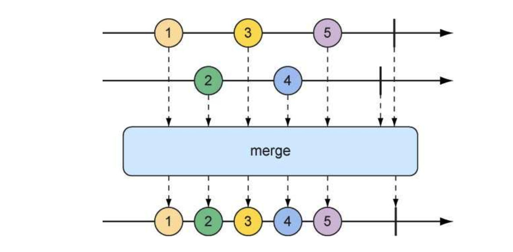

      ~~~java
      @Test
          public void mergeWithTest(){
              Flux<String> just = Flux.just("tom1", "tom2", "tom3")
                      .delayElements(Duration.ofMillis(500));
              Flux<String> just1 = Flux.just("mot1", "mot2", "mot3")
                      /// 在订阅后延迟几秒发布
                      .delaySubscription(Duration.ofMillis(250))
                      /// 每个元素的延迟几秒发布
                      .delayElements(Duration.ofMillis(500));
              Flux<String> stringFlux = just.mergeWith(just1);
              //stringFlux.subscribe(f -> System.out.println(f));
              StepVerifier.create(stringFlux)
                      .expectNext("tom1")
                      .expectNext("mot1")
                      .expectNext("tom2")
                      .expectNext("mot2")
                      .expectNext("tom3")
                      .expectNext("mot3").verifyComplete();
          }
      ~~~

   2. zip方法合并：两个Flux对象压缩在一起

      1. 第一种用法：生成Tuple2（一个容纳两个其他对象的容器对象）的实例

         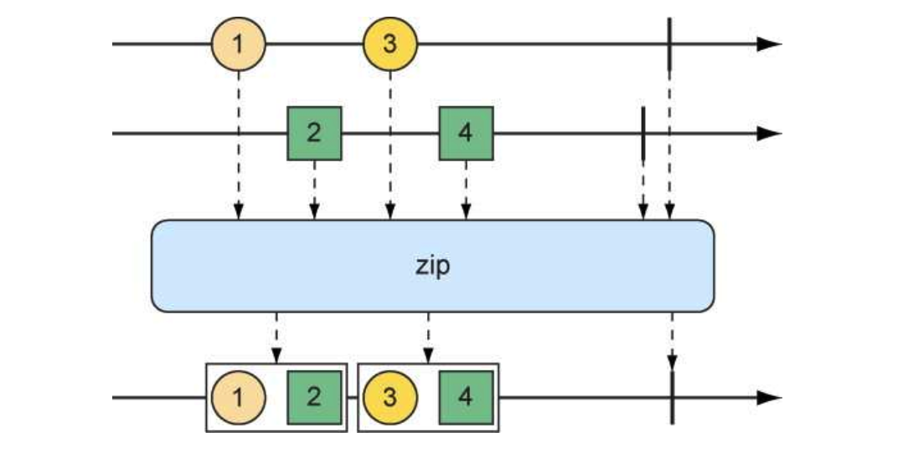

      2. 第二种用法：生成任意对象

            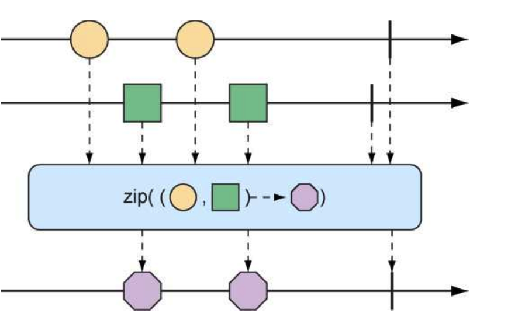

            ~~~java
            @Test
                public void zipTest(){
                    Flux<String> just = Flux.just("tom1", "tom2", "tom3");
                    Flux<String> just1 = Flux.just("mot1", "mot2", "mot3");
                    /// zip第一种合并形式
                    Flux<Tuple2<String, String>> zipFlux = Flux.zip(just, just1);
                    StepVerifier.create(zipFlux)
                            .expectNextMatches(p -> p.getT1().equals("tom1") && p.getT2().equals("mot1"))
                            .expectNextMatches(p -> p.getT1().equals("tom2") && p.getT2().equals("mot2"))
                            .expectNextMatches(p -> p.getT1().equals("tom3") && p.getT2().equals("mot3"))
                            .verifyComplete();
            
                    /// zip 第二种合并形式
                    Flux<String> zipFlux1 = Flux.zip(just, just1, (c, f) -> c + " eat " + f);
                    zipFlux1.subscribe(zipFlux2 -> System.out.println(zipFlux2));
              
            }
            ~~~

      3. first 合并方法：使用first()方法，它将会创建一个新的Flux，这个Flux只会获取第一个源Flux发布的值

         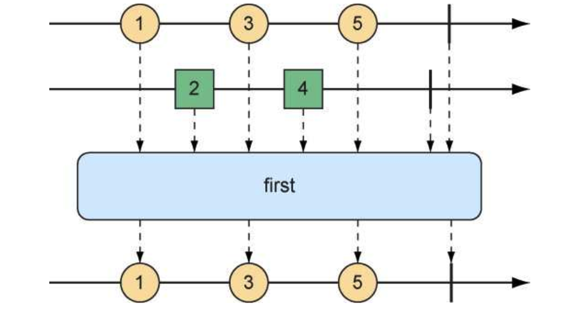

         ~~~java
          @Test
             public void firstTest(){
                 Flux<String> just = Flux.just("tom1", "tom2", "tom3").delayElements(Duration.ofMillis(100));
                 Flux<String> just1 = Flux.just("mot1", "mot2", "mot3");
                 Flux<String> first = Flux.first(just, just1);
                 first.subscribe(f -> System.out.println(f));
             }
         ~~~

#### 转换操作

1. map映射：map操作会创建一个新的Flux，只是在重新发布它所接收的每个对象之前会执行给定Function指定的转换。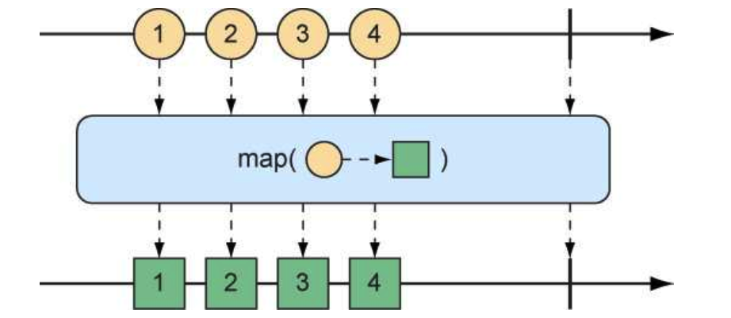

   ~~~java
   @Test
       public void mapTest(){
           Flux<Player> playerFlux = Flux.just("tom 19", "tom 18", "tom 20").map(player -> {
               String[] split = player.split("\\s");
               return new Player(split[0], Integer.valueOf(split[1]));
           });
           playerFlux.subscribe( player -> System.out.println(player));
       }
   ~~~

2. flatMap映射：将对象转换为新的Mono或Flux。结果形成的Mono或Flux会扁平化为新的Flux。当与subscribeOn()方法结合使用时，flatMap操作可以释放Reactor反应式的异步能力。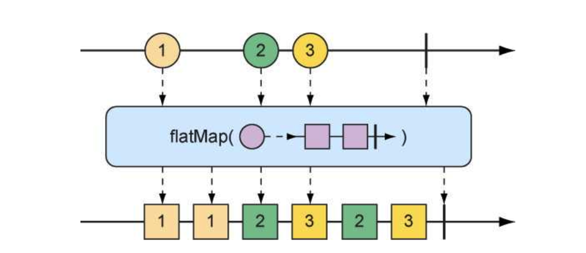

   ~~~java
    @Test
       public void flatMapTest(){
           Flux<Player> playerFlux = Flux.just("tom 19", "tom 18", "tom 20")
                   .flatMap(n -> Mono.just(n).map(n1 -> {
                       String[] split = n1.split("\\s");
                       return new Player(split[0], Integer.valueOf(split[1]));
                   })).subscribeOn(Schedulers.parallel());
   
           //playerFlux.subscribe(player -> System.out.println(player));
           List<Player> players = Arrays.asList(new Player("tom", 19), new Player("tom", 18), new Player("tom", 20));
           StepVerifier.create(playerFlux)
                   .expectNextMatches(player ->players.contains(player))
                   .expectNextMatches(player ->players.contains(player))
                   .expectNextMatches(player ->players.contains(player))
                   .verifyComplete();
       }
   ~~~

   > 尽管subscribeOn()方法的命名与subscribe()方法类似，但是它们的含义却完全不同。 subscribe()方法是一个动词，订阅并驱动反应式流；而subscribeOn()方法则更具描述性，指定了如何并发地处理订阅。Reactor本身并不强制使用特定的并发模型，通过subscribeOn()方法，我们可以使用Schedulers中的任意一个静态方法来指定并发模型。在这个例子中，我们使用了parallel()方法，使用来自固定线程池（大小与CPU核心数量相同）的工作线程。Schedulers支持多种并发模型，如表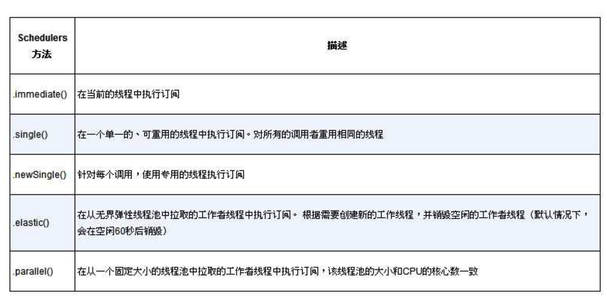

   使用flatMap()和subscribeOn()的好处是：我们可以在多个并行线程之间拆分工作，从而增加流的吞吐量。因为工作是并行完成的，无法保证哪项工作首先完成，所以结果Flux中数据项的发布顺序是未知的。

3. buffer映射

   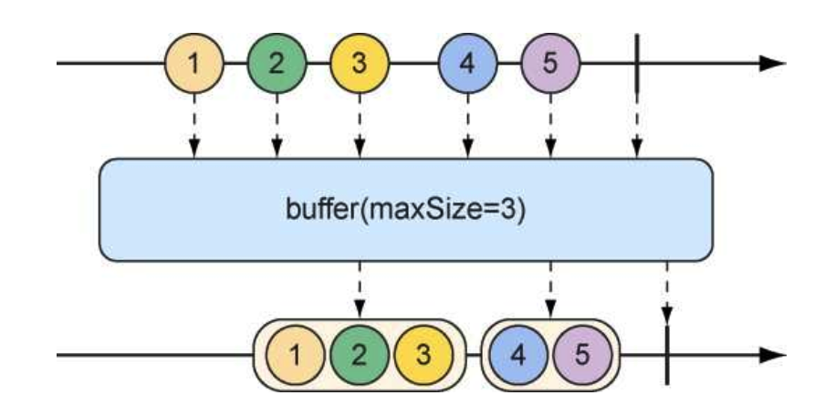

   ~~~java
    public void bufferTest(){
           Flux<List<String>> bufferFlux = Flux.just("tom 19", "tom 18", "tom 20").buffer(2);
           StepVerifier.create(bufferFlux).expectNext(Arrays.asList("tom 19","tom 18")).expectNext(Arrays.asList("tom 20")).verifyComplete();
   
           /// 使用buffer和flatMap组合操作
           Flux.just("aaa","bbbb","cccc","dddd","ffff")
                   .buffer(1)
                   .flatMap(
                           x -> Flux.fromIterable(x)
                                   .map(p -> p.toUpperCase())
                                   .subscribeOn(Schedulers.parallel())
                                   .log()
                   )
                   .subscribe(f -> System.out.println(f));
   
   
       }
   ~~~

4. 映射为list

   ~~~java
     @Test
       public void collectionTest(){
           Flux<List<String>> bufferFlux = Flux.just("tom 19", "tom 18", "tom 20").buffer();
           Mono<List<String>> listMono = Flux.just("tom 19", "tom 18", "tom 20").collectList();
       }
   ~~~

5. 映射为map

   ~~~java
    @Test
       public void CollMapTest(){
           Mono<Map<Character, String>> mapMono =
                   Flux.just("tom 19", "kom 18", "lom 20").collectMap(a -> a.charAt(0));
           StepVerifier.create(mapMono).expectNextMatches(mapMono1 -> mapMono1.size() ==3).verifyComplete();
       }
   ~~~

#### 过滤操作

1. skip 跳过前面几个数据项

   ~~~java
    @Test
       public void skipTest(){
           Flux<String> just = Flux.just("tom1", "tom2", "tom3").skip(2);
           just.subscribe(f -> System.out.println(f));
       }
   ~~~

2. take 发布第一批指定数量的数据项

   ~~~java
   @Test
       public void takeTest(){
           Flux<String> just = Flux.just("tom1", "tom2", "tom3").take(2);
           /// 指定参数为数量
           just.subscribe(f -> System.out.println(f));
   
           // 指定从订阅的200毫秒后开始
           Flux<String> just1 = Flux.just("mot1", "mot2", "mot3")
                   .delayElements(Duration.ofMillis(100))
                   .take(Duration.ofMillis(200));
           just1.subscribe(f -> System.out.println(f));
   
       }
   ~~~

3. filter 过滤

   ~~~java
   @Test
       public void filterTest(){
           Flux<String> just = Flux.just("tom1", "tom2", "tom3").filter(c -> c.contains("2"));
           just.subscribe(f -> System.out.println(f));
       }
   ~~~


#### 逻辑操作

1. all()：可以使用all()方法来确保Flux中的所有消息都满足某些条件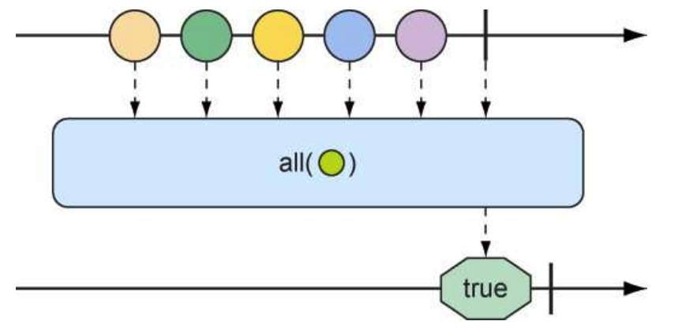
2. any()：可以使用any()方法来确保Flux中至少有一个消息满足某些条件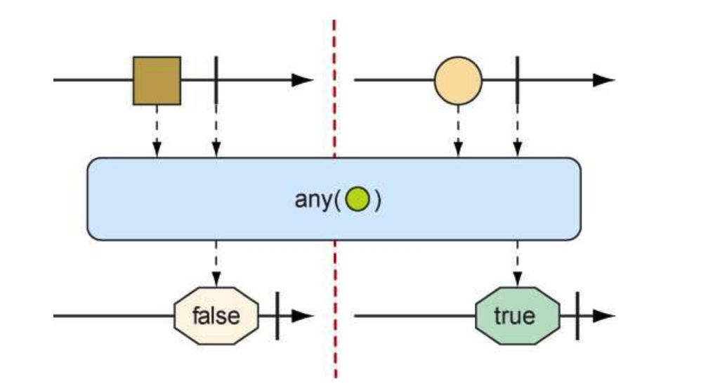

#  开发反应式API

异步的Web框架能够以更少的线程获得更高的可扩展性，通常它们只需要与CPU核心数量相同的线程。通过使用所谓的事件轮询（event looping）机制（如图所示），这些框架能够用一个线程处理很多请求，这样每次连接的成本会更低。

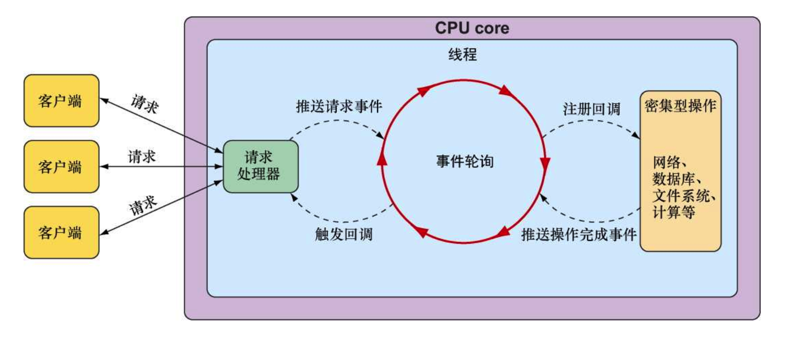

在事件轮询中，所有事情都是以事件的方式来进行处理的，包括请求以及密集型操作（如数据库和网络操作）的回调。当需要执行成本高昂的操作时，事件轮询会为该操作注册一个回调，这样操作可以并行执行，而事件轮询则会继续处理其他的事件。当操作完成时，事件轮询机制会将其作为一个事件，这一点与请求是相同的。这样达到的效果就是，在面临大量负载的时候，异步Web框架能够以更少的线程实现更好的可扩展性，这样会减少线程管理的开销。

## Spring webflux

### 项目构建

1. 依赖

   ~~~xml
   			 <dependency>
               <groupId>org.springframework.boot</groupId>
               <artifactId>spring-boot-starter-webflux</artifactId>
           </dependency>
   ~~~

   > 即WebFlux的默认嵌入式服务器是Netty而不是Tomcat。Netty是一个异步、事件驱动的服务器，非常适合Spring WebFlux这样的反应式Web框架。


2. controller

   ~~~java
   @RestController
   @RequestMapping("/taco")
   public class TacoController {
   
       @Autowired
       private ITacoService iTacoService;
   
       @GetMapping("/recentTaco")
       public Flux<Taco> recentTaco(){
         return iTacoService.recentTaco().take(3);
       }
   
   
       @PostMapping("/save")
       public Mono<Taco> save(@RequestBody Taco tacoMono){
           return iTacoService.save(tacoMono);
       }
   }
   ~~~

   

3. service

   ~~~java
   public interface ITacoService {
   
       Flux<Taco> recentTaco();
   
       Mono<Taco> save(Taco tacoMono);
   }
   ~~~

   ~~~java
   @Service
   public class TacoServiceImpl implements ITacoService {
   
       @Autowired
       private ITacoRepository iTacoRepository;
   
   
       @Override
       public Flux<Taco> recentTaco() {
           return iTacoRepository.findAll();
       }
   
       @Override
       public Mono<Taco> save(Taco tacoMono){
           return iTacoRepository.save(tacoMono);
       }
   
   }
   ~~~

4.  repository：持久化目前只支持nosql（MongoDB Redis等）

   MongoDB

   ~~~xml
           <dependency>
               <groupId>org.springframework.boot</groupId>
               <artifactId>spring-boot-starter-data-mongodb-reactive</artifactId>
           </dependency>
   ~~~

   ~~~java
   @Repository
   public interface ITacoRepository extends ReactiveMongoRepository<Taco,String> {
   }
   
   ~~~

   

## 函数式请求

随着Spring变得越来越流行，很多熟悉其他语言和框架的Spring新手会觉得基于注解的Spring MVC（和WebFlux）与他们之前掌握的知识有很大的差异。作为注解式WebFlux的一种替代方案，Spring 5引入了一个新的函数式编程模型，用来定义反应式API。

这个新的编程模型使用起来更像一个库，而不是一个框架，能够让我们在不使用注解的情况下将请求映射到处理器代码中。使用Spring的函数式编程模型编写API会涉及4个主要的类型：

- RequestPredicate：声明要处理的请求类型。
- RouterFunction：声明如何将请求路由到处理器代码中。
- ServerRequest：代表一个HTTP请求，包括对请求头和请求体的访问。
- ServerResponse：代表一个HTTP响应，包括响应头和响应体信息。

### 项目构建

1. hander

~~~java
@Component
public class TacoHander {

    public Mono<ServerResponse> save(ServerRequest serverRequest){
        Mono<Taco> tacoMono = serverRequest.bodyToMono(Taco.class);
        return ServerResponse.ok().contentType(MediaType.APPLICATION_JSON).body(tacoMono,Taco.class);

    }
}
~~~

2. RouterFunction

~~~java
@Configuration
public class TaceRouteConfig {

    @Autowired
    private TacoHander tacoHander;

    @Bean
    public RouterFunction<ServerResponse> tacoRouteConfig(){
        return RouterFunctions.route(RequestPredicates.POST("/taco/save"),tacoHander::save);
    }
}
~~~

## webclient

Spring 5提供了WebClient，它可以作为RestTemplate的反应式版本。WebClient能够让我们请求外部API时发送和接收反应式类型。WebClient的使用方式与RestTemplate有很大的差别。RestTemplate会有多个方法处理不同类型的请求；而WebClient有一个流畅（fluent）的构建者风格接口，能够让我们描述和发送请求。WebClient的通用使用模式如下：

- 创建WebClient实例（或注入WebClient bean）；
- 指定要发送请求的HTTP方法；
- 指定请求中URI和头信息；
- 提交请求；
- 消费响应。

1. Get请求

   ~~~java
   public static void main(String[] args) {
           Mono<String> stringMono = WebClient.create()
                   .get()
                   .uri("http://127.0.0.1:8080/hello")
                   .retrieve()
                   .bodyToMono(String.class);
           stringMono.subscribe(s -> System.out.println(s));
       }
   ~~~

2. Post请求

   ~~~java
   public static void main(String[] args) {
           Taco taco = new Taco();
           taco.setId("444");
           taco.setAddress("cccc");
           taco.setName(" nininii");
           WebClient.create()
                   .post()
                   .uri("http://localhost:8080/taco/save")
                   .body(Mono.just(taco), ServerRequest.class)
                   .retrieve()
                   .bodyToMono(ServerResponse.class)
                   .subscribe(i-> {
                       System.out.println(i.toString());;
                   });
       }
   ~~~

3. 小技巧：

   你可能会发现在很多请求中都会使用一个通用的基础URI。这样的话，创建WebClient bean的时候设置一个基础URI并将其注入到所需的地方是非常有用的。

   ~~~java
   @Configuration
   public class webClientConfig {
   
       @Bean
       public WebClient webClient(){
           return WebClient.create("Http://127.0.0.1:8080");
       }
   }
   ~~~

   在想要使用基础URI的任意地方，我们都可以将WebClient bean注入进来使用；因为WebClient已经创建好了，所以我们可以通过get()方法直接使用它。对于URI来说，我们只需要调用uri()指定相对于基础URI的相对路径即可。