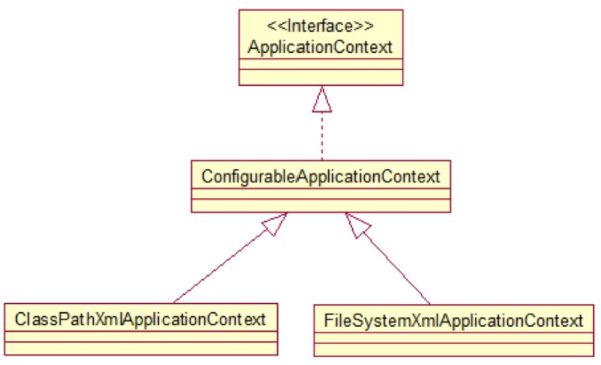
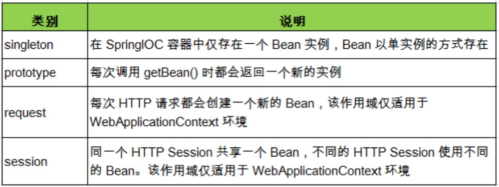
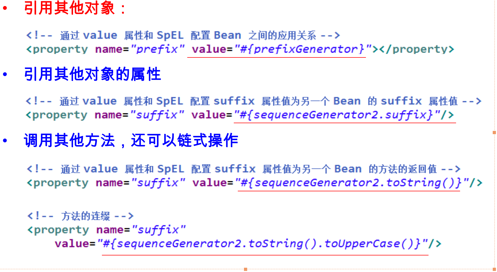
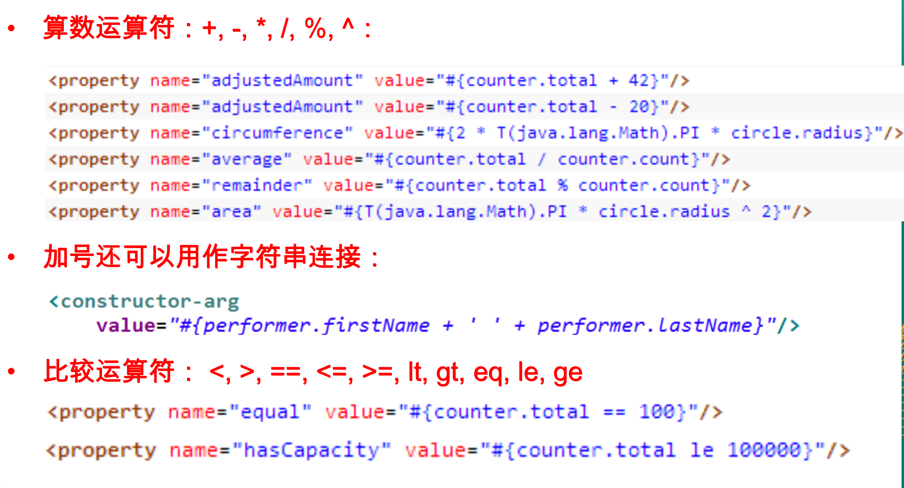
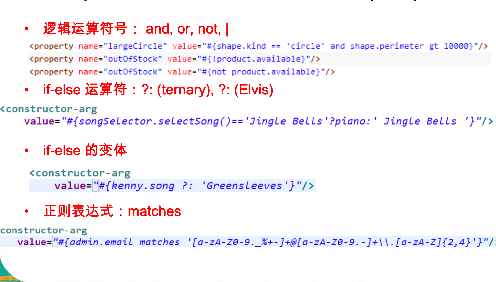
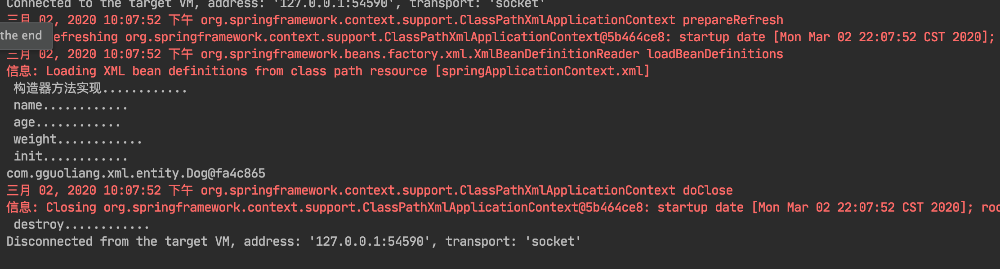
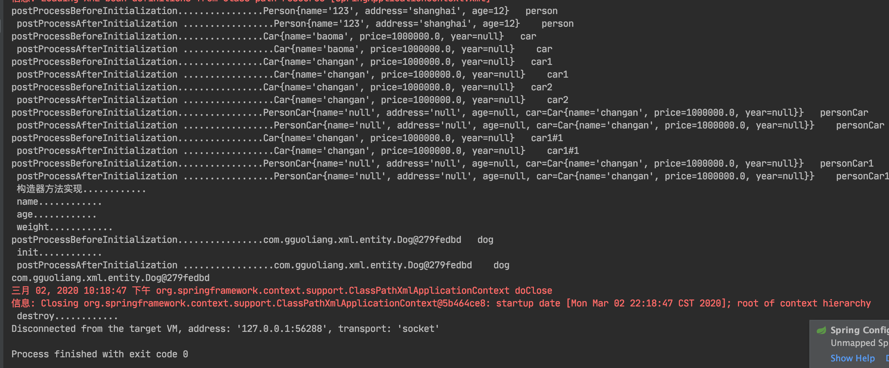

# spring4 DI AOP 事物处理

## IOC 和DI

IOC(Inversion of Control)：其思想是反转资源获取的方向. 传统的资源查找方式要求组件向容器发起请求查找资源. 作为回应, 容器适时的返回资源. 而应用了 IOC 之后, 则是容器主动地将资源推送给它所管理的组件, 组件所要做的仅是选择一种合适的方式来接受资源. 这种行为也被称为查找的被动形式

DI(Dependency Injection) — IOC 的另一种表述方式：即组件以一些预先定义好的方式(例如: setter 方法)接受来自如容器的资源注入. 相对于 IOC 而言，这种表述更直接。

### IOC容器

在 Spring IOC 容器读取 Bean 配置创建 Bean 实例之前, 必须对它进行实例化. 只有在容器实例化后, 才可以从 IOC 容器里获取 Bean 实例并使用.

Spring 提供了两种类型的 IOC 容器实现：

1. **BeanFactory**: IOC 容器的基本实现.
2. **ApplicationContext**: 提供了更多的高级特性. 是 BeanFactory 的子接口.

> BeanFactory 是 Spring 框架的基础设施，面向 Spring 本身；**ApplicationContext 面向使用 Spring 框架的开发者，几乎所有的应用场合都直接使用 ApplicationContext 而非底层的 BeanFactory;**
>
> 无论使用何种方式, 配置文件时相同的。

#### ApplicationContext主要实现类：

1. ClassPathXmlApplicationContext：从 类路径下加载配置文件
2. FileSystemXmlApplicationContext: 从文件系统中加载配置文件

> 1. ConfigurableApplicationContext 扩展于 ApplicationContext，新增加两个主要方法：refresh() 和 close()， 让 ApplicationContext 具有启动、刷新和关闭上下文的能力；
> 2. ApplicationContext 在初始化上下文时就实例化所有单例的 Bean；
> 3. WebApplicationContext 是专门为 WEB 应用而准备的，它允许从相对于 WEB 根目录的路径中完成初始化工作

### DI

#### 属性注入

属性注入即通过 setter 方法注入Bean 的属性值或依赖的对象，属性注入使用 <property> 元素, 使用 name 属性指定 Bean 的属性名称，value 属性或 <value> 子节点指定属性值

属性注入是实际应用中最常用的注入方式

~~~xml
<bean id = "person"  class="com.gguoliang.xml.entity.Person">
        <property name="name" value="123"></property>
        <property name="age" value="12"></property>
        <property name="address" value="shanghai"></property>
    </bean>
~~~

#### 构造方法注入

通过构造方法注入Bean 的属性值或依赖的对象，它保证了 Bean 实例在实例化后就可以使用。

构造器注入在 <constructor-arg> 元素里声明属性, <constructor-arg> 中没有 name 属性

~~~Xml
 <!--根据构造器参数下标-->
    <bean id = "car"  class="com.gguoliang.xml.entity.Car">
        <constructor-arg index="0" value="baoma"/>
        <constructor-arg index="1" value="1000000"/>
    </bean>

   <!--构造器器参数类型-->
    <bean id = "car1"  class="com.gguoliang.xml.entity.Car">
        <constructor-arg type="java.lang.String" value="changan"/>
        <constructor-arg type="double" value="1000000"/>
    </bean>
~~~

###  字面量

字面值：可用字符串表示的值，可以通过 <value> 元素标签或 value 属性进行注入。
基本数据类型及其封装类、String 等类型都可以采取字面值注入的方式

~~~xml
<!--构造器器参数类型-->
<bean id = "car2"  class="com.gguoliang.xml.entity.Car">
    <constructor-arg type="java.lang.String" value="changan"/>
    <constructor-arg type="double" >
        <value>1000000</value>
    </constructor-arg>
</bean>
~~~

若字面值中包含特殊字符，可以使用 <![CDATA[]]> 把字面值包裹起来。

~~~xml
	<bean id="car2" class="com.atguigu.spring.helloworld.Car">
		<constructor-arg value="ChangAnMazda"></constructor-arg>
		<!-- 若字面值中包含特殊字符, 则可以使用 DCDATA 来进行赋值. (了解) -->
		<constructor-arg>
			<value><![CDATA[<ATARZA>]]></value>
		</constructor-arg>
		<constructor-arg value="180" type="int"></constructor-arg>
	</bean>
~~~

###  引入其他bean

组成应用程序的 Bean 经常需要相互协作以完成应用程序的功能. 要使 Bean 能够相互访问, 就必须在 Bean 配置文件中指定对 Bean 的引用
在 Bean 的配置文件中, 可以通过 <ref> 元素或 ref  属性为 Bean 的属性或构造器参数指定对 Bean 的引用. 

~~~xml
 <bean id= "personCar" class="com.gguoliang.xml.entity.PersonCar">
        <property name="car" ref="car1"></property>
    </bean>
~~~

### 内部bean

也可以在属性或构造器里包含 Bean 的声明, 这样的 Bean 称为内部 Bean

当 Bean 实例仅仅给一个特定的属性使用时, 可以将其声明为内部 Bean. 内部 Bean 声明直接包含在 <property> 或 <constructor-arg> 元素里, 不需要设置任何 id 或 name 属性
内部 Bean 不能使用在任何其他地方

~~~xml
    <bean id= "personCar1" class="com.gguoliang.xml.entity.PersonCar">
        <property name="car">
            <bean id = "car1"  class="com.gguoliang.xml.entity.Car">
                <constructor-arg type="java.lang.String" value="changan"/>
                <constructor-arg type="double" value="1000000"/>
            </bean>
        </property>
    </bean>
~~~

###  空标签

可以使用专用的 <null/> 元素标签为 Bean 的字符串或其它对象类型的属性注入 null 值

~~~xml
	<bean id="dao2" class="com.atguigu.spring.ref.Dao">
		<!-- 为 Dao 的 dataSource 属性赋值为 null, 若某一个 bean 的属性值不是 null, 使用时需要为其设置为 null(了解) -->
		<property name="dataSource"><null/></property>
	</bean>
~~~

###  次联

和 Struts、Hiberante 等框架一样，Spring 支持级联属性的配置。

~~~java 
public class Action {

	private Service service;
	
	public void setService(Service service) {
		this.service = service;
	}
	
	public Service getService() {
		return service;
	}
	
	public void execute(){
		System.out.println("Action's execute...");
		service.save();
	}
	
}

public class Service {

	private Dao dao;
	
	public void setDao(Dao dao) {
		this.dao = dao;
	}
	
	public Dao getDao() {
		return dao;
	}
	
	public void save(){
		System.out.println("Service's save");
		dao.save();
	}
	
}

public class Dao {

	private String dataSource = "dbcp";
	
	public void setDataSource(String dataSource) {
		this.dataSource = dataSource;
	}
	
	public void save(){
		System.out.println("save by " + dataSource);
	}
	
	public Dao() {
		System.out.println("Dao's Constructor...");
	}
	
}
~~~

~~~xml
<bean id="action" class="com.atguigu.spring.ref.Action">
		<property name="service" ref="service2"></property>
		<!-- 设置级联属性(了解) -->
		<property name="service.dao.dataSource" value="DBCP2"></property>
	</bean>
~~~

###  集合属性

在 Spring中可以通过一组内置的 xml 标签(例如: <list>, <set> 或 <map>) 来配置集合属性.

1. 配置 java.util.List 类型的属性, 需要指定 <list>  标签, 在标签里包含一些元素. 这些标签可以通过 <value> 指定简单的常量值, 通过 <ref> 指定对其他 Bean 的引用. 通过<bean> 指定内置 Bean 定义. 通过 <null/> 指定空元素. 甚至可以内嵌其他集合.
2. 数组的定义和 List 一样, 都使用 <list>
3. 配置 java.util.Set 需要使用 <set> 标签, 定义元素的方法与 List 一样.
4. Java.util.Map 通过 <map> 标签定义, <map> 标签里可以使用多个 <entry> 作为子标签. 每个条目包含一个键和一个值. 必须在 <key> 标签里定义键，因为键和值的类型没有限制, 所以可以自由地为它们指定 <value>, <ref>, <bean> 或 <null> 元素. 可以将 Map 的键和值作为 <entry> 的属性定义: 简单常量使用 key 和 value 来定义; Bean 引用通过 key-ref 和 value-ref 属性定义
5. 使用 <props> 定义 java.util.Properties, 该标签使用多个 <prop> 作为子标签. 每个 <prop> 标签必须定义 key 属性. 

~~~xml
<!-- 装配集合属性 -->
	<bean id="user" class="com.atguigu.spring.helloworld.User">
		<property name="userName" value="Jack"></property>
		<property name="cars">
			<!-- 使用 list 元素来装配集合属性 -->
			<list>
				<ref bean="car"/>
				<ref bean="car2"/>
			</list>
		</property>
	</bean>
~~~

~~~xml
<!-- 声明集合类型的 bean -->
	<util:list id="cars">
		<ref bean="car"/>
		<ref bean="car2"/>
	</util:list>
	
	<bean id="user2" class="com.atguigu.spring.helloworld.User">
		<property name="userName" value="Rose"></property>
		<!-- 引用外部声明的 list -->
		<property name="cars" ref="cars"></property>
	</bean>
~~~

###  使用 p 命名空间

为了简化 XML 文件的配置，越来越多的 XML 文件采用属性而非子元素配置信息。
Spring 从 2.5 版本开始引入了一个新的 p 命名空间，可以通过 <bean> 元素属性的方式配置 Bean 的属性。
使用 p 命名空间后，基于 XML 的配置方式将进一步简化

~~~xml
<bean id="user3" class="com.atguigu.spring.helloworld.User"
		p:cars-ref="cars" p:userName="Titannic"></bean>
~~~

###  继承

1. Spring 允许继承 bean 的配置, 被继承的 bean 称为父 bean. 继承这个父 Bean 的 Bean 称为子 Bean
2. 子 Bean 从父 Bean 中继承配置, 包括 Bean 的属性配置
3. 子 Bean 也可以覆盖从父 Bean 继承过来的配置
4. 父 Bean 可以作为配置模板, 也可以作为 Bean 实例. 若只想把父 Bean 作为模板, 可以设置 <bean> 的abstract 属性为 true, 这样 Spring 将不会实例化这个 Bean
5. 并不是 <bean> 元素里的所有属性都会被继承. 比如: autowire, abstract 等.
6. 也可以忽略父 Bean 的 class 属性, 让子 Bean 指定自己的类, 而共享相同的属性配置. 但此时 abstract 必须设为 true

~~~xml
<!-- bean 的配置能够继承吗 ? 使用 parent 来完成继承 -->	
	<bean id="user4" parent="user" p:userName="Bob"></bean>
	
	<bean id="user6" parent="user" p:userName="维多利亚"></bean>
~~~

###  依赖 Bean 配置

1. Spring 允许用户通过 depends-on 属性设定 Bean 前置依赖的Bean，前置依赖的 Bean 会在本 Bean 实例化之前创建好
2. 如果前置依赖于多个 Bean，则可以通过逗号，空格或的方式配置 Bean 的名称

~~~xml
	<!-- 测试 depents-on -->	
	<bean id="user5" parent="user" p:userName="Backham" depends-on="user6"></bean>
~~~

###  自动装配

1. Spring IOC 容器可以自动装配 Bean. 需要做的仅仅是在 <bean> 的 autowire 属性里指定自动装配的模式
   byType(根据类型自动装配): 若 IOC 容器中有多个与目标 Bean 类型一致的 Bean. 在这种情况下, Spring 将无法判定哪个 Bean 最合适该属性, 所以不能执行自动装配.
2. byName(根据名称自动装配): 必须将目标 Bean 的名称和属性名设置的完全相同.
3. constructor(通过构造器自动装配): 当 Bean 中存在多个构造器时, 此种自动装配方式将会很复杂. 不推荐使用

~~~xml
<!-- 自动装配: 只声明 bean, 而把 bean 之间的关系交给 IOC 容器来完成 -->
	<!--  
		byType: 根据类型进行自动装配. 但要求 IOC 容器中只有一个类型对应的 bean, 若有多个则无法完成自动装配.
		byName: 若属性名和某一个 bean 的 id 名一致, 即可完成自动装配. 若没有 id 一致的, 则无法完成自动装配
	-->
	<!-- 在使用 XML 配置时, 自动转配用的不多. 但在基于 注解 的配置时, 自动装配使用的较多.  -->
	<bean id="dao" class="com.atguigu.spring.ref.Dao">
		<property name="dataSource" value="C3P0"></property>				
	</bean>
	
	<!-- 默认情况下 bean 是单例的! -->
	<!-- 但有的时候, bean 就不能使单例的. 例如: Struts2 的 Action 就不是单例的! 可以通过 scope 属性来指定 bean 的作用域 -->
	<!--  
		prototype: 原型的. 每次调用 getBean 方法都会返回一个新的 bean. 且在第一次调用 getBean 方法时才创建实例
		singleton: 单例的. 每次调用 getBean 方法都会返回同一个 bean. 且在 IOC 容器初始化时即创建 bean 的实例. 默认值 Bean 的作用域
	-->
	<bean id="dao2" class="com.atguigu.spring.ref.Dao" scope="prototype"></bean>
	
	<bean id="service" class="com.atguigu.spring.ref.Service" autowire="byName"></bean>
	
	<bean id="action" class="com.atguigu.spring.ref.Action" autowire="byType"></bean>
	
~~~

> 1. 在 Bean 配置文件里设置 autowire 属性进行自动装配将会装配 Bean 的所有属性. 然而, 若只希望装配个别属性时, autowire 属性就不够灵活了.
> 2. autowire 属性要么根据类型自动装配, 要么根据名称自动装配, 不能两者兼而有之.
> 3. 一般情况下，在实际的项目中很少使用自动装配功能，因为和自动装配功能所带来的好处比起来，明确清晰的配置文档更有说服力一些

### bean的作用域

1. 在 Spring 中, 可以在 <bean> 元素的 scope 属性里设置 Bean 的作用域.
2. 默认情况下, Spring 只为每个在 IOC 容器里声明的 Bean 创建唯一一个实例, 整个 IOC 容器范围内都能共享该实例：所有后续的 getBean() 调用和 Bean 引用都将返回这个唯一的 Bean 实例.该作用域被称为 singleton, 它是所有 Bean 的默认作用域.

~~~xml
<!-- 默认情况下 bean 是单例的! -->
	<!-- 但有的时候, bean 就不能使单例的. 例如: Struts2 的 Action 就不是单例的! 可以通过 scope 属性来指定 bean 的作用域 -->
	<!--  
		prototype: 原型的. 每次调用 getBean 方法都会返回一个新的 bean. 且在第一次调用 getBean 方法时才创建实例
		singleton: 单例的. 每次调用 getBean 方法都会返回同一个 bean. 且在 IOC 容器初始化时即创建 bean 的实例. 默认值 
	-->
	<bean id="dao2" class="com.atguigu.spring.ref.Dao" scope="prototype"></bean>
~~~

###  使用外部属性文件

1. 在配置文件里配置 Bean 时, 有时需要在 Bean 的配置里混入系统部署的细节信息(例如: 文件路径, 数据源配置信息等). 而这些部署细节实际上需要和 Bean 配置相分离
2. Spring 提供了一个 PropertyPlaceholderConfigurer 的 BeanFactory 后置处理器, 这个处理器允许用户将 Bean 配置的部分内容外移到属性文件中. 可以在 Bean 配置文件里使用形式为 ${var} 的变量, PropertyPlaceholderConfigurer 从属性文件里加载属性, 并使用这些属性来替换变量.
3.  Spring 还允许在属性文件中使用 ${propName}，以实现属性之间的相互引用。

~~~xml
<!-- 导入外部的资源文件 -->
	<context:property-placeholder location="classpath:db.properties"/>
	<!-- 配置数据源 -->
	<bean id="dataSource" class="com.mchange.v2.c3p0.ComboPooledDataSource">
		<property name="user" value="${jdbc.user}"></property>
		<property name="password" value="${jdbc.password}"></property>
		<property name="driverClass" value="${jdbc.driverClass}"></property>
		<property name="jdbcUrl" value="${jdbc.jdbcUrl}"></property>
		
		<property name="initialPoolSize" value="${jdbc.initPoolSize}"></property>
		<property name="maxPoolSize" value="${jdbc.maxPoolSize}"></property>
	</bean>
~~~

### Spring表达式语言：SpEL

1. Spring 表达式语言（简称SpEL）：是一个支持运行时查询和操作对象图的强大的表达式语言。
2. 语法类似于 EL：SpEL 使用 #{…} 作为定界符，所有在大框号中的字符都将被认为是 SpEL
3. SpEL 为 bean 的属性进行动态赋值提供了便利
4. 通过 SpEL 可以实现：
   1. 通过 bean 的 id 对 bean 进行引用
   2. 调用方法以及引用对象中的属性
   3. 计算表达式的值
   4. 正则表达式的匹配

~~~xml
<!-- 测试 SpEL: 可以为属性进行动态的赋值(了解) -->
	<bean id="girl" class="com.atguigu.spring.helloworld.User">
		<property name="userName" value="周迅"></property>
	</bean>
	
	<bean id="boy" class="com.atguigu.spring.helloworld.User" init-method="init" destroy-method="destroy">
		<property name="userName" value="高胜远"></property>
		<property name="wifeName" value="#{girl.userName}"></property>
	</bean>
~~~

#### SpEL 字面量表达

~~~xml
整数：<property name="count" value="#{5}"/>
小数：<property name="frequency" value="#{89.7}"/>
科学计数法：<property name="capacity" value="#{1e4}"/>
String可以使用单引号或者双引号作为字符串的定界符号：<property name=“name” value="#{'Chuck'}"/> 或 <property name='name' value='#{"Chuck"}'/>
Boolean：<property name="enabled" value="#{false}"/>
~~~

####  SpEL：引用 Bean、属性和方法

调用静态方法或静态属性：通过 T() 调用一个类的静态方法，它将返回一个 Class Object，然后再调用相应的方法或属性：

#### SpEL支持的运算符号

### IOC 容器中 Bean 的生命周期方法

Spring IOC 容器可以管理 Bean 的生命周期, Spring 允许在 Bean 生命周期的特定点执行定制的任务. 

Spring IOC 容器对 Bean 的生命周期进行管理的过程:

1. 通过构造器或工厂方法创建 Bean 实例
2. 为 Bean 的属性设置值和对其他 Bean 的引用
3. 调用 Bean 的初始化方法
4. Bean 可以使用了
5. 当容器关闭时, 调用 Bean 的销毁方法

~~~java
public class Dog {

    private String name;
    private Double age;
    private Double weight;

    public Dog() {
        super();
        System.out.println(" 构造器方法实现............");
    }

    public String getName() {
        return name;
    }

    public void setName(String name) {
        System.out.println(" name............");
        this.name = name;
    }

    public Double getAge() {
        return age;
    }

    public void setAge(Double age) {
        System.out.println(" age............");
        this.age = age;
    }

    public Double getWeight() {
        return weight;
    }

    public void setWeight(Double weight) {
        System.out.println(" weight............");
        this.weight = weight;
    }

    public void init(){
        System.out.println(" init............");
    }

    public void destroy(){
        System.out.println(" destroy............");
    }

~~~

在 Bean 的声明里设置 init-method 和 destroy-method 属性, 为 Bean 指定初始化和销毁方法.

~~~xml
<bean id="dog" class="com.gguoliang.xml.entity.Dog" init-method="init" destroy-method="destroy">
        <property name="name" value="大黄"></property>
        <property name="age" value="18"></property>
        <property name="weight" value="80"></property>
    </bean>
~~~

### 创建 Bean 后置处理器

1. Bean 后置处理器允许在调用初始化方法前后对 Bean 进行额外的处理.
2. Bean 后置处理器对 IOC 容器里的所有 Bean 实例逐一处理, 而非单一实例. 其典型应用是: 检查 Bean 属性的正确性或根据特定的标准更改 Bean 的属性.
3. 对Bean 后置处理器而言, 需要实现BeanPostProcessor接口. 在初始化方法被调用前后, Spring 将把每个 Bean 实例分别传递给上述接口的以下两个方法:

~~~java
public class MyProcessor implements BeanPostProcessor {
    public Object postProcessBeforeInitialization(Object o, String s) throws BeansException {
        System.out.println("postProcessBeforeInitialization................"+o+"   "+s);
        return o;
    }

    public Object postProcessAfterInitialization(Object o, String s) throws BeansException {
        System.out.println(" postProcessAfterInitialization ................."+o+"    "+s);
        return o;
    }
}
~~~

添加到Bean中

~~~xml
<bean class="com.gguoliang.xml.MyProcessor"></bean>
~~~

> 添加 Bean 后置处理器后 Bean 的生命周期:
>
>  1. 通过构造器或工厂方法创建 Bean 实例
> 2. 为 Bean 的属性设置值和对其他 Bean 的引用
> 3. 将 Bean 实例传递给 Bean 后置处理器的 postProcessBeforeInitialization 方法
> 4. 调用 Bean 的初始化方法
> 5. 将 Bean 实例传递给 Bean 后置处理器的 postProcessAfterInitialization方法
> 6. Bean 可以使用了
> 7. 当容器关闭时, 调用 Bean 的销毁方法

在后置中修改返回的bean

~~~java
public class MyProcessor implements BeanPostProcessor {
    public Object postProcessBeforeInitialization(Object o, String s) throws BeansException {
        System.out.println("postProcessBeforeInitialization................"+o+"   "+s);
      // 只对单个bean的处理  
      if("car".equals(s)){
            System.out.println(" car ..............");
        }

        return o;
    }

    public Object postProcessAfterInitialization(Object o, String s) throws BeansException {
        System.out.println(" postProcessAfterInitialization ................."+o+"    "+s);
        // 修改返回的bean
        Car car = new Car("hhh",12);
        return car;
    }
}
~~~

### 调用静态工厂方法创建 Bean

调用静态工厂方法创建 Bean是将对象创建的过程封装到静态方法中. 当客户端需要对象时, 只需要简单地调用静态方法, 而不同关心创建对象的细节.

要声明通过静态方法创建的 Bean, 需要在 Bean 的 class 属性里指定拥有该工厂的方法的类, 同时在 factory-method 属性里指定工厂方法的名称. 最后, 使用 <constrctor-arg> 元素为该方法传递方法参数

~~~java
**
 * 静态工厂方法创建bean
 */
public class StatIcCarFactory {

    private static Map<String,Car> carMap = new HashMap<String, Car>();

    static {
        carMap.put("baoma",new Car("baoma",10000));
        carMap.put("audi",new Car("audi",10000));

    }

    private static  Car getCar(String name){
        return carMap.get("name");
    }

}
~~~

~~~xml
<bean id = "baoma"  class="com.gguoliang.xml.entity.StatIcCarFactory" factory-method="getCar">
        <constructor-arg value="baoma"></constructor-arg>
    </bean>
~~~

### 调用实例工厂方法创建 Bean

实例工厂方法: 将对象的创建过程封装到另外一个对象实例的方法里. 当客户端需要请求对象时, 只需要简单的调用该实例方法而不需要关心对象的创建细节.

~~~java 
/**
 * 实例工厂方法
 *
 * @author guoliang
 */
public class InstanceFactory {

    private static Map<String, Car> carMap = null;
    public InstanceFactory(){
        carMap  = new HashMap<String, Car>();
        carMap.put("baoma",new Car("baoma",10000));
        carMap.put("audi",new Car("audi",10000));
    }

    private   Car getCar(String name){
        return carMap.get("name");
    }
}
~~~

要声明通过实例工厂方法创建的 Bean:

1. 在 bean 的 factory-bean 属性里指定拥有该工厂方法的 Bean
2. 在 factory-method 属性里指定该工厂方法的名称
3. 使用 construtor-arg 元素为工厂方法传递方法参数

~~~xml
    <bean id = "instanceFactory" class="com.gguoliang.xml.factory.InstanceFactory"></bean>
    <bean factory-bean="instanceFactory" factory-method="getCar">
        <constructor-arg value="audi"></constructor-arg>
    </bean>
~~~

### 实现 FactoryBean 接口配置 Bean

Spring 中有两种类型的 Bean, 一种是普通Bean, 另一种是工厂Bean, 即FactoryBean. 
工厂 Bean 跟普通Bean不同, 其返回的对象不是指定类的一个实例, 其返回的是该工厂 Bean 的 getObject 方法所返回的对象

~~~java 
public class CarFactoryBean implements FactoryBean<Car> {

    private String name;

    public String getName() {
        return name;
    }

    public void setName(String name) {
        this.name = name;
    }

    //返回实例
    public Car getObject() throws Exception {
        return new Car(name,10000);
    }

    // 返回实例的类型
    public Class<?> getObjectType() {
        return Car.class;
    }

    //返回的实例是否为单例
    public boolean isSingleton() {
        return true;
    }
}

~~~

~~~xml
<bean id ="car4" class="com.gguoliang.xml.factory.CarFactoryBean">
        <property name="name" value="ccc"></property>
    </bean>
~~~

