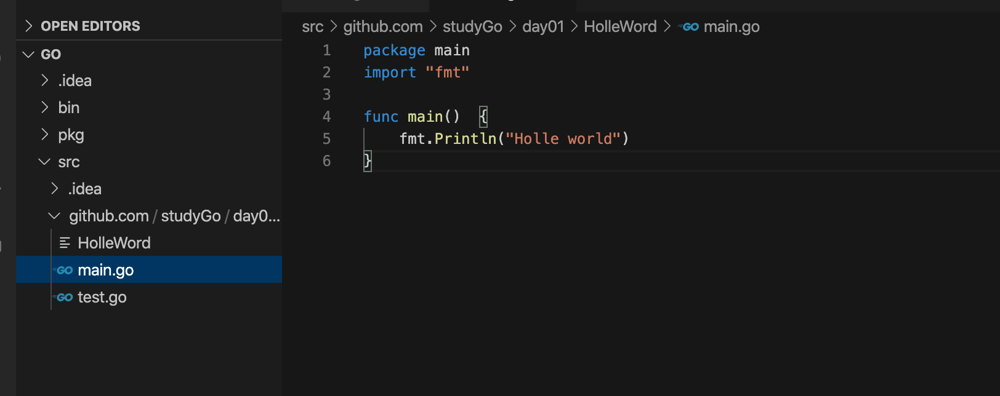
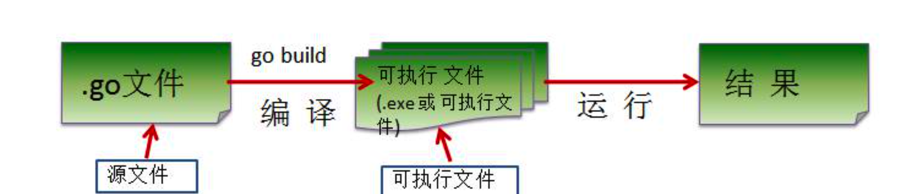
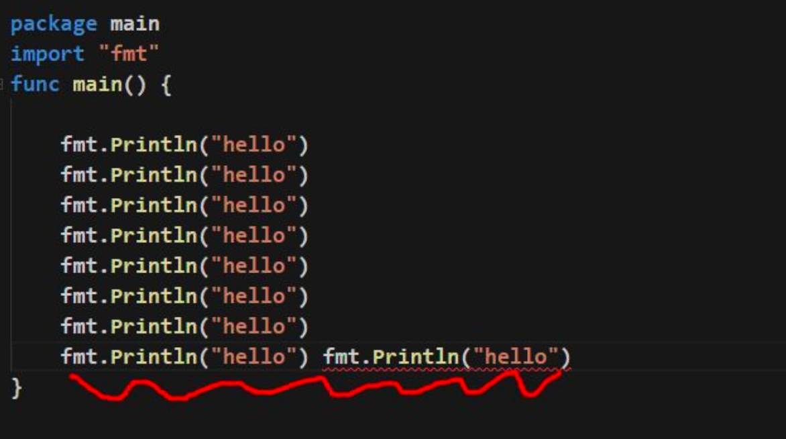
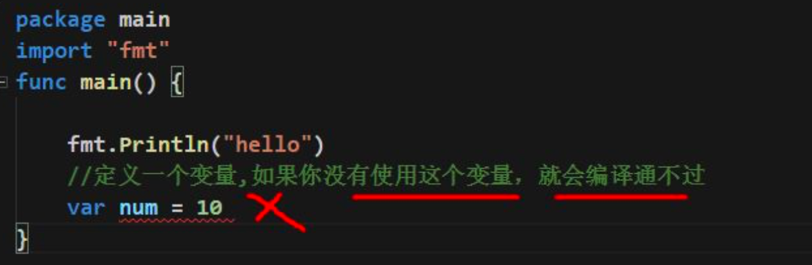

# go入门

## 第一个 .go文件

1.  go 文件的后缀是 .go

2. package main

   表示该 hello.go 文件所在的包是 main, 在 go 中，每个文件都必须归属于一个包。

3. import “fmt”

   表示:引入一个包，包名 fmt, 引入该包后，就可以使用 fmt 包的函数，比如:fmt.Println

4. **func** main() {

   }  

   func 是一个关键字，表示一个函数。

   main 是函数名，是一个主函数，即我们程序的入口。
   
5. fmt.Println(“hello”)

   表示调用 fmt 包的函数 Println 输出 “hello,world”

## Golang 执行流程分析

1. 如果是对源码编译后，再执行，Go 的执行流程如下图

   

2. 如果我们是对源码直接 执行 go run 源码，Go 的执行流程如下图

   

3. 两种执行流程的方式区别

   1. 如果我们先编译生成了可执行文件，那么我们可以将该可执行文件拷贝到没有 go 开发环境的机

      器上，仍然可以运行

   2. 如果我们是直接 go run go 源代码，那么如果要在另外一个机器上这么运行，也需要 go 开发

      环境，否则无法执行。

   3. 在编译时，编译器会将程序运行依赖的库文件包含在可执行文件中，所以，可执行文件变大了

      很多。

## Go 程序开发的注意事项

1.  Go 源文件以 "go" 为扩展名。

2. Go应用程序的执行入口是main()函数。这个是和其它编程语言(比如java/c)

3. Go语言严格区分大小写。

4. Go方法由一条条语句构成，每个语句后不需要分号(Go语言会在每行后自动加分号)，这也体现出 Golang 的简洁性。

5. Go编译器是一行行进行编译的，因此我们一行就写一条语句，不能把多条语句写在同一个，否则报错

   

6. go语言定义的变量或者**import**的包如果没有使用到，代码不能编译通过。

   