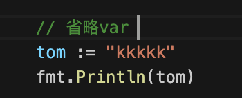
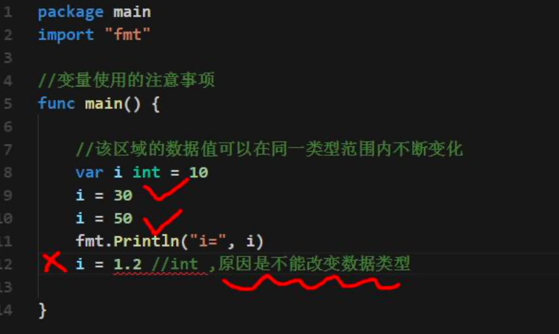
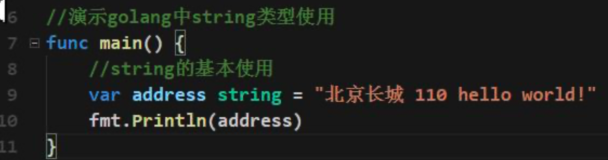

# go入门

## 第一个 .go文件

1.  go 文件的后缀是 .go

2. package main

   表示该 hello.go 文件所在的包是 main, 在 go 中，每个文件都必须归属于一个包。

3. import “fmt”

   表示:引入一个包，包名 fmt, 引入该包后，就可以使用 fmt 包的函数，比如:fmt.Println

4. **func** main() {

   }  

   func 是一个关键字，表示一个函数。

   main 是函数名，是一个主函数，即我们程序的入口。
   
5. fmt.Println(“hello”)

   表示调用 fmt 包的函数 Println 输出 “hello,world”

## Golang 执行流程分析

1. 如果是对源码编译后，再执行，Go 的执行流程如下图

   

2. 如果我们是对源码直接 执行 go run 源码，Go 的执行流程如下图

   

3. 两种执行流程的方式区别

   1. 如果我们先编译生成了可执行文件，那么我们可以将该可执行文件拷贝到没有 go 开发环境的机

      器上，仍然可以运行

   2. 如果我们是直接 go run go 源代码，那么如果要在另外一个机器上这么运行，也需要 go 开发

      环境，否则无法执行。

   3. 在编译时，编译器会将程序运行依赖的库文件包含在可执行文件中，所以，可执行文件变大了

      很多。

## Go 程序开发的注意事项

1.  Go 源文件以 "go" 为扩展名。

2. Go应用程序的执行入口是main()函数。这个是和其它编程语言(比如java/c)

3. Go语言严格区分大小写。

4. Go方法由一条条语句构成，每个语句后不需要分号(Go语言会在每行后自动加分号)，这也体现出 Golang 的简洁性。

5. Go编译器是一行行进行编译的，因此我们一行就写一条语句，不能把多条语句写在同一个，否则报错

   

6. go语言定义的变量或者**import**的包如果没有使用到，代码不能编译通过。

   

# 基本语法

## 转义符

常用的转义符：

- \t : 表示一个制表符，通常使用它可以排版。
- \n :换行符
-  \\ :一个\
- \" :一个"
- \r :一个回车 fmt.Println("天龙八部雪山飞狐\r 张飞");

## 代码风格

1. 正确的注释和注释风格

   Go官方推荐使用行注释来注释整个方法和语句。

2. 正确的缩进和空白

   1. 使用一次 **tab** 操作，实现缩进,默认整体向右边移动，时候用 **shift+tab** 整体向左移 看老师的演示:
   2. 使用 gofmt 来进行格式化

3. 运算符两边习惯性各加一个空格。比如:2 + 4 * 5。

4. Go语言的代码风格（Go 设计者思想: 一个问题尽量只有一个解决方法）

   反例

5. 一行最长不超过 80 个字符，超过的请使用换行展示，尽量保持格式优雅

   

## 变量

### 变量的声明，初始化和赋值

### 变量的声明方式

1. 第一种:指定变量类型，声明后若不赋值，使用默认值
2. 第二种:根据值自行判定变量类型(类型推导)
3. 省略 var, 注意 :=左侧的变量不应该是已经声明过的，否则会导致编译错误

4. 在编程中，有时我们需要一次性声明多个变量，Golang 也提供这样的语法
5. 该区域的数据值可以在同一类型范围内不断变化(重点)
6. 变量在同一个作用域(在一个函数或者在代码块)内不能重名
7. 变量=变量名+值+数据类型，这一点请大家注意，变量的三要素
8. Golang 的变量如果没有赋初值，编译器会使用默认值, 比如 int 默认值 0,小数默认为 0

### 程序中 +号的使用

- 当左右两边都是数值型时，则做加法运算
- 当左右两边都是字符串，则做字符串拼接

## 数据类型

### 整数类型

1. 有符号的
2. 无符号的

3. 默认其他的

> 注意事项
>
> 1. Golang 各整数类型分:有符号和无符号，int uint 的大小和系统有关。
> 2. Golang 的整型默认声明为 int 型
> 3. 如何在程序查看某个变量的字节大小和数据类型 (使用较多)
> 4. Golang程序中整型变量在使用时，遵守保小不保大的原则，即:在保证程序正确运行下，尽量 使用占用空间小的数据类型。【如:年龄】
> 5. bit: 计算机中的最小存储单位。byte:计算机中基本存储单元。[二进制再详细说] 1byte = 8 bit

### 小数类型/浮点型

1. 关于浮点数在机器中存放形式的简单说明,浮点数=符号位+指数位+尾数位。说明:浮点数都是有符号的。
2. 尾数部分可能丢失，造成精度损失。

> float64 的精度比 float32 的要准确.
>
> 如果我们要保存一个精度高的数，则应该选用 float64

3. 浮点型的存储分为三部分:符号位+指数位+尾数位 在存储过程中，精度会有丢失。
4. 
5. Golang 的浮点型默认声明为 float64 类型。
6. 浮点型常量有两种表示形式
   1. 十进制数形式:如:5.12 .512 (必须有小数点)
   2. 科学计数法形式:如:5.1234e2 = 5.12 * 10 的 2 次方 5.12E-2 = 5.12/10 的 2 次方

### 字符类型

Golang 中没有专门的字符类型，如果要存储单个字符(字母)，一般使用 **byte** 来保存。

**字符串就是一串固定长度的字符连接起来的字符序列**。Go 的字符串是由单个字节连接起来的。也 就是说对于传统的字符串是由字符组成的，**而 Go 的字符串不同，它是由字节组成的**。

> 1. 如果我们保存的字符在 ASCII 表的,比如[0-1, a-z,A-Z..]直接可以保存到 byte
> 2. 如果我们保存的字符对应码值大于 255,这时我们可以考虑使用 int 类型保存
> 3. 如果我们需要安装字符的方式输出，这时我们需要格式化输出，即 fmt.Printf(“%c”, c1)..

#### 使用细节

1. 字符常量是用单引号('')括起来的单个字符。例如:var c1 byte = 'a' var c2 int = '中' var c3 byte = '9'
2. Go 中允许使用转义字符 '\’来将其后的字符转变为特殊字符型常量。例如:var c3 char = ‘\n’ // '\n'表示换行符
3. Go 语言的字符使用 UTF-8 编码 ，如果想查询字符对应的 utf8 码值 http://www.mytju.com/classcode/tools/encode_utf8.asp
4. 在 Go 中，字符的本质是一个整数，直接输出时，是该字符对应的 UTF-8 编码的码值。
5. 可以直接给某个变量赋一个数字，然后按格式化输出时%c，会输出该数字对应的 unicode 字符
6. 字符类型是可以进行运算的，相当于一个整数，因为它都对应有 Unicode 码.

#### 字符类型本质探讨

1. 字符型 存储到 计算机中，需要将字符对应的码值(整数)找出来 

   存储:字符--->对应码值---->二进制-->存储
   读取:二进制----> 码值 ----> 字符 --> 读取

2. 字符和码值的对应关系是通过字符编码表决定的(是规定好)

3. Go语言的编码都统一成了utf-8。非常的方便，很统一，再也没有编码乱码的困扰了

### 布尔类型

布尔类型也叫 bool 类型，bool 类型数据只允许取值 true 和 false;bool类型占1个字节;bool 类型适于逻辑运算，一般用于程序流程控制。

### string 类型

字符串就是一串固定长度的字符连接起来的字符序列。Go 的字符串是由单个字节连接起来的。Go 语言的字符串的字节使用 UTF-8 编码标识 Unicode 文本

> 1. Go语言的字符串的字节使用UTF-8编码标识Unicode文本，这样Golang统一使用UTF-8编码,中文 乱码问题不会再困扰程序员。
>2. 字符串一旦赋值了，字符串就不能修改了:在 Go 中字符串是不可变的。
> 3. 字符串的两种表示形式
>
>    1. 双引号, 会识别转义字符
>
>    2. 反引号，以字符串的原生形式输出，包括换行和特殊字符，可以实现防止攻击、输出源代码等效果
>4. 字符串拼接方式
> 5. 当一行字符串太长时，需要使用到多行字符串，可以如下处理

### 基本数据类型的默认值

### 基本数据类型的相互转换

Golang 和 java / c 不同，**Go 在不同类型的变量之间赋值时需要显式转换。也就是说 Golang 中数 据类型不能自动转换。**

#### 基本语法

表达式 T(v) 将值 v 转换为类型 T

####  相互转换的注意事项

1. Go中，数据类型的转换可以是从表示范围小-->表示范围大，也可以范围大--->范围小
2. 被转换的是变量存储的数据(即值)，变量本身的数据类型并没有变化!

3. 在转换中，比如将 int64 转成 int8 【-128---127】 ，编译时不会报错，只是转换的结果是按 溢出处理，和我们希望的结果不一样。 因此在转换时，需要考虑范围.

### 基本数据类型和 string 的转换

1. 基本类型转string
   1. fmt.Sprintf("%参数", 表达式)
   2. 使用 strconv 包的函数
2. string转你基本类型
   1. 使用时 strconv 包的函数

### 指针

