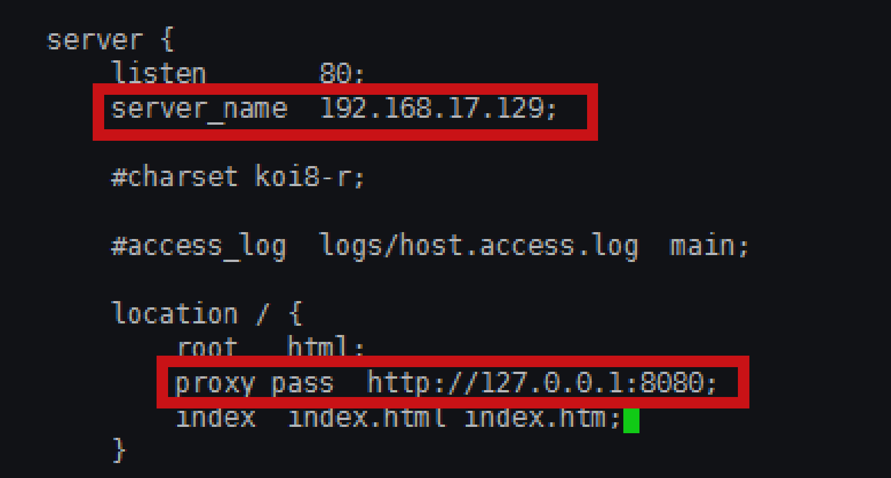
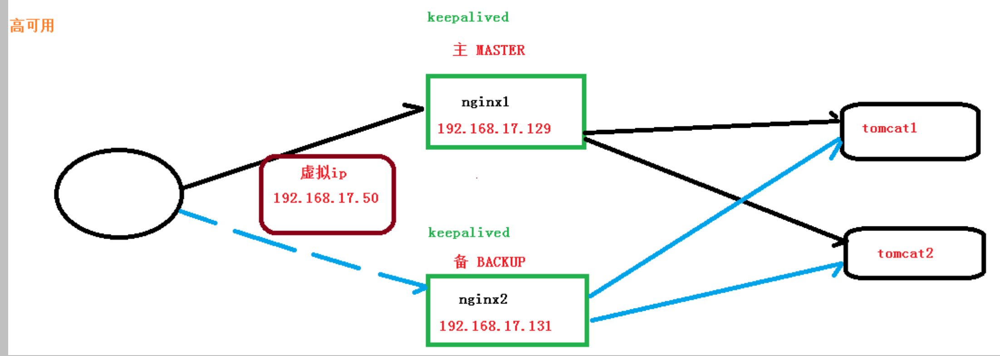
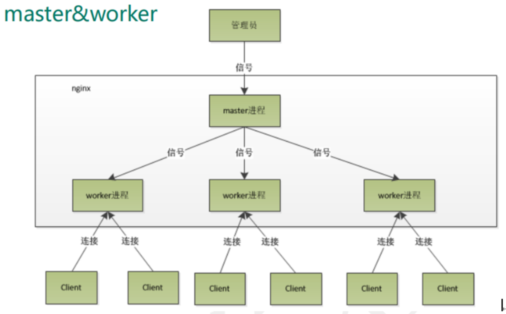
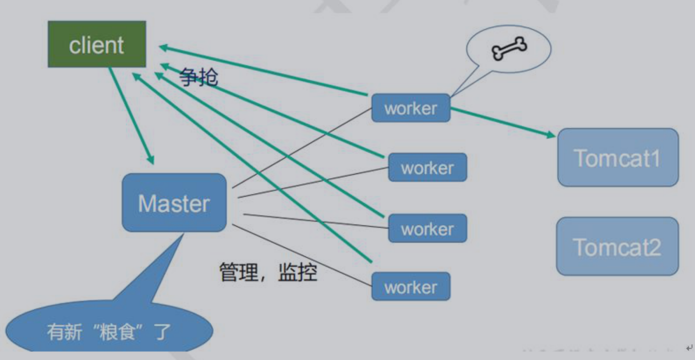

# nginx

## nginx的简介

### 简介

Nginx 是高性能的 HTTP 和反向代理的服务器，处理高并发能力是十分强大的，能经受高负

载的考验,有报告表明能支持高达 50,000 个并发连接数。

### 正向代理

需要在客户端配置代理服务器进行指定的网站访问

### 反向代理

暴露的事代理服务器地址，隐藏真是的服务器的ip地址

### 负载均衡

增加服务器的数量的，然后将请求分发到各个服务器上，将原先请求集中到各个服务器上的情况改为将请求分发到多个服务器上，将负载分发到不同的服务器上。

### 动静分类

为了加快网站的解析速度，可以把动态页面和静态页面由不同的服务器来解析，加快解析速度。降低原来单个服务器的压力

## nginx安装 

###  开始安装 nginx

#### 安装pcre依赖

~~~shell
// 下载pcre 压缩文件
wget http://downloads.sourceforge.net/project/pcre/pcre/8.37/pcre-8.37.tar.gz
// 解压压缩文件
 tar –xvf pcre-8.37.tar.gz
 ./configure
// 回到 pcre 目录下执行 make，最后执行 make install
make && make install
~~~

#### **安装** **openssl** 、zlib、 **gcc** 依赖

~~~shell
yum -y install make zlib zlib-devel gcc-c++ libtool openssl openssl-devel
~~~

#### **安装** nginx

~~~shell
//使用命令解压
tar –xvf XX(压缩包名称)
 ./configure
 make && make install
~~~

### nginx使用命令

~~~shell
进入 nginx 目录中
cd /usr/local/nginx/sbin

1、查看 nginx 版本号
./nginx -v 

2、启动 nginx
./nginx

3、停止 nginx
./nginx -s stop

4、重新加载 nginx
./nginx -s reload
~~~

### 出现无法访问问题

**在** **windows** **系统中访问** **linux** **中** **nginx，默认不能访问的，因为防火墙问题

1. 关闭防火墙
2. 开放访问的端口号，80 端口

~~~shell
//查看开放的端口号
firewall-cmd --list-all
//设置开放的端口号
firewall-cmd --add-service=http –permanent
firewall-cmd --add-port=80/tcp --permanent
//重启防火墙
firewall-cmd –reload
~~~

### ngin的配置文件

nginx 安装目录下，其默认的配置文件都放在这个目录的 conf 目录下，而主配置文件nginx.conf 也在其中，后续对 nginx 的使用基本上都是对此配置文件进行相应的修改

~~~shell
//配置文件的所在目录
cd /usr/local/nginx/conf/nginx.conf
~~~

##配置文件内容

### 全局块

从配置文件开始到 events 块之间的内容，主要会设置一些影响 nginx 服务器整体运行的配置指令，主要包括配置运行 Nginx 服务器的用户（组）、允许生成的 worker process 数，进程 PID 存放路径、日志存放路径和类型以及配置文件的引入等。

~~~shell
worker_processes 1 //处理并发数的配置，
~~~

这是 Nginx 服务器并发处理服务的关键配worker_processes 值越大，可以支持的并发处理量也越多，但是会受到硬件、软件等设备的制约

### events块

events 块涉及的指令主要影响 Nginx 服务器与用户的网络连接，常用的设置包括是否开启对多 work process 

下的网络连接进行序列化，是否允许同时接收多个网络连接，选取哪种事件驱动模型来处理连接请求，每个 word process 可以同时支持的最大连接数等。

~~~shell
worker_connections 1024 //支持的最大连接数量为1024
~~~

上述例子就表示每个 work process 支持的最大连接数为 1024.

这部分的配置对 Nginx 的性能影响较大，在实际中应该灵活配置。

### http块

这算是 Nginx 服务器配置中最频繁的部分，代理、缓存和日志定义等绝大多数功能和第三方模块的配置都这里。需要注意的是：http 块也可以包括 **http 全局块**、**server 块**。

#### http 全局块

http 全局块配置的指令包括文件引入、MIME-TYPE 定义、日志自定义、连接超时时间、单链接请求数上限等。

####server块

这块和虚拟主机有密切关系，虚拟主机从用户角度看，和一台独立的硬件主机是完全一样的，该技术的产生是为了节省互联网服务器硬件成本。

每个 http 块可以包括多个 server 块，而每个 server 块就相当于一个虚拟主机。

而每个 server 块也分为全局 server 块，以及可以同时包含多个 locaton 块。

**1、全局 server 块**

最常见的配置是本虚拟机主机的监听配置和本虚拟主机的名称或 IP 配置。

**2、location 块**

一个 server 块可以配置多个 location 块。

这块的主要作用是基于 Nginx 服务器接收到的请求字符串（例如 server_name/uri-string），对虚拟主机名称（也可以是 IP 别名）之外的字符串（例如 前面的 /uri-string）进行匹配，对特定的请求进行处理。地址定向、数据缓存和应答控制等功能，还有许多第三方模块的配置也在这里进行。

### nginx 配置实例反向代理实例

#### 案例1

```shell
  server {
        listen       80;
        server_name  localhost;// 本地的ip地址
        
        location / {
            root   html;
            proxy_pass http://127.0.0.1:8080;
            index  index.html index.htm;
        }
```



####  案例2

**访问** **http://192.168.17.129:9001/edu/** **直接跳转到** **127.0.0.1:8080**

**访问** **http:// 192.168.17.129:9001/vod/** **直接跳转到** **127.0.0.1:8081**

~~~shell
     server {
        listen       9001;
        server_name  localhost;// 本地的ip地址
        
        location ~ /edu/  {
            proxy_pass http://127.0.0.1:8080;
        }
        
        location ~ /vod/  {
            proxy_pass http://127.0.0.1:8081;
        }   
~~~

#### localtion 指令说明

1、= ：用于不含正则表达式的 uri 前，要求请求字符串与 uri 严格匹配，如果匹配成功，就停止继续向下搜索并立即处理该请求。

2、~：用于表示 uri 包含正则表达式，并且区分大小写。

3、~*：用于表示 uri 包含正则表达式，并且不区分大小写。

4、^~：用于不含正则表达式的 uri 前，要求 Nginx 服务器找到标识 uri 和请求字符串匹配度最高的 location 后，立即使用此 location 处理请求，而不再使用 location 块中的正则 uri 和请求字符串做匹配。

注意：如果 uri 包含正则表达式，则必须要有 ~ 或者 ~* 标识。

### nginx配置实例负载均衡

~~~shell
http {

		upstream myServer {
      server 172.27.2.18:4433;
      server 172.27.2.22:4433;
      ip_hash;
    }
    
     server {
     
     		location /myserver{
     				proxy_pass http://myserver
     		}
~~~

#### 负载均衡策略

##### 轮询（默认）

每个请求按时间顺序逐一分配到不同的后端服务器，如果后端服务器 down 掉，能自动剔除

##### 权重

weight 代表权,重默认为 1,权重越高被分配的客户端越多

指定轮询几率，weight 和访问比率成正比，用于后端服务器性能不均的情况。 例如：

~~~shell
upstream server_pool{
server 192.168.5.21 weight=10;
server 192.168.5.22 weight=10; 
}
~~~

#####ip_hash

每个请求按访问 ip 的 hash 结果分配，这样每个访客固定访问一个后端服务器，可以解决 session 的问题。 例如：

~~~shell
upstream server_pool{
ip_hash;
server 192.168.5.21:80;
server 192.168.5.22:80; 
}
~~~

##### fair

按后端服务器的响应时间来分配请求，响应时间短的优先分配。

~~~shell
upstream server_pool{
server 192.168.5.21:80; 
server 192.168.5.22:80;
fair; 
}
~~~

### nginx配置动静分离

具体 Expires 定义：是给一个资源设定一个过期时间，也就是说无需去服务端验证，直接通过浏览器自身确认是否过期即可，所以不会产生额外的流量。此种方法非常适合不经常变动的资源。（如果经常更新的文件，不建议使用 Expires 来缓存），我这里设置 3d，表示在这 3 天之内访问这个 URL，发送一个请求，比对服务器该文件最后更新时间没有变化，则不会从服务器抓取，返回状态码304，如果有修改，则直接从服务器重新下载，返回状态码 200。

~~~shell
server {
        listen       9001;
        server_name  localhost;// 本地的ip地址
        
        location ~ /www/  {
           root /data/;
           Expires 1d;
        }
        
        location ~ /vod/  {
           root /data/;
           Expires 1d;
        }   
~~~

### nginx 高可用的配置

#### nginx 高可用



1. 需要俩台nginx服务器
2. 需要keepalived
3. 需要虚拟ip

#### 安装keepalived

~~~shell
yum install keepalived –y
//安装之后，在 etc 里面生成目录 keepalived，有文件 keepalived.conf
~~~

####  高可用配置（主从配置）

~~~shell
修改配置文件
/etc/keepalived/keepalivec.conf

global_defs {
notification_email {
acassen@firewall.loc
failover@firewall.loc
sysadmin@firewall.loc
}
notification_email_from Alexandre.Cassen@firewall.loc
smtp_server 192.168.17.129  // 本机ip地址
smtp_connect_timeout 30
router_id LVS_DEVEL
}
vrrp_script chk_http_port {
script "/usr/local/src/nginx_check.sh"
interval 2 #（检测脚本执行的间隔）
weight 2
}
vrrp_instance VI_1 {
state BACKUP # 备份服务器上将 MASTER 改为 BACKUP 
interface ens33 //网卡
virtual_router_id 51 # 主、备机的 virtual_router_id 必须相同
priority 90 # 主、备机取不同的优先级，主机值较大，备份机值较小
advert_int 1
authentication {
auth_type PASS
auth_pass 1111
}
virtual_ipaddress {
192.168.17.50 // VRRP H 虚拟地址
} 
}


在/usr/local/src 添加检测脚本
#!/bin/bash
A=`ps -C nginx –no-header |wc -l`
if [ $A -eq 0 ];then
		/usr/local/nginx/sbin/nginx
		sleep 2
		if [ `ps -C nginx --no-header |wc -l` -eq 0 ];then
				killall keepalived
		fi
fi


把两台服务器上 nginx 和 keepalived 启动
启动 nginx：./nginx
启动 keepalived：systemctl start keepalived.service
~~~

## nginx原理

### mater和worker




### worker工作原理



###一个master和多个worker好处

- **可以使用nginx –s reload热部署，利用nginx进行热部署操作**

- **每个woker是独立的进程，如果有其中的一个woker出现问题，其他 woker独立的，继续进行争抢，实现请求过程，不会造成服务中断**


### 设置多少个worker合适
**worker数和服务器的cpu 数相等是最为适宜的**

### 连接数worker_connections

请求静态资源占2个连接数，请求动态资源需要占用4个连接数

**nginx有一个master，有四个 woke，每个woker支持最大的连接数1024，支持的最大并发数是多少？**

- 普通的静态访问：worker_connections*worker_processes/2

- 而如果是HTTP作 为反向代理来，最大并发数量应该是worker_connections *worker_processes/4。：