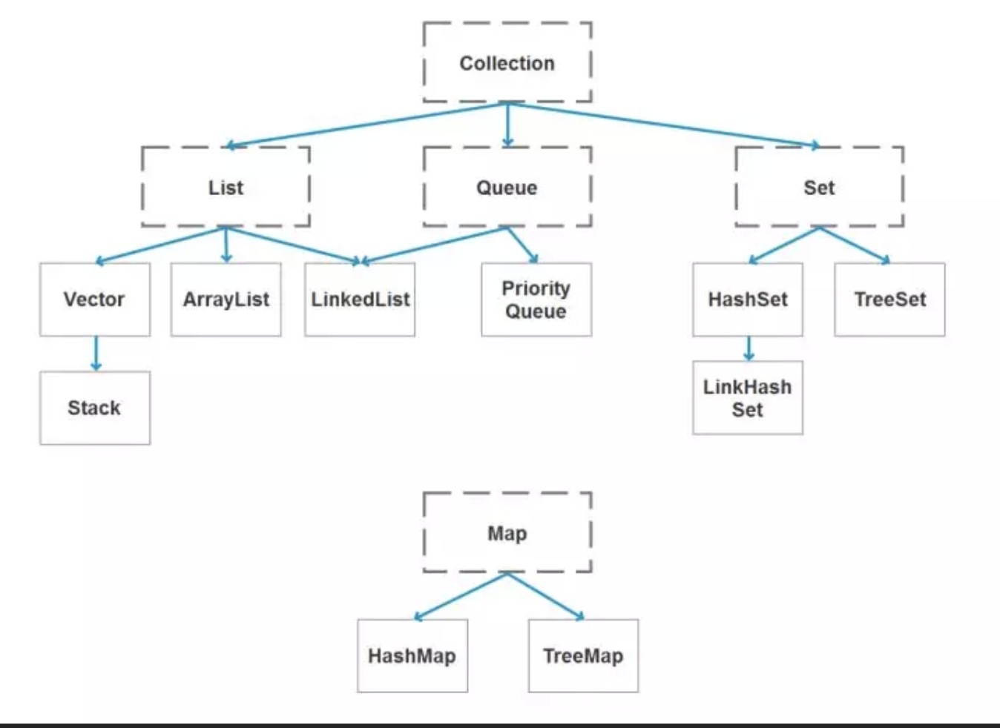

基础面试

###  **JDK 和 JRE 有什么区别？**

- JDK：Java Development Kit 的简称，java 开发工具包，提供了 java 的开发环境和运行环境
- JRE：Java Runtime Environment 的简称，java 运行环境，为 java 的运行提供了所需环境。

具体来说 JDK 其实包含了 JRE，同时还包含了编译 java 源码的编译器 javac，还包含了很多 java 程序调试和分析的工具。简单来说：如果你需要运行 java 程序，只需安装 JRE 就可以了，如果你需要编写 java 程序，需要安装 JDK。

###  **== 和 equals 的区别是什么？**

== ：对于基本数据类型和引用数据类型

- 基本数据类型：比较的是**值**是否相同
- 引用数据类型：比较的是**引用**是否相同；

~~~java
String x = "string";
String y = "string";
String z = new String("string");
System.out.println(x==y); // true
System.out.println(x==z); // false
System.out.println(x.equals(y)); // true
System.out.println(x.equals(z)); // true
~~~

> 因为 x 和 y 指向的是同一个引用，所以 == 也是 true，而 new String()方法则重写开辟了内存空间，所以 == 结果为 false，而 equals 比较的一直是值，所以结果都为 true。

**equals 解读**

equals 本质上就是 ==，只不过 String 和 Integer 等重写了 equals 方法，把它变成了值比较。看下面的代码就明白了。

~~~Java 
class Cat {
    public Cat(String name) {
        this.name = name;
    }

    private String name;

    public String getName() {
        return name;
    }

    public void setName(String name) {
        this.name = name;
    }
}

Cat c1 = new Cat("王磊");
Cat c2 = new Cat("王磊");
System.out.println(c1.equals(c2)); // false
~~~

~~~java
public boolean equals(Object obj) {
    return (this == obj);
}
~~~

> 原来 equals 本质上就是 ==。

那问题来了，两个相同值的 String 对象，为什么返回的是 true？代码如下：

~~~java
String s1 = new String("老王");
String s2 = new String("老王");
System.out.println(s1.equals(s2)); // true
~~~

同样的，当我们进入 String 的 equals 方法，找到了答案，代码如下：

~~~java 
public boolean equals(Object anObject) {
    if (this == anObject) {
        return true;
    }
    if (anObject instanceof String) {
        String anotherString = (String)anObject;
        int n = value.length;
        if (n == anotherString.value.length) {
            char v1[] = value;
            char v2[] = anotherString.value;
            int i = 0;
            while (n-- != 0) {
                if (v1[i] != v2[i])
                    return false;
                i++;
            }
            return true;
        }
    }
    return false;
}
~~~

原来是 String 重写了 Object 的 equals 方法，把引用比较改成了值比较。

> **总结** ：== 对于基本类型来说是值比较，对于引用类型来说是比较的是引用；而 equals 默认情况下是引用比较，只是很多类重新了 equals 方法，比如 String、Integer 等把它变成了值比较，所以一般情况下 equals 比较的是值是否相等。

### **两个对象的 hashCode()相同，则 equals()也一定为 true，对吗？**

不对，两个对象的 hashCode()相同，equals()不一定 true。

~~~java 
String str1 = "通话";
String str2 = "重地";
System.out.println(String.format("str1：%d | str2：%d",  str1.hashCode(),str2.hashCode()));
System.out.println(str1.equals(str2));

执行的结果：
str1：1179395 | str2：1179395
false
~~~

> 代码解读：很显然“通话”和“重地”的 hashCode() 相同，然而 equals() 则为 false，因为在散列表中，hashCode()相等即两个键值对的哈希值相等，然而哈希值相等，并不一定能得出键值对相等。

### **final 在 java 中有什么作用？**

- final 修饰的类叫最终类，该类不能被继承。
- final 修饰的方法不能被重写。
- final 修饰的变量叫常量，常量必须初始化，初始化之后值就不能被修改。

### **java 中的 Math.round(-1.5) 等于多少？**

等于 -1，因为在数轴上取值时，中间值（0.5）向右取整，所以正 0.5 是往上取整，负 0.5 是直接舍弃。

## **String**

### String 属于基础的数据类型吗？

String 不属于基础类型，基础类型有 8 种：byte、boolean、char、short、int、float、long、double，而 String 属于对象。

###  **java 中操作字符串都有哪些类？它们之间有什么区别？**

操作字符串的类有：String、StringBuffer、StringBuilder。

String 和 StringBuffer、StringBuilder 的区别在于 String 声明的是不可变的对象，每次操作都会生成新的 String 对象，然后将指针指向新的 String 对象，而 StringBuffer、StringBuilder 可以在原有对象的基础上进行操作，所以在经常改变字符串内容的情况下最好不要使用 String。

StringBuffer 和 StringBuilder 最大的区别在于，**StringBuffer 是线程安全的，而 StringBuilder 是非线程安全的**，但 StringBuilder 的性能却高于 StringBuffer，所以在单线程环境下推荐使用 StringBuilder，多线程环境下推荐使用 StringBuffer。

### **String str="i"与 String str=new String("i")一样吗？**

不一样，因为内存的分配方式不一样。String str="i"的方式，java 虚拟机会将其分配到常量池中；而 String str=new String("i") 则会被分到堆内存中。

### **如何将字符串反转？**

使用 StringBuilder 或者 stringBuffer 的 reverse() 方法。

~~~java
// StringBuffer reverse
StringBuffer stringBuffer = new StringBuffer();
stringBuffer.append("abcdefg");
System.out.println(stringBuffer.reverse()); // gfedcba
// StringBuilder reverse
StringBuilder stringBuilder = new StringBuilder();
stringBuilder.append("abcdefg");
System.out.println(stringBuilder.reverse()); // gfedcba
~~~

###  String 类的常用方法都有那些？

~~~java
indexOf()：返回指定字符的索引。

charAt()：返回指定索引处的字符。

replace()：字符串替换。

trim()：去除字符串两端空白。

split()：分割字符串，返回一个分割后的字符串数组。

getBytes()：返回字符串的 byte 类型数组。

length()：返回字符串长度。

toLowerCase()：将字符串转成小写字母。

toUpperCase()：将字符串转成大写字符。

substring()：截取字符串。

equals()：字符串比较。
~~~

## 抽象类

### **抽象类必须要有抽象方法吗？**

不需要，抽象类不一定非要有抽象方法。

~~~java
abstract class Cat {
    public static void sayHi() {
        System.out.println("hi~");
    }
}
~~~

> 上面代码，抽象类并没有抽象方法但完全可以正常运行。

### **普通类和抽象类有哪些区别？**

- 普通类不能包含抽象方法，抽象类可以包含抽象方法。
- 抽象类不能直接实例化，普通类可以直接实例化。

### **抽象类能使用 final 修饰吗？**

不能，定义抽象类就是让其他类继承的，如果定义为 final 该类就不能被继承，这样彼此就会产生矛盾，所以 final 不能修饰抽象类，

### **接口和抽象类有什么区别？**

- 实现：抽象类的子类使用 extends 来继承；接口必须使用 implements 来实现接口。
- 构造函数：抽象类可以有构造函数；接口不能有。
- main 方法：抽象类可以有 main 方法，并且我们能运行它；接口不能有 main 方法。
- 实现数量：类可以实现很多个接口；但是只能继承一个抽象类。
- 访问修饰符：接口中的方法默认使用 public 修饰；抽象类中的方法可以是任意访问修饰符。

## IO流

### **java 中 IO 流分为几种？**

- 按功能来分：输入流（input）、输出流（output）。
- 按类型来分：字节流和字符流。
- 字节流和字符流的区别是：字节流按 8 位传输以字节为单位输入输出数据，字符流按 16 位传输以字符为单位输入输出数据。

### **BIO、NIO、AIO 有什么区别？**

- BIO：Block IO 同步阻塞式 IO，就是我们平常使用的传统 IO，它的特点是模式简单使用方便，并发处理能力低。
- NIO：New IO 同步非阻塞 IO，是传统 IO 的升级，客户端和服务器端通过 Channel（通道）通讯，实现了多路复用。
- AIO：Asynchronous IO 是 NIO 的升级，也叫 NIO2，实现了异步非堵塞 IO ，异步 IO 的操作基于事件和回调机制。

### **Files的常用方法都有哪些？**

~~~Java 
Files.exists()：检测文件路径是否存在。

Files.createFile()：创建文件。

Files.createDirectory()：创建文件夹。

Files.delete()：删除一个文件或目录。

Files.copy()：复制文件。

Files.move()：移动文件。

Files.size()：查看文件个数。

Files.read()：读取文件。

Files.write()：写入文件
~~~

## **容器**

### **java 容器都有哪些**

### **Collection 和 Collections 有什么区别？**

- java.util.Collection 是一个集合接口（集合类的一个顶级接口）。它提供了对集合对象进行基本操作的通用接口方法。Collection接口在Java 类库中有很多具体的实现。Collection接口的意义是为各种具体的集合提供了最大化的统一操作方式，其直接继承接口有List与Set。
- Collections则是集合类的一个工具类/帮助类，其中提供了一系列静态方法，用于对集合中元素进行排序、搜索以及线程安全等各种操作。

### **List、Set、Map 之间的区别是什么？**

|          | List                                          | Set                              | Map                |
| :------- | --------------------------------------------- | -------------------------------- | ------------------ |
| 继承接口 | Collection                                    | Collection                       |                    |
| 常见实现 | ArrayList（数组）、LInkedList（链表）、Vector | HashSet 、TreeSet、LinkedHashSet | HashMap、HashTable |
| 元素     | 可以重复                                      | 不可重复                         | 键值对             |
| 顺序     | 有序                                          | 无序                             |                    |
| 线程安全 | Vector 线程安全                               |                                  | HashTable线程安全  |

### **HashMap 和 Hashtable 有什么区别？**

- hashMap去掉了HashTable 的contains方法，但是加上了containsValue（）和containsKey（）方法。
- hashTable同步的，而HashMap是非同步的，效率上比hashTable要高。
- hashMap允许空键值，而hashTable不允许。

### **如何决定使用 HashMap 还是 TreeMap**

对于在Map中插入、删除和定位元素这类操作，HashMap是最好的选择。然而，假如你需要对一个有序的key集合进行遍历，TreeMap是更好的选择。基于你的collection的大小，也许向HashMap中添加元素会更快，将map换为TreeMap进行有序key的遍历。

### **说一下 HashMap 的实现原理？**

HashMap概述： HashMap是基于哈希表的Map接口的非同步实现。此实现提供所有可选的映射操作，并允许使用null值和null键。此类不保证映射的顺序，特别是它不保证该顺序恒久不变。 

HashMap的数据结构： 在java编程语言中，最基本的结构就是两种，一个是数组，另外一个是模拟指针（引用），所有的数据结构都可以用这两个基本结构来构造的，HashMap也不例外。HashMap实际上是一个“链表散列”的数据结构，即数组和链表的结合体。

当我们往Hashmap中put元素时,首先根据key的hashcode重新计算hash值,根绝hash值得到这个元素在数组中的位置(下标),如果该数组在该位置上已经存放了其他元素,那么在这个位置上的元素将以链表的形式存放,新加入的放在链头,最先加入的放入链尾.如果数组中该位置没有元素,就直接将该元素放到数组的该位置上。

需要注意Jdk 1.8中对HashMap的实现做了优化,当链表中的节点数据超过八个之后,该链表会转为红黑树来提高查询效率,从原来的O(n)到O(logn)

### **说一下 HashSet 的实现原理？**

- HashSet底层由HashMap实现
- HashSet的值存放于HashMap的key上
- HashMap的value统一为PRESENT

### **ArrayList 和 LinkedList 的区别是什么？**

最明显的区别是 ArrrayList底层的数据结构是数组，支持随机访问，而 LinkedList 的底层数据结构是双向循环链表，不支持随机访问。使用下标访问一个元素，ArrayList 的时间复杂度是 O(1)，而 LinkedList 是 O(n)。

###  **如何实现数组和 List 之间的转换？**

- List转换成为数组：调用ArrayList的toArray方法。
- 数组转换成为List：调用Arrays的asList方法。

### **ArrayList 和 Vector 的区别是什么？**

- Vector是同步的，而ArrayList不是。然而，如果你寻求在迭代的时候对列表进行改变，你应该使用CopyOnWriteArrayList。 
- ArrayList比Vector快，它因为有同步，不会过载。 
- ArrayList更加通用，因为我们可以使用Collections工具类轻易地获取同步列表和只读列表。

### **Array 和 ArrayList 有何区别**

- Array可以容纳基本类型和对象，而ArrayList只能容纳对象。 
- Array是指定大小的，而ArrayList大小是固定的。 
- Array没有提供ArrayList那么多功能，比如addAll、removeAll和iterator等。

### **在 Queue 中 poll()和 remove()有什么区别？**

poll() 和 remove() 都是从队列中取出一个元素，但是 poll() 在获取元素失败的时候会返回空，但是 remove() 失败的时候会抛出异常。

### **哪些集合类是线程安全的？**

- vector：就比arraylist多了个同步化机制（线程安全），因为效率较低，现在已经不太建议使用。在web应用中，特别是前台页面，往往效率（页面响应速度）是优先考虑的。
- statck：堆栈类，先进后出。
- hashtable：就比hashmap多了个线程安全。
- enumeration：枚举，相当于迭代器。

### **迭代器 Iterator 是什么？**

迭代器是一种设计模式，它是一个对象，它可以遍历并选择序列中的对象，而开发人员不需要了解该序列的底层结构。迭代器通常被称为“轻量级”对象，因为创建它的代价小。

### **Iterator 怎么使用？有什么特点？**

Java中的Iterator功能比较简单，并且只能单向移动：

(1) 使用方法iterator()要求容器返回一个Iterator。第一次调用Iterator的next()方法时，它返回序列的第一个元素。注意：iterator()方法是java.lang.Iterable接口,被Collection继承。　

(2) 使用next()获得序列中的下一个元素。　

(3) 使用hasNext()检查序列中是否还有元素。　

(4) 使用remove()将迭代器新返回的元素删除。　

Iterator是Java迭代器最简单的实现，为List设计的ListIterator具有更多的功能，它可以从两个方向遍历List，也可以从List中插入和删除元素。

### **Iterator 和 ListIterator 有什么区别？**

- Iterator可用来遍历Set和List集合，但是ListIterator只能用来遍历List。 
- Iterator对集合只能是前向遍历，ListIterator既可以前向也可以后向。 
- ListIterator实现了Iterator接口，并包含其他的功能，比如：增加元素，替换元素，获取前一个和后一个元素的索引，等等。

## **反射**

### **什么是反射？**

反射主要是指程序可以访问、检测和修改它本身状态或行为的一种能力

## Java反射：

在Java运行时环境中，对于任意一个类，能否知道这个类有哪些属性和方法？对于任意一个对象，能否调用它的任意一个方法

Java反射机制主要提供了以下功能：

- 在运行时判断任意一个对象所属的类。
- 在运行时构造任意一个类的对象。
- 在运行时判断任意一个类所具有的成员变量和方法。
- 在运行时调用任意一个对象的方法。 

### **什么是 java 序列化？什么情况下需要序列化？**

简单说就是为了保存在内存中的各种对象的状态（也就是实例变量，不是方法），并且可以把保存的对象状态再读出来。虽然你可以用你自己的各种各样的方法来保存object states，但是Java给你提供一种应该比你自己好的保存对象状态的机制，那就是序列化。

什么情况下需要序列化：

a）当你想把的内存中的对象状态保存到一个文件中或者数据库中时候；
b）当你想用套接字在网络上传送对象的时候；
c）当你想通过RMI传输对象的时候；

### **动态代理是什么？有哪些应用？**

动态代理：

当想要给实现了某个接口的类中的方法，加一些额外的处理。比如说加日志，加事务等。可以给这个类创建一个代理，故名思议就是创建一个新的类，这个类不仅包含原来类方法的功能，而且还在原来的基础上添加了额外处理的新类。这个代理类并不是定义好的，是动态生成的。具有解耦意义，灵活，扩展性强。

动态代理的应用：

- Spring的AOP
- 加事务
- 加权限
- 加日志

### **怎么实现动态代理？**

首先必须定义一个接口，还要有一个InvocationHandler(将实现接口的类的对象传递给它)处理类。再有一个工具类Proxy(习惯性将其称为代理类，因为调用他的newInstance()可以产生代理对象,其实他只是一个产生代理对象的工具类）。利用到InvocationHandler，拼接代理类源码，将其编译生成代理类的二进制码，利用加载器加载，并将其实例化产生代理对象，最后返回。

## 对象拷贝

### **为什么要使用克隆？**

想对一个对象进行处理，又想保留原有的数据进行接下来的操作，就需要克隆了，Java语言中克隆针对的是类的实例。

### **如何实现对象克隆？**

1). 实现Cloneable接口并重写Object类中的clone()方法；

  

2). 实现Serializable接口，通过对象的序列化和反序列化实现克隆，可以实现真正的深度克隆，代码如下：

~~~java
import java.io.ByteArrayInputStream;
import java.io.ByteArrayOutputStream;
import java.io.ObjectInputStream;
import java.io.ObjectOutputStream;
import java.io.Serializable;

public class MyUtil {

    private MyUtil() {
        throw new AssertionError();
    }

    @SuppressWarnings("unchecked")
    public static <T extends Serializable> T clone(T obj) throws Exception {
        ByteArrayOutputStream bout = new ByteArrayOutputStream();
        ObjectOutputStream oos = new ObjectOutputStream(bout);
        oos.writeObject(obj);

        ByteArrayInputStream bin = new ByteArrayInputStream(bout.toByteArray());
        ObjectInputStream ois = new ObjectInputStream(bin);
        return (T) ois.readObject();

        // 说明：调用ByteArrayInputStream或ByteArrayOutputStream对象的close方法没有任何意义
        // 这两个基于内存的流只要垃圾回收器清理对象就能够释放资源，这一点不同于对外部资源（如文件流）的释放
    }
}
~~~

测试代码

~~~java
import java.io.Serializable;

/**
 * 人类
 * @author nnngu
 *
 */
class Person implements Serializable {
    private static final long serialVersionUID = -9102017020286042305L;

    private String name;    // 姓名
    private int age;        // 年龄
    private Car car;        // 座驾

    public Person(String name, int age, Car car) {
        this.name = name;
        this.age = age;
        this.car = car;
    }

    public String getName() {
        return name;
    }

    public void setName(String name) {
        this.name = name;
    }

    public int getAge() {
        return age;
    }

    public void setAge(int age) {
        this.age = age;
    }

    public Car getCar() {
        return car;
    }

    public void setCar(Car car) {
        this.car = car;
    }

    @Override
    public String toString() {
        return "Person [name=" + name + ", age=" + age + ", car=" + car + "]";
    }

}

~~~

~~~java

/**
 * 小汽车类
 * @author nnngu
 *
 */
class Car implements Serializable {
    private static final long serialVersionUID = -5713945027627603702L;

    private String brand;       // 品牌
    private int maxSpeed;       // 最高时速

    public Car(String brand, int maxSpeed) {
        this.brand = brand;
        this.maxSpeed = maxSpeed;
    }

    public String getBrand() {
        return brand;
    }

    public void setBrand(String brand) {
        this.brand = brand;
    }

    public int getMaxSpeed() {
        return maxSpeed;
    }

    public void setMaxSpeed(int maxSpeed) {
        this.maxSpeed = maxSpeed;
    }

    @Override
    public String toString() {
        return "Car [brand=" + brand + ", maxSpeed=" + maxSpeed + "]";
    }

}
~~~

~~~java

class CloneTest {

    public static void main(String[] args) {
        try {
            Person p1 = new Person("郭靖", 33, new Car("Benz", 300));
            Person p2 = MyUtil.clone(p1);   // 深度克隆
            p2.getCar().setBrand("BYD");
            // 修改克隆的Person对象p2关联的汽车对象的品牌属性
            // 原来的Person对象p1关联的汽车不会受到任何影响
            // 因为在克隆Person对象时其关联的汽车对象也被克隆了
            System.out.println(p1);
        } catch (Exception e) {
            e.printStackTrace();
        }
    }
}
~~~

>注意：基于序列化和反序列化实现的克隆不仅仅是深度克隆，更重要的是通过泛型限定，可以检查出要克隆的对象是否支持序列化，这项检查是编译器完成的，不是在运行时抛出异常，这种是方案明显优于使用Object类的clone方法克隆对象。让问题在编译的时候暴露出来总是好过把问题留到运行时。

### **深拷贝和浅拷贝区别是什么？**

- 浅拷贝只是复制了对象的引用地址，两个对象指向同一个内存地址，所以修改其中任意的值，另一个值都会随之变化，这就是浅拷贝（例：assign()）
- 深拷贝是将对象及值复制过来，两个对象修改其中任意的值另一个值不会改变，这就是深拷贝（例：JSON.parse()和JSON.stringify()，但是此方法无法复制函数类型）

